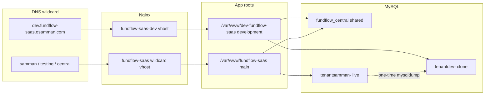

# Provision `dev` subdomain on development branch

## Target architecture

Confirmed choices:
- `dev.` served by [`/var/www/dev-fundflow-saas`](/var/www/dev-fundflow-saas) (`development` branch)
- Keep existing central tenant `dev` + domain `dev.fundflow-saas.osamman.com` in shared `fundflow_central`
- Replace `tenantdev-` with a full copy of `tenantsamman-`
- Separate queue + scheduler for the dev checkout; `MAIL_MAILER=log`

## 1. Refresh tenant database + storage

- Drop/recreate `tenantdev-`, then:
  - `mysqldump tenantsamman- | mysql tenantdev-`
- Copy tenant files into the **dev** app storage path used by Stancl (`suffix_storage_path`):
  - `rsync -a /var/www/fundflow-saas/storage/tenantsamman/ /var/www/dev-fundflow-saas/storage/tenantdev/`
- `chown -R www-data:www-data` on the new storage tree
- Leave central row as-is (`tenants.id=dev`, `tenancy_db_name=tenantdev-`, domain already set)

## 2. Nginx: exclusive vhost for `dev.`

- Add [`deploy/nginx/fundflow-saas-dev.conf`](deploy/nginx/fundflow-saas-dev.conf) (new), cloned from [`deploy/nginx/fundflow-saas.conf`](deploy/nginx/fundflow-saas.conf) with:
  - `server_name dev.fundflow-saas.osamman.com;` only (more specific than `*.fundflow-saas.osamman.com`, so it wins)
  - `root /var/www/dev-fundflow-saas/public;`
  - Same TLS cert as prod (`/etc/letsencrypt/live/fundflow-saas.osamman.com/`)
  - Same PHP-FPM socket and `/app/` Reverb proxy to `127.0.0.1:8080` (shared Reverb process is fine)
- Install to `sites-available` / `sites-enabled`, `nginx -t`, reload
- Do **not** change the production wildcard vhost root

## 3. Harden development `.env` isolation

Update [`/var/www/dev-fundflow-saas/.env`](/var/www/dev-fundflow-saas/.env):

| Setting | Value | Why |
|---|---|---|
| `DB_DATABASE` | `fundflow_central` | already set; shared central |
| `APP_URL` | `https://dev.fundflow-saas.osamman.com` | already set |
| `APP_ENV` | `local` | mark non-prod |
| `APP_DEBUG` | `true` | useful on dev |
| `MAIL_MAILER` | `log` | never SMTP to real members |
| `CACHE_PREFIX` | `dev_fundflow_` | avoid Redis collisions with prod |
| `DB_QUEUE_TABLE` | `jobs_dev` | isolate queue from prod `jobs` |
| `SCHEDULE_TENANT_IDS` | `dev` | scheduler only touches the clone |
| `QUEUE_WORKER_WATCHDOG_ENABLED` | `false` | Supervisor owns the worker |

Create `jobs_dev` (+ `job_batches_dev` / `failed_jobs_dev` if used) by cloning structure from existing `jobs` in `fundflow_central`.

## 4. Scheduler tenant filter (required with shared central)

Without a filter, `schedule:run` on either app walks **all** tenants via [`TenantAwareScheduledCommand`](app/Console/Concerns/TenantAwareScheduledCommand.php) / Stancl `HasATenantsOption`, so a dev cron would run development-branch code against live `samman`.

- Add env-driven filter `SCHEDULE_TENANT_IDS` (comma-separated) that narrows `getTenants()` when set
- Wire it in the shared tenant-aware command path on the **development** branch
- Dev `.env`: `SCHEDULE_TENANT_IDS=dev`
- Production `.env` (main app): set `SCHEDULE_TENANT_IDS=samman,testing` so prod cron never mutates the clone (or at minimum pause automation on tenant `dev` after clone)

## 5. Dev queue worker + scheduler

- Add [`deploy/supervisor/fundflow-dev-queue.conf`](deploy/supervisor/fundflow-dev-queue.conf): `queue:work database --queue=default` under `/var/www/dev-fundflow-saas` (reads `DB_QUEUE_TABLE=jobs_dev` from that `.env`)
- Add [`deploy/cron/fundflow-dev-scheduler`](deploy/cron/fundflow-dev-scheduler): every minute `php artisan schedule:run -q` in the dev root
- Install supervisor program + cron; ensure log files owned by `www-data`
- Leave existing `fundflow-queue` / `fundflow-scheduler` pointed at production only

## 6. App readiness checks

In `/var/www/dev-fundflow-saas`:

- Confirm branch `development`, `composer install`, `npm run build` if assets stale
- `php artisan optimize:clear`
- `chmod`/`chown` `storage` + `bootstrap/cache` for `www-data`
- Smoke: HTTPS `dev.fundflow-saas.osamman.com` resolves to tenant `dev`, login works against cloned users, production `samman.` unchanged

## Out of scope / explicit non-goals

- No separate central DB (`dev_fundflow_central` unused for this setup)
- No new TLS cert (existing wildcard covers `dev.`)
- No separate Reverb process unless websockets prove broken on `dev.`
- No ongoing auto-refresh of Samman → `tenantdev-` (one-time clone; refresh later on request)
