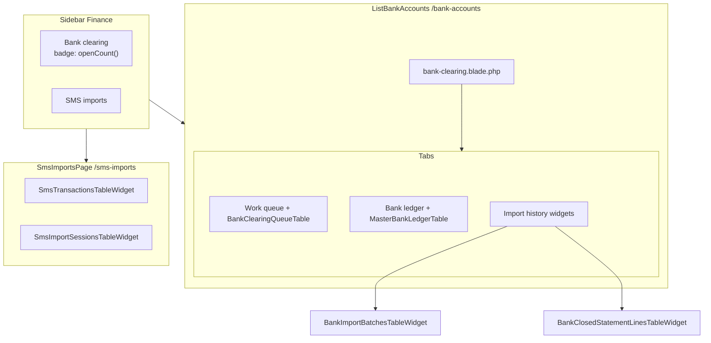

# Bank Clearing Workspace — Exploration Notes

| Field | Value |
|-------|-------|
| **Version** | 1.1 |
| **Date** | June 2026 |
| **Type** | **Historical** — pre-restructure as-is analysis (June 2026) |
| **Current architecture** | [Implementation plan §3](bank-clearing-workspace-implementation-plan.md#3-implemented-state) |
| **Implementation follow-up** | [bank-clearing-workspace-implementation-plan.md](bank-clearing-workspace-implementation-plan.md) |
| **Related redesign** | [admin-portal-redesign-plan.md §7.6](admin-portal-redesign-plan.md#76-bank-clearing) |

This document captures how the **Bank clearing** workspace worked **before** the June 2026 restructure. It informed the implementation plan. For the **current** system, see [implementation plan §3](bank-clearing-workspace-implementation-plan.md#3-implemented-state) and [Appendix C smoke checklist](bank-clearing-workspace-implementation-plan.md#appendix-c--manual-smoke-checklist-en--ar).

---

## Table of contents

1. [Architecture overview](#1-architecture-overview)
2. [Entry points & file map](#2-entry-points--file-map)
3. [Navigation layers](#3-navigation-layers)
4. [Bank channel tabs](#4-bank-channel-tabs)
5. [Table configurations](#5-table-configurations)
6. [Domain scopes & services](#6-domain-scopes--services)
7. [User workflows](#7-user-workflows)
8. [Header actions & widgets](#8-header-actions--widgets)
9. [Master account overlap](#9-master-account-overlap)
10. [SMS channel](#10-sms-channel)
11. [Cross-links from reconciliation](#11-cross-links-from-reconciliation)
12. [UI patterns & CSS](#12-ui-patterns--css)
13. [Copy & labels inventory](#13-copy--labels-inventory)
14. [Pain points](#14-pain-points)
15. [Technical hazards](#15-technical-hazards)
16. [Test coverage](#16-test-coverage)
17. [Reconciliation patterns to mirror](#17-reconciliation-patterns-to-mirror)
18. [Post-implementation reference](#18-post-implementation-reference)

---

## 1. Architecture overview

The workspace is a **Filament resource** (`BankAccountsResource`) whose Eloquent model is `BankStatement`, but the list page (`ListBankAccounts`) is a **multi-tab workspace** over three concepts:

- `BankStatement` — import batches
- `BankTransaction` — CSV lines and synthetic operational rows
- `Transaction` — master **bank** account ledger rows

It uses a **custom `content()` schema** (not the default Filament list layout): channel switcher → optional Filament tabs → optional imports sub-pills → embedded table.

```mermaid
flowchart TB
    subgraph nav [Sidebar]
        BC["Bank clearing<br/>badge: uncleared count"]
    end

    subgraph page [ListBankAccounts]
        INS[BankAccountsInsightsWidget]
        W[bank-workspace.blade.php<br/>Channel: Bank | SMS]
        subgraph bankChannel [channel=bank]
            FT[Filament tabs x4]
            IP[imports-section-pills<br/>Unmatched | Matched]
            T[EmbeddedTable]
        end
        subgraph smsChannel [channel=sms]
            ST[SMS sub-pills]
            SW[SmsTransactionsTableWidget<br/>or SmsImportSessionsTableWidget]
        end
    end

    nav --> page
    W --> bankChannel
    W --> smsChannel
    INS --> page
```

**List page content order (bank channel):**

1. `BankAccountsInsightsWidget` (header widget, full width)
2. `bank-workspace.blade.php` — Bank / SMS channel pills
3. Filament tab bar (`getTabsContentComponent()`)
4. `imports-section-pills.blade.php` — only when tab = `imports`
5. Embedded data table

---

## 2. Entry points & file map

### 2.1 Primary UI

| Role | Path |
|------|------|
| Resource | `app/Filament/Tenant/Resources/BankAccounts/BankAccountsResource.php` |
| List page | `app/Filament/Tenant/Resources/BankAccounts/Pages/ListBankAccounts.php` |
| Statement detail | `app/Filament/Tenant/Resources/BankAccounts/Pages/ViewBankStatement.php` |
| Workspace shell | `resources/views/filament/tenant/resources/bank-accounts/pages/bank-workspace.blade.php` |
| Imports sub-pills | `resources/views/filament/tenant/resources/bank-accounts/partials/imports-section-pills.blade.php` |

### 2.2 Tables

| Class | Path |
|-------|------|
| Pending operational clearance | `app/Filament/Tenant/Resources/BankAccounts/Tables/PendingOperationalClearanceTable.php` |
| Statement lines (CSV) | `app/Filament/Tenant/Resources/BankAccounts/Tables/BankTransactionsTable.php` |
| Master bank ledger | `app/Filament/Tenant/Resources/BankAccounts/Tables/MasterBankLedgerTable.php` |
| Statement batches | `app/Filament/Tenant/Resources/BankAccounts/Tables/BankStatementsTable.php` |

### 2.3 Actions & services

| Role | Path |
|------|------|
| Row/bulk bank actions | `app/Filament/Support/BankTransactionTableActions.php` |
| Import header actions | `app/Filament/Support/BankWorkspaceImportTableHeaderActions.php` |
| Match / scope logic | `app/Services/BankClearingMatchService.php` |
| Insights data | `app/Services/BankAccountsInsightsService.php` |
| Insights widget | `app/Filament/Tenant/Widgets/BankAccountsInsightsWidget.php` |
| Insights blade | `resources/views/filament/tenant/widgets/bank-accounts-insights.blade.php` |
| Synthetic statement buckets | `app/Support/BankStatementBuckets.php` |
| Pending line deletion | `app/Services/PendingOperationalClearanceDeletionService.php` |
| Import CSV | `app/Services/BankImportService.php` |
| Mirror to cash | `app/Services/FundFlowService.php` |

### 2.4 Master account relation managers

| RM | Path |
|----|------|
| Pending bank match | `app/Filament/Tenant/Resources/MasterAccounts/RelationManagers/PendingOperationalClearanceRelationManager.php` |
| Bank lines awaiting posting | `app/Filament/Tenant/Resources/MasterAccounts/RelationManagers/BankLinesAwaitingPostingRelationManager.php` |
| Transaction history | `app/Filament/Tenant/Resources/MasterAccounts/RelationManagers/TransactionsRelationManager.php` |

### 2.5 SMS widgets (embedded in workspace)

| Widget | Path |
|--------|------|
| SMS transactions | `app/Filament/Tenant/Widgets/SmsTransactionsTableWidget.php` |
| SMS import sessions | `app/Filament/Tenant/Widgets/SmsImportSessionsTableWidget.php` |

---

## 3. Navigation layers

Three independent dimensions on the bank channel:

| Layer | State property | URL param | Default |
|-------|----------------|-----------|---------|
| **Channel** | `$channel` | `?channel=bank\|sms` | `bank` |
| **Main tab** | `$activeTab` (Filament) | `?tab=` | `clearance` |
| **Imports section** | `$importsSection` | `?importsSection=unmatched\|matched` | `unmatched` |

SMS channel adds a fourth:

| Layer | State | URL | Default |
|-------|-------|-----|---------|
| **SMS sub-tab** | `$smsSubTab` | `?smsSubTab=transactions\|history` | `transactions` |

### 3.1 Tab resolution (`BankAccountsResource::resolveListBankAccountsTab()`)

Priority:

1. If `resolveChannel() === 'sms'` → return `'sms'` (no bank table).
2. Else if Livewire `ListBankAccounts` has `activeTab` → use it.
3. Else `request('tab')` or **`'clearance'`**.

Aliases:

| Incoming `?tab=` | Resolved |
|------------------|----------|
| `transactions` | `imports` |
| `ledger`, `statements`, `imports`, `clearance`, `sms` | unchanged |
| anything else | `clearance` |

### 3.2 Channel resolution (`resolveChannel()`)

1. Livewire `$channel` on `ListBankAccounts` if valid.
2. Else `request('channel')` or `'bank'`.

### 3.3 URL builder (`BankAccountsResource::listUrl()`)

- Omits `tab` when `$tab === 'imports'` (legacy default for statement lines).
- Omits `channel` when `bank`.
- Supports `filters`, `smsSubTab=history`.

**Implication:** Default index URL opens **Pending bank match** (`clearance`), not statement lines.

### 3.4 Sidebar navigation

| Attribute | Value |
|-----------|--------|
| Label | Bank clearing |
| Group | Accounts (`TenantNavigation::GROUP_ACCOUNTS`) |
| Sort | `SORT_BANK_CLEARING = 10` |
| Slug | `/bank-accounts` |
| Badge | `BankTransaction::uncleared()->count()` (warning) |
| Model label (internal) | Bank statement |
| Plural model label | Bank accounts |

**Badge mismatch:** Sidebar counts **all** uncleared `BankTransaction` rows. The **Pending bank match** tab badge uses `BankClearingMatchService::pendingOperationalClearanceCount()` only (synthetic operational rows).

---

## 4. Bank channel tabs

Defined in `ListBankAccounts::getTabs()`:

| Key | Label | Icon | Badge | Table |
|-----|-------|------|-------|-------|
| `clearance` | Pending bank match | link | pending operational count | `PendingOperationalClearanceTable` |
| `imports` | Statement lines | queue-list | — | `BankTransactionsTable` |
| `ledger` | Master bank ledger | book-open | — | `MasterBankLedgerTable` |
| `statements` | Statements | document-text | — | `BankStatementsTable` |

Default active tab: `clearance` (`getDefaultActiveTab()`).

Tab styling: `data-ff-tab-key` + `data-ff-tab-color` via `TabLabelColors::forKey()`.

### 4.1 Table query (`ListBankAccounts::getTableQuery()`)

| Tab | Query |
|-----|-------|
| `ledger` | `Transaction` where `account_id = master bank` |
| `imports` | `applyRealBankStatementLinesScope()` + status filter from `importsSection` |
| `clearance` | `applyPendingOperationalClearanceScope()` |
| default (`statements`) | `BankStatement` Eloquent query from resource |

**Imports section filter:**

| `importsSection` | `status` IN |
|------------------|-------------|
| `unmatched` (default) | `imported`, `mirrored` |
| `matched` | `posted`, `duplicate`, `ignored` |

### 4.2 Imports sub-pills UI

Shown only when `resolveListBankAccountsTab() === 'imports'`.

- Amber banner: **Statement lines — action required first**
- Pills: **Unmatched** | **Matched / closed**
- Helper copy differs per section (post/clear vs read-only audit)

---

## 5. Table configurations

### 5.1 `PendingOperationalClearanceTable`

**Rows:** Uncleared synthetic operational `BankTransaction` rows (deposits, cash-outs, expense/fee/invest disbursements, invest returns).

**Columns:**

| Column | Notes |
|--------|-------|
| `transaction_date` | sortable |
| `clearance_kind` | **Virtual** — `state()` from FK ids; badge; `searchable(false)` required |
| `member.name` | sortable |
| `amount` | money, color by sign |
| `description` | searchable |
| `status` | badge |

**Type badge mapping (`clearance_kind` state):**

| Condition | Label | Color |
|-----------|-------|-------|
| `invest_return_id` | Return in | success |
| `invest_disbursement_id` | Invest out | warning |
| `fee_disbursement_id` | Fee | info |
| `expense_disbursement_id` | Expense | danger |
| `cash_out_request_id` | Cash out | warning |
| default | Deposit | success |

**Row actions:** View (`ViewBankTransactionAction`), **Clear / Match**, **Remove pending bank match**

**Bulk:** Clear / match, bulk remove pending matches

**Empty state:** Accepted deposits, cash-outs, expense disbursements… still need a matching line from an imported bank statement.

### 5.2 `BankTransactionsTable`

**Rows:** Real CSV statement lines (excludes synthetic operational buckets).

**Columns:** date, source (statement filename), amount, assigned member, master cash summary, status, cleared icon, duplicate-of (hidden)

**Row actions:** View, **Post to cash**, **Post to member**, **Clear / Match** (pending operational rows only), **Ignore**, **Delete**

**Bulk:** Clear / match, post to cash, post to member, ignore, delete

**Filters:** status, cleared, date, member, duplicate link, statement, description contains

**Empty state:** Imported bank statement lines. Manual master bank credits/debits are on the Master bank ledger tab.

### 5.3 `MasterBankLedgerTable`

**Rows:** `Transaction` on master **bank** account (not `BankTransaction`).

**Header actions:** Credit / Debit / Refund (`AccountTransactionManualAdjustmentHeaderActions`)

**Row actions:** View only (`ViewAccountTransactionAction`)

### 5.4 `BankStatementsTable`

**Rows:** Import batch metadata.

**Row click:** navigates to `ViewBankStatement`

**Actions:** View modal, delete (cascades transactions)

**Bulk:** delete selected, refresh

### 5.5 `ViewBankStatement` page

- Detail insights + statement metadata schema
- `BankTransactionsRelationManager` — per-statement lines (view + delete)

---

## 6. Domain scopes & services

### 6.1 `BankClearingMatchService` scopes

| Method | Purpose |
|--------|---------|
| `applyRealBankStatementLinesScope()` | Excludes synthetic operational statement filenames |
| `applyPendingOperationalClearanceScope()` | Uncleared + operational FK + operational bucket filenames |
| `applyPendingOperationalClearanceScopeForMasterAccount()` | Above, filtered by master account type |
| `applyBankLinesAwaitingPostingScope()` | Real CSV lines with status `imported` or `mirrored` |

### 6.2 Operational clearance scope (SQL shape)

```text
bank_transactions WHERE
  is_cleared = 0
  AND (fund_posting_id OR cash_out_request_id OR expense_disbursement_id
       OR fee_disbursement_id OR invest_disbursement_id OR invest_return_id IS NOT NULL)
  AND bank_statement.filename IN (operational clearance buckets)
```

### 6.3 Master account types with pending clearance

`cash`, `expense`, `fees`, `invest` — via `masterAccountTypesWithPendingClearance()`.

### 6.4 Count helpers

| Method | Counts |
|--------|--------|
| `pendingOperationalClearanceCount()` | All pending operational rows |
| `pendingOperationalClearanceCountForMasterAccount($account)` | Scoped to account type |
| `bankLinesAwaitingPostingCount()` | CSV lines needing post to cash pool |

### 6.5 Synthetic vs real buckets

Defined in `App\Support\BankStatementBuckets`:

- **Operational clearance** — member-postings, member-cash-outs, master-expense-disbursements, etc.
- **Synthetic operational** — excluded from “real bank statement lines” scope

---

## 7. User workflows

### A. Import bank CSV

1. Bank clearing → Bank channel.
2. **Import statement** (page header on clearance, imports, statements tabs — not ledger).
3. Modal: CSV, bank template, optional bank name → `BankImportService::importCsv()`.
4. New rows → **Statement lines → Unmatched** (`status=imported`).

### B. Post import line to master cash

1. Statement lines → Unmatched → **Post to cash** (or bulk).
2. `FundFlowService::mirrorToCash()` → status `mirrored`, master cash credited.

### C. Assign import line to member

1. **Post to member** on `imported` or `mirrored` row.
2. Credits/debits member cash via posting services.

### D. Operational clearance (deposit, cash-out, expense, etc.)

1. Business flow creates synthetic `BankTransaction` on operational statement bucket.
2. Row appears on **Pending bank match** (default tab).
3. **Clear / Match** → select real CSV line → `BankClearingMatchService::clearMatchPair()`.
4. Row leaves pending list; import line marked cleared.

### E. Match from statement lines

Same **Clear / Match** UI on `BankTransactionsTable` for eligible rows — duplicate entry point.

### F. Ignore / delete

- **Ignore:** `imported` status only.
- **Delete:** `BankTransactionDeletion` rules; pending operational delete uses `PendingOperationalClearanceDeletionService` (ledger reversal).

### G. Manual master bank adjustments

**Master bank ledger** tab → Credit / Debit / Refund.

### H. Review import batches

**Statements** tab → row → `ViewBankStatement`.

### I. SMS channel

1. Channel pill → **SMS**.
2. **Transactions:** `SmsTransactionsTableWidget` — review/post to member cash.
3. **History:** `SmsImportSessionsTableWidget` — **Import SMS file** in widget header.

### J. From master account pages

- **Pending bank match** RM reuses `PendingOperationalClearanceTable` (scoped).
- **Bank lines awaiting posting** RM on master cash — post actions mirror statement lines.
- **Transactions** RM — ledger with bank import column on cash accounts.

---

## 8. Header actions & widgets

### 8.1 Page header actions (`ListBankAccounts::getHeaderActions()`)

| Tab | Import statement |
|-----|------------------|
| `imports`, `transactions`, `clearance`, `statements` | Yes |
| `ledger` | No |
| SMS channel | No |

Uses `BankWorkspaceImportTableHeaderActions::bankStatementImportAction()`.

### 8.2 `BankAccountsInsightsWidget`

Always mounted as header widget (`getHeaderWidgets()`).

**On clearance / imports tabs** — clearing KPI strip (4 cards):

- Imported today, Auto-matched, Unmatched, Stale pending (links via `BankAccountsInsightsService`)

**Always shown:**

- Hero banner + KPI strip
- Posting pipeline status bars
- Master cash / master bank balance cards
- Import trend, recent statements

Widget view: `ff-app-insights` CSS class.

Data driven by `BankAccountsInsightsService::snapshot()` which reads `resolveListBankAccountsTab()` for context.

---

## 9. Master account overlap

On `ViewMasterAccount` (`MasterAccountResource`):

| Relation manager | Visible when | Reuses |
|------------------|--------------|--------|
| Bank lines awaiting posting | master `cash` | Custom inline table + post actions |
| Pending bank match | master `cash`, `expense`, `fees`, `invest` | `PendingOperationalClearanceTable` |
| Transactions | all | Standard ledger |

**Pending bank match RM nuance:**

```php
showClearanceKindColumn: in_array($owner->type, ['cash', 'invest'], true)
```

Expense and fees master accounts **hide** the Type column but still show the pending match table.

**Duplication:** Same Clear/Match and Post workflows exist on workspace tabs and on master account RMs — useful as contextual drill-down but scatters muscle memory.

---

## 10. SMS channel

Rendered entirely inside `bank-workspace.blade.php` when `$channel === 'sms'`:

- No Filament tabs
- No embedded `BankAccountsResource` table
- Livewire widgets replace the table
- Import entry: **Import SMS file** on History widget (not page header)

Copy:

- Workspace helper: *Switch between bank statement and SMS channels. Parsing templates are managed under Settings.*
- Transactions: *Review parsed SMS transactions and post verified rows to member cash.*
- History: *Monitor SMS import batches with counts, errors, and completion state.*

---

## 11. Cross-links from reconciliation

| Source | Target |
|--------|--------|
| `ReconciliationOverviewPage::getBankClearingUrl()` | `BankAccountsResource::listUrl('clearance')` |
| `reconciliation-workspace-shortcuts.blade.php` | Bank clearing shortcut card |
| `ReconciliationExceptionPresenter` | `domainLabel('bank_clearing')`, context URLs to `listUrl('clearance')` |

Reconciliation treats **Pending bank match** as the primary bank clearing entry.

---

## 12. UI patterns & CSS

| Class / attr | Usage |
|--------------|-------|
| `ff-tenant-tab-pills`, `__item`, `__item--active` | Channel, SMS, imports-section pills |
| `ff-app-insights` | Bank accounts insights widget |
| `data-ff-tab-key`, `data-ff-tab-color` | Filament bank tabs |
| `ff-recon-shortcut-card` | Reconciliation → bank clearing links |

Filament table standards: filters, grouping, bulk actions enforced via `FilamentTableStandardsTest`.

Global `Column::configureUsing()` applies `->searchable()` to all columns — **virtual columns must opt out** with `->searchable(false)`.

---

## 13. Copy & labels inventory

| Location | English |
|----------|---------|
| Page / nav title | Bank clearing |
| Channel | Bank / SMS |
| Tabs | Pending bank match · Statement lines · Master bank ledger · Statements |
| Imports sub | Unmatched · Matched / closed |
| SMS sub | Transactions · History |
| Primary import CTA | Import statement / Import SMS file |
| Match action | Clear / Match |
| Post actions | Post to cash · Post to member |
| Delete pending | Remove pending bank match |
| Master RM titles | Bank lines awaiting posting · Pending bank match |

Arabic: `tests/Feature/Tenant/BankAccountsTranslationTest.php`.

---

## 14. Pain points

Ranked by operational impact:

1. **Three navigation layers** on bank channel (channel → tab → imports sub-pill).
2. **Default tab is clearance** while many sessions start with unmatched imports; redesign plan §7.6 envisioned unmatched-first.
3. **Duplicate Clear/Match** in Pending tab, Statement lines tab, and master RMs.
4. **Duplicate posting** — Bank lines awaiting posting RM vs Statement lines.
5. **Overlapping vocabulary** — uncleared, pending match, unmatched, imported/mirrored/posted, cleared.
6. **Heavy insights** above queue competes with table on small viewports.
7. **Sidebar badge ≠ tab badge** — different counting logic.
8. **Legacy naming** — slug `bank-accounts`, plural label “Bank accounts”, nav “Bank clearing”.
9. **Hybrid tab systems** — Filament tabs + custom pills (unlike Reconciliation’s single registry).
10. **SMS cohabitation** — different import entry points and widget embedding.
11. **Import on clearance tab** — header action on tabs that are not strictly about importing.

---

## 15. Technical hazards

### 15.1 Virtual column global search

`TextColumn::make('clearance_kind')` uses `state()` only — no DB column. Global `->searchable()` caused:

```text
Unknown column 'clearance_kind' in 'WHERE'
```

**Fix applied:** `->searchable(false)` on that column.

**Audit needed:** Other `->state()` columns across Filament tables (member balances, loan outstanding, fund tier computed columns, etc.).

### 15.2 Tab reconfiguration on switch

`ListBankAccounts::updatedActiveTab()` calls `reconfigureTableForActiveTab()` — rebuilds table, resets filters. Switching tabs loses filter state (by design).

### 15.3 `listUrl()` default tab omission

`listUrl()` omits `tab` param when `$tab === 'imports'`, but default resolved tab is `clearance` — deep links must pass `tab` explicitly for non-imports views.

---

## 16. Test coverage

| Test file | Covers |
|-----------|--------|
| `BankAccountsListTabResolutionTest.php` | Tab/channel URL resolution |
| `BankAccountsImportHeaderActionTest.php` | Import action visibility per tab |
| `SmsImportSessionsAndBankWorkspaceTest.php` | SMS channel, widgets |
| `BankClearingMatchServiceTest.php` | Scopes, matching |
| `MasterAccountPendingBankPostingScopeTest.php` | Per-account pending scopes |
| `PendingOperationalClearanceDeletionTest.php` | Delete pending + **table search regression** |
| `BankAccountsTranslationTest.php` | Arabic strings |
| `AdminPortalPhaseEightTest.php` | Tab defaults (clearance) |
| `ReconciliationExceptionPresenterTest.php` | Bank clearing context links |

---

## 17. Reconciliation patterns to mirror

The reconciliation workspace redesign provides a proven template:

| Pattern | Reconciliation | Bank clearing today |
|---------|----------------|-------------------|
| Tab registry | `ReconciliationTabRegistry` | Keys in `getTabs()` + `resolveListBankAccountsTab()` |
| Custom shell blade | `reconciliation.blade.php` | `bank-workspace.blade.php` (channel only) |
| Pill navigation | `reconciliation-tab-pills` | Mixed Filament tabs + pills |
| Workspace actions | `workspacePanelActions()` + partial | Page `getHeaderActions()` only |
| Overview KPIs | Queue insights partial | Full insights widget always |
| Shortcut cards | `reconciliation-workspace-shortcuts` | Inbound only (from recon) |
| Presenter | `ReconciliationExceptionPresenter` | None for bank queue rows |
| Grouped actions | `ReconciliationExceptionActions` | Flat row action lists |
| Embed trait | `EmbedsAsAuditWorkspacePanel` | Not used |

---

## 18. Post-implementation reference

> Added June 2026 after Phases 1–4 shipped. Supersedes sections 1–17 for day-to-day navigation.

### 18.1 Architecture (current)



### 18.2 Entry points (current)

| Role | Path |
|------|------|
| Bank clearing list | `app/Filament/Tenant/Resources/BankAccounts/Pages/ListBankAccounts.php` |
| Workspace shell | `resources/views/filament/tenant/pages/bank-clearing.blade.php` |
| SMS imports page | `app/Filament/Tenant/Pages/SmsImportsPage.php` |
| Unified queue table | `app/Filament/Tenant/Resources/BankAccounts/Tables/BankClearingQueueTable.php` |
| Queue actions | `app/Filament/Support/BankClearingQueueActions.php` |
| Tab registry | `app/Filament/Tenant/Support/BankClearingTabRegistry.php` |

**Removed:** `bank-workspace.blade.php`, `imports-section-pills.blade.php`, Bank/SMS channel on bank clearing page.

### 18.3 User-facing vocabulary (current)

| Label | Meaning |
|-------|---------|
| Match to bank line | Pair operational/import row with CSV evidence |
| Clear without evidence | Close operational synthetic row without CSV line |
| Match automatically | Unique candidate within tolerance |
| Open in bank clearing | Deep link from master account RM with `queueFilter` |

### 18.4 Pain points — resolution status

| # | Pre-restructure pain | Resolution |
|---|---------------------|------------|
| 1 | Three navigation layers | Single tab row + queue filter chips |
| 2 | Wrong default tab | Default **Work queue** |
| 3 | Duplicate Clear/Match | Split actions; RMs read-only + link |
| 4 | Duplicate posting RM | View-only + link to queue |
| 5 | Overlapping vocabulary | Clear vs match labels |
| 6 | Heavy insights on queue | Slim KPIs + optional toggle |
| 7 | Badge mismatch | `openCount()` |
| 8 | SMS cohabitation | Separate `/sms-imports` page |

### 18.5 Test coverage (current)

| Test file | Covers |
|-----------|--------|
| `BankClearingWorkspaceLocaleSmokeTest.php` | EN/AR shell, queue, history, SMS page |
| `BankClearingWorkspaceSmokeTest.php` | Tab switching, URLs, import action |
| `BankClearingQueueWorkflowTest.php` | Post, match, clear-without-evidence, combined history |
| `BankClearingPhaseThreeAndSmsTest.php` | RM preview, SMS redirect |
| `BankClearingTabRegistryTest.php` | Tab aliases |
| `BankClearingMatchServiceTest.php` | Matching, auto-match, clear without evidence |

---

## Appendix — `ListBankAccounts` Livewire URL state (historical)

| Property | `#[Url]` name | Notes |
|----------|---------------|-------|
| ~~`$channel`~~ | ~~`channel`~~ | Removed; legacy redirects to `SmsImportsPage` |
| ~~`$smsSubTab`~~ | ~~`smsSubTab`~~ | Moved to `SmsImportsPage::$activeTab` |
| `$queueFilter` | `queueFilter` | Active |
| `$historySection` | `historySection` | Expands closed-lines panel when `closed` |
| `$activeTab` | (Filament) | `queue` \| `ledger` \| `history` |

---

*Historical exploration. For current behaviour see [bank-clearing-workspace-implementation-plan.md](bank-clearing-workspace-implementation-plan.md).*
