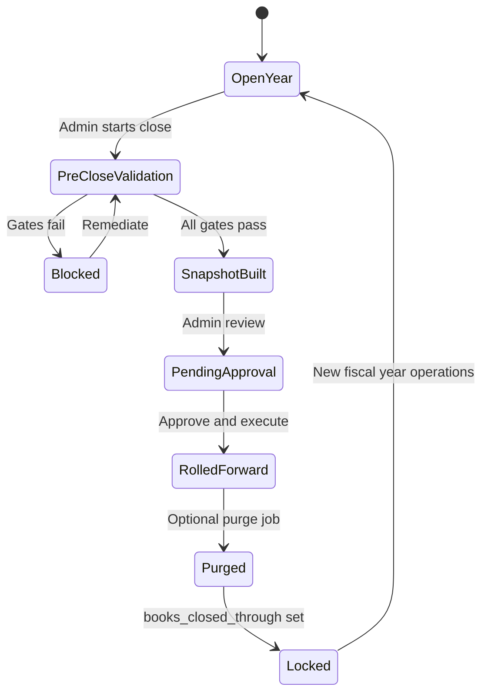

# Fiscal year-end close — design proposal

This document describes a best-practice scheme for closing financial books at a configurable fiscal year-end, optionally purging ledger detail and other historical tables, while preserving balances, arrears, active loans, and collection-engine accuracy.

It aligns with FundFlow’s existing model:

- **Pool mirrors** — master cash/fund = sum of member cash/fund (`MasterAccountInvariantService`, `MemberInvariantService`)
- **Contribution cycles** — open period, arrears, late fees (`ContributionCycleService`, `ContributionCollectionCycleService`)
- **Incremental collection** — cash-in triggers contribution and EMI collection
- **Import cut-off pattern** — `MemberOpeningBalanceService`, `contribution_arrears_cutoff_date`, `opening_*_balance` on members

**Status:** Phases 1–4 implemented (readiness, snapshot, roll-forward, books lock, Tier A/B purge, archive exports). Phase 5 (multi-year history / restore tooling) is optional follow-up.

---

## 1. Core principle: separate “state” from “history”

| Layer | Purpose after close | Purge candidate? |
|--------|---------------------|------------------|
| **Balances** (`accounts.balance`, master pool totals) | Current financial position | Never — roll forward |
| **Operational carry-forward** (unpaid contributions, pending/overdue installments, active loans) | What the collection engine must still act on | Never without re-encoding |
| **Ledger detail** (`transactions`, bank lines, audit rows) | Proof / drill-down | Yes, after snapshot |
| **Closed workflow** (accepted deposits, paid installments, posted contributions) | Historical narrative | Yes, if summarized in close snapshot |

**Rule:** Purge only after a **certified close snapshot** captures everything needed to recompute invariants without the deleted rows.

`MemberInvariantService` defines expected balances as:

```text
expected = opening_* + Σ(transactions by reference type)
```

Closing must either:

1. **Roll opening balances forward** and purge transactions (invariant still works), or
2. **Keep minimal synthetic opening legs** (one tagged entry per pool per member) and purge the rest.

Rolling forward on `members.opening_*` matches the existing CSV import cut-off pattern.

---

## 2. Configuration

Tenant settings (proposed: **Settings → Fiscal calendar**):

| Setting key | Example | Use |
|-------------|---------|-----|
| `fiscal_year_start_month` | `1` (Jan) or `7` (Jul) | Fiscal year boundary |
| `fiscal_year_start_day` | `1` | Optional; default 1st |
| `books_closed_through` | `2025-12-31` | Last date in closed books; immutable once closed |
| `current_fiscal_year_label` | `FY2025` | Display / reporting |
| `purge_policy` | `archive_then_delete` / `delete_only` / `retain_7y` | Post-close data retention |

**Business day** (`BusinessDaySettings`) drives operational “today” for collection. **`books_closed_through`** is a hard ceiling for backdated postings and for distinguishing historical vs current periods.

---

## 3. Close workflow



### Phase A — Pre-close validation (hard gates)

Block close unless all pass (or explicit waiver with audit):

1. **Pool mirrors** — `MASTER_CASH_POOL_DRIFT`, `MASTER_FUND_POOL_DRIFT` within tolerance
2. **Member drift** — no `MEMBER_CASH_DRIFT` / `MEMBER_FUND_DRIFT` for active members
3. **Open operational items** — no pending fund postings, cash-outs, or in-flight loan disbursements (configurable)
4. **Reconciliation** — no open critical reconciliation exceptions; uncleared bank lines documented or matched
5. **Contribution cycles** — every cycle ≤ close date is posted/collected or explicitly carried as arrears
6. **Loans** — active loans consistent: `amount_disbursed`, `total_repaid`, installment totals vs fund/cash legs

**Output:** Close Readiness Report (in-app checklist + exportable PDF/CSV).

### Phase B — Snapshot (immutable anchor)

Capture tenant-wide and per-member state before any purge. See [§6 Proposed schema](#6-proposed-schema).

### Phase C — Roll-forward (preserves standing)

1. **Per member** — set `opening_cash_balance` / `opening_fund_balance` to closing balances; update `opening_balances_posted_at`
2. **Optional** — post one tagged leg pair per pool (`FISCAL_CLOSE_FY2025`) via `MemberOpeningBalanceService`-style posting, or rely on balance + opening fields only if all transactions will be purged
3. **Contributions** — retain unpaid/partial/overdue rows; archive or delete fully settled rows for periods ≤ `period_end` only after snapshot
4. **Loans** — retain active loans and unpaid/overdue installments; purge paid installment history only after snapshot confirms `total_repaid` and schedule state
5. **Collection engine** — extend import cut-off guards with tenant `books_closed_through` so auto-collection never targets purged periods

### Phase D — Purge (optional, policy-driven)

Background job only after roll-forward and export complete.

| Tier | Data | Condition |
|------|------|-----------|
| **A** | `transactions` (≤ period_end), cleared `bank_transactions`, resolved `reconciliation_exceptions`, old notifications | After snapshot |
| **B** | Posted `contributions`, paid `loan_installments`, closed `fund_postings`, `fund_audit_log`, monthly statements | Export first (default) |
| **C** | `members`, `accounts`, open arrears, active `loans` + open installments, `fiscal_closes` + snapshots, settings | Never |

**Bank caveat:** Do not purge uncleared bank lines tied to pending cash-outs or deposits unless explicitly written off during close.

### Phase E — Lock

- Reject ledger postings with `transacted_at ≤ books_closed_through` (except controlled super-admin adjustment workflow)
- UI banner when books are closed and/or ledger purged
- New fiscal year runs on clean transaction table + rolled opening balances + carried arrears

---

## 4. Financial standing after close

| Question | Source after purge |
|----------|---------------------|
| Member cash / fund balance | `accounts.balance` (+ invariant vs `opening_*`) |
| Who owes contributions? | Remaining `contributions` rows + snapshot `contribution_arrears_json` |
| Loan outstanding and next EMI | Active `loans` + pending/overdue `loan_installments` |
| Delinquency / eligibility | Evaluators on carried cycles; retain counters on `members`/`loans` if history purged |
| Master pool = Σ members | Unchanged balances; nightly reconciliation |
| “What happened in FY2025?” | `fiscal_closes` export / archived GL, not live tables |

---

## 5. Alignment with existing code (reuse, don’t reinvent)

Fiscal close should extend patterns already in production—not introduce a parallel accounting model.

| Existing piece | Location | Fiscal close reuse |
|----------------|----------|-------------------|
| **Opening balance posting** | `MemberOpeningBalanceService` | Roll-forward legs and `opening_cash_balance` / `opening_fund_balance` / `opening_balances_posted_at`; pass `entry_label` such as `FISCAL_CLOSE_FY2025` (same as `IMPORT_CUTOFF` today) |
| **Per-member arrears cut-off** | `members.contribution_arrears_cutoff_date` | “Do not collect before this date”; for fully settled members at close, align with `period_end`; complement with tenant-level `books_closed_through` |
| **Pre-cutoff contribution dismissal** | `ContributionCollectionCycleService` | Safe removal/reversal of pending rows before a cut-off (`Dismissed: before contribution arrears cut-off`); model for excising pre-close rows without breaking collection state |
| **Member drift formula** | `MemberInvariantService` | Post-close regression: expected balances = `opening_*` + Σ(transactions since close); must pass after roll-forward and purge |
| **Master pool drift** | `MasterAccountInvariantService`, `ReconciliationService` | Hard gate before close; re-run after purge |
| **Pool mirror posting** | `AccountingService` (`creditMemberCashWithMasterMirror`, etc.) | Same mirror rules when posting optional fiscal opening legs; use `withoutMemberCashCollection()` during roll-forward |
| **Import cut-off on approval** | `MembershipApprovalPostingPipeline`, CSV fields on `membership_applications` | Precedent for “system takes over at date X with balances Y” |
| **Business day override** | `BusinessDay`, `BusinessDaySettings` | Close **execution** timestamp; fiscal **`period_end`** is configured calendar, not necessarily “today” |
| **Migration historical stubs** | `docs/fund_management_system_requirements.md` §4 | UNRESOLVED cycle stubs, `MIGRATION_PENDING`, late-fee suppression—analogous to carrying arrears without replaying full ledger history |
| **Bank clearance separation** | `FundPostingService`, `MemberCashOutService`, `.cursor/rules/accounting-master-member-sync.mdc` | Close must not purge uncleared bank lines tied to pending deposits/cash-outs; clearance remains a separate step |
| **Nightly reconciliation** | `ReconciliationService` | `PENDING_PAST_WINDOW_CLOSE`, pool drift codes—readiness report surfaces these before close |

**Design constraint:** Any new close logic that credits/debits member or master cash/fund must follow the same master/member mirror order and must not trigger unintended auto-collection (`member_id` on master cash legs, `onMemberCashIncreased`, etc.).

---

## 6. Proposed schema

### 6.1 Settings (`settings` table — group `fiscal`)

| Key | Type | Notes |
|-----|------|-------|
| `fiscal_year_start_month` | int 1–12 | |
| `fiscal_year_start_day` | int 1–28 | Optional |
| `books_closed_through` | date nullable | Null = books open |
| `current_fiscal_year_label` | string | e.g. `FY2025` |
| `purge_policy` | enum string | See configuration table |

### 6.2 `fiscal_closes`

Header record for each close execution.

```sql
-- Conceptual; implement via Laravel migration
fiscal_closes
  id                          bigint PK
  fiscal_year_label           varchar       -- FY2025
  period_start                date          -- inclusive
  period_end                  date          -- inclusive (books_closed_through candidate)
  status                      varchar       -- draft|validating|snapshot|pending_approval|rolled_forward|purged|failed
  readiness_report_json       json nullable -- output of FiscalCloseReadinessService
  pool_snapshot_json          json          -- master cash/fund/fees/bank totals at close
  member_count                int
  active_loan_count           int
  open_arrears_period_count   int
  export_manifest_json        json nullable -- paths/keys of generated files
  checksum                    varchar(64)   -- SHA-256 of member snapshots aggregate
  closed_by                   FK users nullable
  closed_at                   timestamp nullable
  approved_by                 FK users nullable
  approved_at                 timestamp nullable
  purge_started_at            timestamp nullable
  purge_completed_at          timestamp nullable
  purge_summary_json          json nullable -- row counts deleted per table
  failure_reason              text nullable
  created_at, updated_at
```

**Indexes:** `status`, `period_end`, unique partial on `fiscal_year_label` where status not in (`failed`).

### 6.3 `fiscal_close_member_snapshots`

One row per member per close.

```sql
fiscal_close_member_snapshots
  id                          bigint PK
  fiscal_close_id             FK fiscal_closes
  member_id                   FK members
  cash_balance                decimal(15,2)
  fund_balance                decimal(15,2)
  opening_cash_before         decimal(15,2) nullable
  opening_fund_before         decimal(15,2) nullable
  contribution_arrears_json   json          -- [{period, principal_due, late_fee_due, collection_status}]
  loans_json                  json          -- [{loan_id, outstanding, overdue_installments[], next_due}]
  delinquency_json            json nullable -- trailing/rolling misses at close
  eligibility_json            json nullable -- flags for audit
  created_at, updated_at

  UNIQUE (fiscal_close_id, member_id)
```

### 6.4 `fiscal_close_waivers` (optional)

Explicit override when a gate fails but admin proceeds.

```sql
fiscal_close_waivers
  id                bigint PK
  fiscal_close_id   FK fiscal_closes
  gate_code         varchar       -- e.g. RECON_EXCEPTION_OPEN
  reason            text
  waived_by         FK users
  created_at
```

### 6.5 Existing tables — fields reused (no migration required for v1)

| Table / field | Role in close |
|---------------|---------------|
| `members.opening_cash_balance` | Roll-forward target |
| `members.opening_fund_balance` | Roll-forward target |
| `members.opening_balances_posted_at` | Close execution timestamp |
| `members.contribution_arrears_cutoff_date` | Per-member “do not collect before”; may align with `period_end` for settled members |
| `accounts.balance` | Source of truth post-close |

### 6.6 Optional v2: `fiscal_close_archive_refs`

Pointer to cold storage (S3) for GL CSV, PDF packs.

```sql
fiscal_close_archive_refs
  id                bigint PK
  fiscal_close_id   FK fiscal_closes
  kind              varchar       -- gl_export|arrears_aging|loan_portfolio|readiness_report
  storage_disk      varchar
  storage_path      varchar
  byte_size         bigint nullable
  created_at
```

---

## 7. Service outline

### 7.1 Package layout

```text
app/
  Services/FiscalClose/
    FiscalCloseService.php              -- orchestrator
    FiscalCloseReadinessService.php     -- Phase A gates
    FiscalCloseSnapshotService.php      -- Phase B
    FiscalCloseRollForwardService.php   -- Phase C
    FiscalClosePurgeService.php         -- Phase D
    FiscalCloseExportService.php        -- GL / arrears / loan exports
    FiscalClosePeriodResolver.php       -- FY boundaries from settings
  Models/Tenant/
    FiscalClose.php
    FiscalCloseMemberSnapshot.php
    FiscalCloseWaiver.php
  Filament/Tenant/Pages/
    FiscalYearClose.php                 -- admin wizard
```

### 7.2 `FiscalClosePeriodResolver`

```php
// Responsibilities
resolveCurrentFiscalYear(): FiscalYearDefinition
resolvePeriodForLabel(string $label): { start: Carbon, end: Carbon }
nextPeriodAfter(Carbon $closedThrough): FiscalYearDefinition
assertNotClosed(Carbon $transactedAt): void  // throws if <= books_closed_through
```

Uses `Setting::get('fiscal', ...)` and `BusinessDay` where operational “today” matters.

### 7.3 `FiscalCloseReadinessService`

```php
assess(?Carbon $proposedPeriodEnd = null): FiscalCloseReadinessReport

// Gates (each returns Pass|Fail|Warn + details)
checkMasterPoolMirrors(): GateResult
checkMemberDrifts(): GateResult
checkOpenFundPostings(): GateResult
checkOpenCashOuts(): GateResult
checkReconciliationExceptions(): GateResult
checkUnclearedBankLines(): GateResult
checkContributionCycleCompleteness(Carbon $periodEnd): GateResult
checkLoanPortfolioConsistency(): GateResult

canProceed(FiscalCloseReadinessReport $report, Collection $waivers): bool
```

Delegates to existing `ReconciliationService`, `MasterAccountInvariantService`, `MemberInvariantService`.

### 7.4 `FiscalCloseSnapshotService`

```php
build(FiscalClose $close): FiscalClose

capturePoolTotals(): array
captureMemberSnapshot(Member $member, Carbon $periodEnd): FiscalCloseMemberSnapshot
computeChecksum(Collection $snapshots): string
```

Populates `fiscal_closes.pool_snapshot_json` and `fiscal_close_member_snapshots.*`.

### 7.5 `FiscalCloseRollForwardService`

```php
execute(FiscalClose $close): void

// Per member (transactional)
rollMemberOpeningBalances(Member $member, FiscalCloseMemberSnapshot $snapshot): void
// Delegates to MemberOpeningBalanceService with entry_label FISCAL_CLOSE_{label}
// Sets opening_* from snapshot; does not change accounts.balance

applyTenantBooksClosedThrough(Carbon $periodEnd): void
// Setting::set('fiscal', 'books_closed_through', ...)

pruneSettledContributions(FiscalClose $close, PurgePolicy $policy): int  // optional in Phase C or D
prunePaidInstallments(FiscalClose $close, PurgePolicy $policy): int
```

**Important:** Reuse `AccountingService::withoutMemberCashCollection()` during roll-forward posting to avoid auto-collection side effects.

### 7.6 `FiscalClosePurgeService`

```php
execute(FiscalClose $close, PurgePolicy $policy): PurgeSummary

purgeTransactionsThrough(Carbon $periodEnd): int
purgeClearedBankLinesThrough(Carbon $periodEnd): int
purgeResolvedReconciliationExceptions(): int
purgePostedContributionsThrough(Carbon $periodEnd): int   // Tier B
purgePaidLoanInstallmentsThrough(Carbon $periodEnd): int  // Tier B
// Never: members, accounts, open contributions, open installments, fiscal_closes
```

Runs in queued job with chunking; updates `fiscal_closes.purge_summary_json`.

Post-purge: run `MasterAccountInvariantService` + sample `MemberInvariantService` checks.

### 7.7 `FiscalCloseService` (orchestrator)

```php
startDraft(string $fiscalYearLabel): FiscalClose
runValidation(FiscalClose $close): FiscalCloseReadinessReport
buildSnapshot(FiscalClose $close): FiscalClose
submitForApproval(FiscalClose $close): FiscalClose
approveAndRollForward(FiscalClose $close, User $approver): FiscalClose
schedulePurge(FiscalClose $close): void
cancel(FiscalClose $close): void  // only if not rolled_forward
```

State machine enforced on `fiscal_closes.status`.

### 7.8 `FiscalCloseExportService`

```php
exportGl(FiscalClose $close): string           // storage path
exportArrearsAging(FiscalClose $close): string
exportLoanPortfolio(FiscalClose $close): string
exportReadinessReport(FiscalClose $close): string
```

Called after snapshot, before purge.

### 7.9 Integration hooks (existing services)

| Service | Change |
|---------|--------|
| `AccountingService::debit/credit` | Call `FiscalClosePeriodResolver::assertNotClosed($transactedAt)` when set |
| `ContributionCollectionCycleService` | Skip periods ≤ `books_closed_through` (tenant) in addition to member cut-off |
| `LoanInstallmentCollectionService` | Same period ceiling for auto-collection |
| `MemberOpeningBalanceService` | Accept `entry_label` e.g. `FISCAL_CLOSE_FY2025` (already supports label param) |
| `FundAuditLogService` | Log `FISCAL_CLOSE_*` events |

---

## 8. Admin UX (high level)

### 8.1 Settings — Fiscal calendar

**Path:** Tenant admin → **Settings → General** (or dedicated **Fiscal calendar** section)

| Control | Purpose |
|---------|---------|
| Fiscal year start month / day | Defines FY boundaries for labels and readiness reports |
| Current fiscal year label | Display (e.g. `FY2025`) |
| Books closed through | Read-only once set; shows last closed period |
| Purge policy | Default retention behavior after close |

Optional: link to **Business calendar** (`BusinessDaySettings`) with helper text explaining the difference—business day drives collection “today”; fiscal calendar drives book lock and purge scope.

### 8.2 Year-end close wizard

**Path:** Tenant admin → **Accounting → Year-end close** (new Filament page: `FiscalYearClose`)

| Step | Admin action | System behavior |
|------|--------------|-----------------|
| 1 | Select fiscal year / confirm `period_end` | `FiscalClosePeriodResolver` computes inclusive start/end |
| 2 | Run readiness checks | Live checklist from `FiscalCloseReadinessService`; failures link to reconciliation, deposits, cash-outs, etc. |
| 3 | Preview snapshot | Compare pool totals and sample members vs live `accounts.balance` |
| 4 | Download exports | GL CSV, arrears aging, loan portfolio, readiness PDF via `FiscalCloseExportService` |
| 5 | Approve | Optional second approver; record `approved_by` / `approved_at` |
| 6 | Execute roll-forward | `FiscalCloseRollForwardService`; set `books_closed_through` |
| 7 | Schedule purge (optional) | Confirm tier A/B per `purge_policy`; queued job with progress |

**UX patterns:** Match existing operational pages (contributions apply, reconciliation)—confirmation modals for irreversible steps, disabled purge until exports exist, clear “blocked” state with waiver flow for exceptional gates.

### 8.3 Post-close visibility

- **Admin / member panel banner** when `books_closed_through` is set (similar to `partials/business-day-banner.blade.php`)—e.g. “Books closed through 31 Dec 2025; historical ledger archived.”
- **Close history** — read-only list of `fiscal_closes` with status, checksum, export download links, purge summary.
- **Member profile** — optional read-only “Opening balances (FY close)” showing rolled `opening_*` and close date (no member-facing purge).

### 8.4 Audit trail

Every state transition writes to:

- `fiscal_closes` status fields and `failure_reason`
- `FundAuditLogService` — events such as `FISCAL_CLOSE_VALIDATED`, `FISCAL_CLOSE_SNAPSHOT`, `FISCAL_CLOSE_ROLLED_FORWARD`, `FISCAL_CLOSE_PURGE_COMPLETED`
- `fiscal_close_waivers` when gates are overridden with documented reason

Purge job logs **row counts per table** in `purge_summary_json` for forensic review.

---

## 9. Testing strategy

| Test | Assert |
|------|--------|
| Readiness blocks on pool drift | Close cannot proceed |
| Snapshot matches live balances | Checksum stable |
| Roll-forward + purge Tier A | `MemberInvariantService` passes with opening + new-year txs only |
| Arrears retained | Unpaid contribution still collectable after close |
| Open loan EMI | Pending installment still collectable |
| Backdated posting rejected | `transacted_at <= books_closed_through` fails |
| Purge does not delete open bank uncleared | Gate or explicit write-off required |

Feature tests under `tests/Feature/Tenant/FiscalClose/` using `InitializesTenancy`.

---

## 10. Implementation phases (when you’re ready)

Implement incrementally. Do **not** ship purge until roll-forward and invariants are proven in production-like tests.

| Phase | Deliverable | Outcome | Risk |
|-------|-------------|---------|------|
| **1 — Readiness only** | Fiscal settings; `FiscalCloseReadinessService`; Close Readiness Report UI; no mutations | Admins can see whether the tenant *could* close safely | **Low** |
| **2 — Snapshot + roll-forward** | Migrations for `fiscal_closes` / snapshots; `FiscalCloseSnapshotService`, `FiscalCloseRollForwardService`; `books_closed_through` lock in `AccountingService` | Certified close with opening roll-forward; ledger retained | **Medium** |
| **3 — Purge Tier A** | `FiscalClosePurgeService` for `transactions`, cleared bank lines, resolved exceptions; invariant tests post-purge | Smaller DB; live balances unchanged | **High** |
| **4 — Purge Tier B + exports** | Archive posted contributions, paid installments, closed fund postings; mandatory export manifest | Full year-end hygiene with offline archive | **High** |
| **5 — History & restore (optional)** | Multi-year `fiscal_closes` list; documented restore-from-export procedure (manual, not auto-replay) | Long-term compliance and audit | **Optional** |

**Suggested order of work**

1. Phase 1 — unblocks operational review without risk.
2. Phase 2 — first “real” close on a staging tenant; verify `MemberInvariantService` / `MasterAccountInvariantService` before and after.
3. Phase 3 — only after at least one successful close with exports stored.
4. Phase 4 — only if storage/retention policy requires deleting Tier B rows.

**Exit criteria per phase**

- **Phase 1:** All readiness gates runnable; report exportable; zero data mutation.
- **Phase 2:** Roll-forward idempotent; backdated posting blocked; arrears and open EMIs still collectable.
- **Phase 3:** Post-purge pool mirrors hold; sample of members pass drift check with `opening_*` + new-year txs only.
- **Phase 4:** Export manifest complete before any Tier B delete; purge summary auditable.

---

## 11. Risks and explicit non-goals

### 11.1 Risks

| Risk | Impact | Mitigation |
|------|--------|------------|
| Purge before snapshot | Unrecoverable loss of proof; broken invariants | State machine: snapshot required before roll-forward; exports before purge |
| Delete unpaid contribution rows | Collection engine “forgets” arrears | Tier C never purged; snapshot `contribution_arrears_json`; keep pending/overdue rows |
| Delete unpaid / overdue installments | EMI auto-collection targets wrong periods | Keep open installments; snapshot `loans_json` |
| Purge uncleared bank lines | Breaks deposit/cash-out clearance | Readiness gate; explicit write-off workflow |
| Purge paid installment history | Loan eligibility / late-payment counters wrong | Snapshot delinquency/eligibility; retain `late_repayment_count` on `loans`/`members` or encode in snapshot |
| Roll-forward triggers auto-collection | Unexpected debits on close day | `AccountingService::withoutMemberCashCollection()` during roll-forward |
| FY boundary vs contribution cycle | Confusion on which periods are “open” | Readiness report documents overlap; tenant `books_closed_through` + existing open-period logic |
| Hard delete vs archive | Compliance failure | Default `purge_policy = archive_then_delete` |

### 11.2 Anti-patterns (do not do)

- **Big bang purge** — deleting transactions without per-member opening roll-forward.
- **Balance reset** — zeroing `accounts.balance` and reposting everything; causes visible jumps and breaks bank clearance links.
- **Regenerating loan schedules** after close — carry forward remaining installments only.
- **Silent close** — no export, no checksum, no audit log entries.
- **Member-level close only** — fiscal close is tenant-wide; per-member cut-off remains a separate concept (`contribution_arrears_cutoff_date`).

### 11.3 Explicit non-goals (v1)

| Non-goal | Notes |
|----------|-------|
| Full double-entry GL with retained journal numbers across years | Exports provide external GL; live table is operational sub-ledger |
| Automatic unattended close | Always requires admin validation and approval |
| Cross-tenant consolidation | Single-tenant scope only |
| Auto-replay from export into live ledger | Restore is manual / forensic, not production workflow |
| Rewriting historical contribution cycle stubs | Use carry-forward rows + snapshot, not regeneration from ledger |
| Purging active members, accounts, or open loans | Tier C forbidden |

---

## 12. Recommendation

Treat **fiscal year-end close as a tenant-wide import cut-off**—the same conceptual move as CSV migration (`MemberOpeningBalanceService`, `contribution_arrears_cutoff_date`), applied once per fiscal year for the whole fund.

**Recommended close sequence**

1. **Validate** — pool and member invariants; no blocking operational items (or documented waivers).
2. **Snapshot** — balances, arrears, loan state, checksum; export GL and reports.
3. **Roll forward** — update `opening_*` on each member (and optionally one tagged `FISCAL_CLOSE_*` mirrored leg per pool); set `books_closed_through`.
4. **Purge** — ledger detail only, under policy, never operational carry-forward (Tier C).
5. **Lock** — reject backdated postings; new fiscal year runs on a clean transaction spine plus rolled openings and carried arrears.

This yields a smaller database and faster ledgers while keeping contributions, loans, repayments, arrears, delinquency, and eligibility behavior consistent with how the application already models money.

**Default policy choices (see §13 for alternatives)**

- Fiscal year: **calendar month/day** (Phase 1).
- Purge: **Standard** — Tier A + B with mandatory `archive_then_delete`.
- Opening legs: **One leg per pool per member** via `MemberOpeningBalanceService`; optional balance-only mode for tenants that do not need residual transaction rows.

When implementation starts, confirm §13 explicitly; then build Phase 1 readiness before any mutating close logic.

---

## 13. Policy decisions required before implementation

Confirm these three choices to finalize migrations and service contracts:

### 13.1 Fiscal year definition

| Option | Description |
|--------|-------------|
| **A — Calendar** | `fiscal_year_start_month` / `day` (e.g. 1 Jan – 31 Dec) |
| **B — Contribution-aligned** | FY boundary aligned to `contribution.cycle_start_day` |
| **C — Hybrid** | Calendar label, but collection “open period” may span FY boundary with explicit rules |

**Recommendation:** Start with **A**; document overlap with contribution cycles in readiness report.

### 13.2 Purge aggressiveness

| Option | Description |
|--------|-------------|
| **Conservative** | Tier A only (transactions + cleared bank); retain posted contributions and paid installments |
| **Standard** | Tier A + B with mandatory export archive |
| **Aggressive** | Tier B delete without archive (not recommended for production) |

**Recommendation:** **Standard** with `archive_then_delete` default.

### 13.3 Synthetic opening legs

| Option | Description |
|--------|-------------|
| **Balance-only** | Update `opening_*` and purge all transactions; invariant uses opening + post-close txs only |
| **One leg per pool** | Post single `FISCAL_CLOSE_*` mirrored leg per member via `MemberOpeningBalanceService`; purge rest |
| **Full retain opening legs** | Keep all opening/cut-off legs forever; purge only non-opening transactions |

**Recommendation:** **One leg per pool** for easier debugging and alignment with `MemberInvariantService` component sums; optional **balance-only** mode for tenants that never drill into ledger detail.

---

## 14. Reference implementations in codebase

See also [§5 Alignment with existing code](#5-alignment-with-existing-code-reuse-dont-reinvent) for the full reuse matrix.

| Flow | Service / doc | Pattern |
|------|---------------|---------|
| CSV import cut-off balances | `MemberOpeningBalanceService` | Signed pool mirrors on member + master |
| Arrears cut-off | `ContributionCollectionCycleService` | Skip / dismiss pre-cutoff periods |
| Member drift formula | `MemberInvariantService` | `opening_*` + transaction components |
| Master pool drift | `MasterAccountInvariantService` | Nightly batch |
| Migration stubs | `docs/fund_management_system_requirements.md` §4 | Historical cycle handling — analogous to fiscal carry-forward |

---

## 15. Should we proceed with implementation?

**Yes — but incrementally, not as one big release.**

### 15.1 Recommendation

**Proceed with Phase 1 only** (fiscal settings + readiness report + wizard shell, **no mutations, no purge**). That is low risk, validates the design against real tenant data, and forces resolution of open policy questions (§13) before anything irreversible.

**Do not proceed yet with Phases 2–4** (roll-forward, lock, purge) until:

1. **Policy choices in §13 are confirmed** — especially FY definition, purge tier, and synthetic opening legs.
2. **Operational stability is solid** — business day, collection timing, deposit dates, and reconciliation should be stable in production first; fiscal close amplifies any drift or date bugs.
3. **At least one staging tenant** can run readiness with zero drift, no blocking deposits/cash-outs/recon exceptions, and realistic arrears/loan data.

### 15.2 Why Phase 1 now

- Surfaces whether close is even feasible for a tenant today (pool drift, open items, cycle gaps).
- Reuses existing services (`MemberInvariantService`, `MasterAccountInvariantService`, `MemberOpeningBalanceService`) without changing ledger data.
- Gives admins visibility before committing to purge semantics.

### 15.3 Why not full implementation yet

- **Purge is high-risk and irreversible** — wrong cut-off or deleted arrears/installment rows breaks collection and eligibility.
- **Cross-cutting hooks** — `books_closed_through` must be enforced everywhere money moves (`AccountingService`, contribution/EMI collection, backdated postings).
- **Compliance/audit** — export and archive strategy should be agreed before Tier B deletes anything.

### 15.4 Practical sequence

```text
Now        → Phase 1 (readiness UI + report)
Next       → Confirm §13 policies with stakeholders
Then       → Phase 2 on staging (snapshot + roll-forward, keep all history)
Only after → Phase 3/4 purge, with exports mandatory and invariant tests green
```

### 15.5 Bottom line

Treat full fiscal close as a **major accounting feature**, not a housekeeping task. If no tenant needs year-end close in the next few months, Phase 1 still pays off as a periodic health check; defer Phases 2–4 until there is a concrete close date and a signed-off retention policy.

**Suggested first ticket:** Fiscal calendar settings + `FiscalCloseReadinessService` + Filament report page (read-only).

---

## 16. Related documents

- [Fund management system requirements](./fund_management_system_requirements.md) — migration cut-off, opening balances
- [Collection cycle workflow](./collection_cycle_workflow.md) — phases and invariants
- [Fund flow implementation](./fund-flow-implementation.md) — bank mirror and clearance
- Accounting master/member sync rule — `.cursor/rules/accounting-master-member-sync.mdc`
