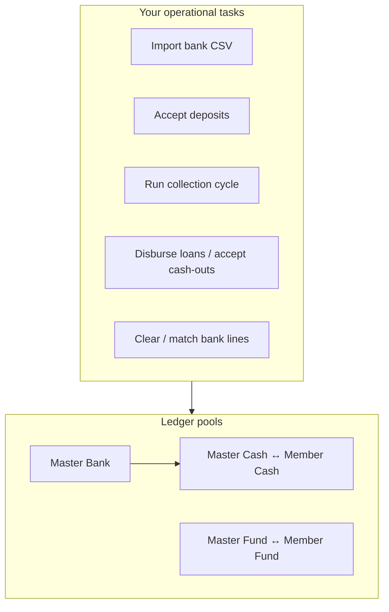
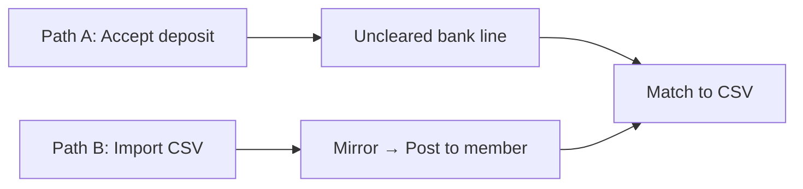
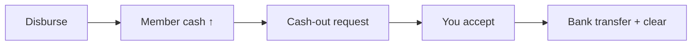

# FundFlow — Admin Operations Guide (Fund Flow)

**One page · For tenant administrators**

---

## System overview

Every member action that touches cash or fund must keep **master and member pools in sync**. Nightly reconciliation checks this.

---

## Money in — two admin paths

| Path | When to use | Your steps |
|------|-------------|------------|
| **A — Fund posting** | Member reported a deposit | Fund Postings → **Accept** → later **Clear/Match** to bank CSV |
| **B — Bank first** | You have the statement CSV | Import → **Mirror to cash** → **Post to member** |

**Rule:** Do not double-count the same deposit (manual bank credit + import for the same money).

---

## Collection cycle (monthly)

| Phase | Admin action |
|-------|----------------|
| Open cycle | Contributions created; members notified |
| Collection window | Auto-debit runs when member cash increases |
| After due date | Late fees; delinquency flags |
| Close | Reconcile exceptions |

**On collection:** Member cash ↓, master cash ↓ (mirror), member fund ↑, master fund ↑ (mirror).

Deposits trigger **immediate re-collection** if a contribution or EMI is outstanding.

---

## Loans & cash-outs

### Disbursement (your approve action)

| Step | Ledger effect |
|------|----------------|
| Disburse loan | Fund debited (member + pool portions); **cash credited** to member |
| Member cashes out | **Separate step** — not automatic at disbursement |

### Cash-out (your accept action)

| Step | Ledger effect |
|------|----------------|
| Accept cash-out | Member + master **cash debited**; **uncleared** bank line created |
| Clear/match later | Link to imported bank debit — **no extra ledger entries** |

---

## Loan repayments

Imported or live payments: **credit cash (mirror in) → debit cash (collection) → credit fund → credit loan account**.

Schedule sync runs after bulk legacy imports. Fully **member-fund** loans (no pool slice) complete with **no EMI schedule**.

---

## Admin checklist by function

| Task | Cash | Fund | Bank |
|------|------|------|------|
| Accept deposit | CR member + master | — | Uncleared → match |
| Import & mirror | CR master cash | — | CR master bank |
| Post to member | CR member | — | — |
| Contribution collected | DR member + master | CR member + master | — |
| Disburse loan | CR member + master | DR member + master | — |
| Accept cash-out | DR member + master | — | Uncleared → match |
| Post repayment | CR/DR pair on cash | CR member + master | — |

---

## Reconciliation signals

| Exception | Meaning | Typical fix |
|-----------|---------|-------------|
| Master cash pool drift | Master cash ≠ sum of member cash | Rebuild balances; check unpaired legs |
| Master fund pool drift | Master fund ≠ sum of member fund | Same |
| Uncleared bank lines | Ledger intent without bank proof | Import CSV and clear/match |
| Pending past window | Contribution still uncollected after due | Follow up with member |

---

## Slide outline (presentation)

1. **Title** — Admin fund flow in FundFlow  
2. **Two pools** — Cash and fund; master = sum of members  
3. **Deposits** — Path A vs Path B  
4. **Collection** — Cycle phases and auto-debit  
5. **Loans** — Disburse → cash → cash-out → clear  
6. **Repayments** — Import and schedule sync  
7. **Reconciliation** — What to watch and fix  
8. **Do / Don’t** — No double-counting; clearance ≠ new ledger  

---

*Full technical reference: [fund-flow-dynamics.md](./fund-flow-dynamics.md)*
