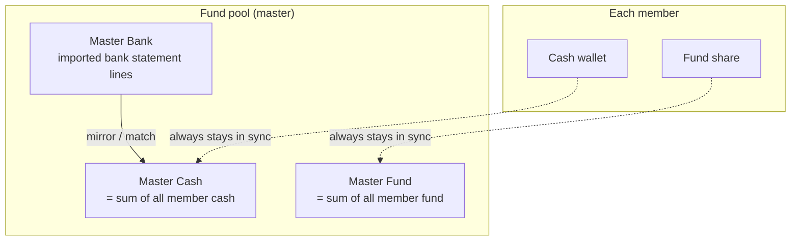
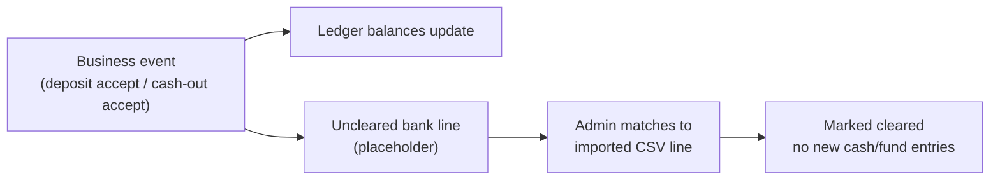
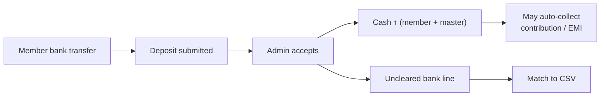
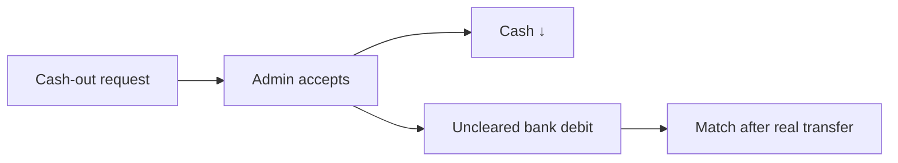
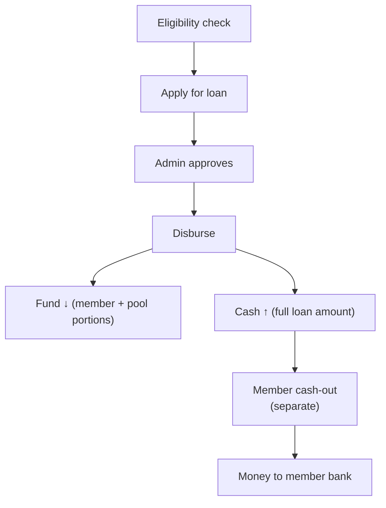
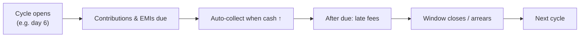

# FundFlow User Guide

**Who this is for:** members and fund administrators
**What it covers:** how money is structured, how it moves for every major feature, and how to operate the member portal and the admin portal day to day.

Use this as the single handbook to share with your fund’s users. Technical repair manuals for accountants remain separate.

---

## Table of contents

1. [Big picture](#1-big-picture)
2. [Accounting structure](#2-accounting-structure)
3. [How money flows (all features)](#3-how-money-flows-all-features)
4. [The monthly collection cycle](#4-the-monthly-collection-cycle)
5. [Member portal operation manual](#5-member-portal-operation-manual)
6. [Admin portal operation manual](#6-admin-portal-operation-manual)
7. [Settings that affect money](#7-settings-that-affect-money)
8. [Quick reference tables](#8-quick-reference-tables)
9. [Common questions](#9-common-questions)

---

## 1. Big picture

FundFlow keeps track of two kinds of money for every member:

| Balance        | Everyday meaning                   | Used for                                            |
| -------------- | ---------------------------------- | --------------------------------------------------- |
| **Cash** | Wallet — money available now      | Contributions, loan payments, cash-out to your bank |
| **Fund** | Your share of the cooperative pool | Builds equity; used when you borrow                 |

The fund also keeps **master** (pool-wide) cash and fund balances. Those must always equal the **sum of all members’** cash and fund balances.

**Three ideas to remember**

1. **Ledger vs bank** — Accepting a deposit or cash-out updates the ledger (balances). Matching an imported bank line later only proves the transfer happened; it does **not** move money a second time.
2. **Cash-in often auto-settles** — When cash increases, the system can immediately collect a due contribution or loan installment.
3. **Loan cash is not a bank payout** — Disbursement credits the member’s cash wallet. Sending money to the member’s real bank is a separate **cash-out**.

---

## 2. Accounting structure

### 2.1 Chart of accounts (plain language)

| Account                                      | Who sees it    | Purpose                                                     |
| -------------------------------------------- | -------------- | ----------------------------------------------------------- |
| **Member Cash**                        | Member + admin | Spendable balance                                           |
| **Member Fund**                        | Member + admin | Equity in the pool (can go negative while a loan is active) |
| **Member Loan**                        | Member + admin | Tracks principal on an active loan                          |
| **Master Cash**                        | Admin          | Pool cash on hand (= sum of member cash)                    |
| **Master Fund**                        | Admin          | Pool equity (= sum of member fund)                          |
| **Master Bank**                        | Admin          | Control account for imported bank statement lines           |
| **Master Fees**                        | Admin          | Fee income (late fees, membership / subscription fees)      |
| **Master Expense / Invest / Suspense** | Admin          | Operating expense, investments, and clearing / exceptions   |

### 2.2 Mirror rule (why every move has two sides)

When a member’s cash or fund changes for a pool event, the matching **master** account changes by the same amount in the same journal.

**Example — contribution of 1,000 collected**

| Step | Account     | Effect           |
| ---- | ----------- | ---------------- |
| 1    | Member Cash | −1,000          |
| 2    | Master Cash | −1,000 (mirror) |
| 3    | Member Fund | +1,000           |
| 4    | Master Fund | +1,000 (mirror)  |

Cash left the wallet and became fund equity. Pool totals stay consistent.

### 2.3 Bank clearance is a separate step

---

## 3. How money flows (all features)

### 3.1 Deposit (member reports money sent to the fund)

**Typical path**

1. Member transfers money to the fund’s bank account.
2. Member submits a **deposit** in the portal (amount, date, reference / attachment).
3. Admin **accepts** → Member Cash ↑ and Master Cash ↑.
4. Later, admin **clears / matches** the uncleared line to the bank CSV.

**Example:** Nora deposits 2,000. After accept, her cash is 2,000. If she owes a 500 contribution, the system can collect it immediately → cash 1,500, fund +500.

**Alternate admin path (bank first):** Import CSV → **Mirror to cash** (Master Bank + Master Cash) → **Post to member** (Member Cash). Do **not** also accept a deposit for the same money.

### 3.2 Monthly contribution

Standing monthly amount is chosen by the member (or set by admin) from electable tiers (defaults **500 to 10,500 in steps of 500**; minimum, step, and maximum are configurable in Settings).

When collected for a cycle:

- Cash ↓ (member + master)
- Fund ↑ (member + master)

**Open-cycle amount request:** Member can ask to raise **this cycle only** above the standing amount. Admin approval changes the cycle’s due amount; standing allocation for future cycles stays the same.

### 3.3 Late fees and annual / membership fees

| Fee                                      | Effect                                                     |
| ---------------------------------------- | ---------------------------------------------------------- |
| Contribution or EMI late fee             | Cash ↓ (member + master) →**Master Fees** ↑       |
| Membership application fee (on approval) | Cash credited then fee taken to Master Fees (no bank line) |
| Annual subscription fee                  | Cash ↓ → Master Fees ↑                                  |

### 3.4 Cash-out (withdraw to personal bank)

1. Member requests cash-out (only available cash; amounts reserved for due EMI may be blocked).
2. Admin accepts → Cash ↓ (member + master) + uncleared bank debit line.
3. Admin pays the member and **matches** the line to the bank statement.

### 3.5 Cash transfer (household / peer)

Parent can fund a dependent’s cash wallet (or transfer between members when policy allows). Cash moves between members with matching master mirrors so pool totals stay correct.

**Example:** Parent sends 1,000 to a dependent → parent cash −1,000, dependent cash +1,000 (master cash unchanged overall).

### 3.6 Loans

| Stage                 | What happens                                                                                                                    |
| --------------------- | ------------------------------------------------------------------------------------------------------------------------------- |
| **Apply**       | Member checks eligibility and submits                                                                                           |
| **Approve**     | Admin reviews; may use loan queue / tiers                                                                                       |
| **Disburse**    | Fund equity is used (member portion + pool portion). Full amount is credited to**member cash**. No automatic bank payout. |
| **Cash-out**    | Member withdraws cash to their bank when ready                                                                                  |
| **Repay (EMI)** | Deposits raise cash; system collects installment: cash ↓, fund ↑, loan balance ↓                                             |
| **Complete**    | Loan marked completed; guarantor may be released                                                                                |

**Repayment idea (simple):** You repay the **pool’s share** of the loan (plus any settlement rule the fund configured). The part funded from your own fund equity at disbursement is already your equity — it is not collected again as EMI in the same way.

**Guarantors:** If a borrower defaults, the system may debit the guarantor’s fund and/or top up the borrower’s cash from the guarantor so installments can be collected. Guarantors can view loans they guarantee in the member portal.

**Admin loan transfer:** Admin can reassign a loan to another member (remaining obligation or full unwind + redisburse), depending on the transfer mode.

### 3.7 Bank import and clearing

| Step           | Result                                                                        |
| -------------- | ----------------------------------------------------------------------------- |
| Import CSV     | Statement lines appear as**imported**                                   |
| Mirror to cash | Master Bank and Master Cash move together                                     |
| Post to member | Member Cash updated (master already mirrored)                                 |
| Clear / Match  | Links ledger intent to a statement line                                       |
| Post as…      | Admin can classify a line (deposit, cash-out, expense, fee, investment, etc.) |

SMS bank clearing (if enabled) is an alternate inbound channel that can post to cash similarly.

### 3.8 Opening balances (new / migrated members)

On membership approval, cut-off cash and fund opening amounts can be posted to member + master cash/fund. These do **not** create bank statement lines.

### 3.9 Manual adjustments (admin only)

Admins can credit, debit, or refund on accounts when repairing or adjusting. Prefer paired cash/fund tools that keep master and member in sync. Nightly reconciliation flags unpaired drift.

### 3.10 Reserves (admin only)

Master Fund can move to expense, fees, or investment reserves (and back). Investment returns and check-style disbursements from reserves are admin Finance actions.

### 3.11 Membership status and leave

| Action                     | Notes                                                           |
| -------------------------- | --------------------------------------------------------------- |
| Freeze / unfreeze          | Pause membership (requests or admin)                            |
| Withdraw / leave           | Voluntary exit; settlement may include fund→cash then cash-out |
| Reinstate / release payout | Admin-controlled return or payout release                       |

---

## 4. The monthly collection cycle

| Concept                        | Meaning                                                                          |
| ------------------------------ | -------------------------------------------------------------------------------- |
| **Cycle start day**      | Configurable (often the 6th). Period runs until the day before the next start.   |
| **Open cycle**           | Current period members are collecting for                                        |
| **Standing allocation**  | Member’s usual monthly contribution amount                                      |
| **Pending / overdue**    | Not yet fully collected                                                          |
| **Arrears**              | Older unpaid periods (often settled oldest-first when cash arrives)              |
| **Exemption / grace**    | Some members or loan phases skip contribution for a period by policy             |
| **Household settlement** | Parent cash can cover dependents’ contributions and EMIs first, then the parent |

**Automation** (when enabled): init cycle, apply collections, close window, late fees, EMI close, bank auto-match, nightly reconciliation, and status digests run on a schedule under **Audit & System → Automation**.

---

## 5. Member portal operation manual

**URL:** `https://<your-fund-domain>/member`

### 5.1 Sign in

1. Open the member login page.
2. Enter email and password.
3. Household profiles: sign in with the household email, pick your profile, then confirm with that profile’s password or PIN.
4. Separated dependents (own email) sign in directly with their email.

If status is inactive, withdrawn, or otherwise blocked, contact the fund office.

Use the **language switch** for English / Arabic where supported.

### 5.2 Navigation map

| Area                              | What you do there                                                              |
| --------------------------------- | ------------------------------------------------------------------------------ |
| **Overview**                | Balances, dues, shortcuts                                                      |
| **Cash account**            | Wallet balance and cash ledger                                                 |
| **Fund account**            | Fund share and fund ledger                                                     |
| **Contributions**           | Cycle dues, status, late fees                                                  |
| **Loans**                   | Your loans, installments, settle / pay actions                                 |
| **Apply for loan**          | Eligibility and application                                                    |
| **Guaranteed loans**        | Loans you guarantee for others                                                 |
| **Loan calculator**         | Estimate amounts before applying                                               |
| **Deposits**                | Report money you sent to the fund                                              |
| **Cash out**                | Request withdrawal to your bank                                                |
| **Cash transfer**           | Move cash to a dependent (or peer if allowed)                                  |
| **Dependents**              | Household members, allocations, funding                                        |
| **Statements**              | Monthly statements                                                             |
| **Activity / transactions** | Recent movements                                                               |
| **Requests**                | Membership, allocation, open-cycle amount, freeze, leave, independence, payout |
| **Messages**                | Chat with administrators                                                       |
| **Settings / profile**      | Contact details, standing contribution amount, notifications                   |

### 5.3 Everyday member workflows

#### Report a deposit

1. Transfer money to the fund bank account (details from admin / public page).
2. **Deposits → New** — amount, date, reference or proof.
3. Wait for admin accept. Watch **Cash** rise; dues may auto-collect.

#### Change standing contribution

1. **Settings** (or contribution settings) — choose an allowed amount (e.g. 500, 1,000, … up to the fund maximum).
2. Some changes may require admin approval as a **request**, depending on fund policy.

#### Ask for a larger amount this cycle only

1. From **Contributions** or settings, request an **open-cycle** amount above your standing allocation.
2. Admin approves → this cycle’s due rises; future cycles keep your standing amount.

#### Request a cash-out

1. Ensure cash is available (after dues / EMI holds).
2. **Cash out → New** — amount and bank details if required.
3. Wait for admin accept and bank transfer.

#### Apply for a loan

1. Check eligibility (fund balance, membership length, arrears rules).
2. **Apply for loan** — amount, purpose, guarantors if required.
3. After approval and disbursement, cash rises; submit a **cash-out** when you want the bank transfer.

#### Manage dependents

1. **Dependents** — request add/remove, set monthly allocation, fund their cash.
2. Parent cash can settle dependents’ dues automatically when collections run.

#### Communicate and track requests

- **Messages** for questions and admin replies.
- **Requests** for formal items (leave fund, freeze, independence, allocation, open-cycle amount).
- **Statements** for monthly PDF / history.

### 5.4 What members cannot do

- Import or match bank statements
- Touch master accounts or manual ledger repairs
- Disburse loans or accept their own cash-outs
- Change fund-wide settings

---

## 6. Admin portal operation manual

**URL:** `https://<your-fund-domain>/admin` (tenant panel)

### 6.1 Navigation map

#### Operations

| Area                     | Purpose                                                                             |
| ------------------------ | ----------------------------------------------------------------------------------- |
| **Applications**   | Approve / reject membership; opening balances and application fees post on approval |
| **Members**        | Profiles, accounts, status, dependents, fees, manual adjustments                    |
| **Contributions**  | Open cycle, generate / collect, arrears, exemptions, late fees                      |
| **Loans**          | Approve, reject, disburse, repay, settle, transfer                                  |
| **Loan queue**     | Priority and projection workbench                                                   |
| **Disbursements**  | Disbursement-focused ops                                                            |
| **Delinquency**    | Arrears, defaults, guarantor actions, digests                                       |
| **Deposits**       | Accept / reject member fund postings                                                |
| **Cash outs**      | Accept / reject withdrawals                                                         |
| **Cash transfers** | Approve member transfers                                                            |
| **Requests**       | Review member requests (allocation, open-cycle, freeze, leave, etc.)                |
| **Statements**     | Generate / view monthly statements                                                  |
| **Support**        | Support tickets                                                                     |

#### Finance

| Area                        | Purpose                                          |
| --------------------------- | ------------------------------------------------ |
| **Bank clearing**     | Import CSV, mirror, post, match / clear, post-as |
| **Bank SMS clearing** | SMS-based inbound clearing (if used)             |
| **Transactions**      | Full ledger browser                              |
| **Member accounts**   | Per-member cash / fund / loan                    |
| **Master accounts**   | Pool accounts and reserve actions                |
| **Reconciliation**    | Exceptions, drift, reports                       |
| **Reports**           | Operational / financial reports                  |
| **Year-end close**    | Fiscal close readiness                           |

#### System

| Area                                  | Purpose                                                                                           |
| ------------------------------------- | ------------------------------------------------------------------------------------------------- |
| **Settings**                    | Cycle day, contribution tiers, fees, loans, guarantors, bank templates, statements, notifications |
| **Audit & System / Automation** | Job schedule, re-runs, logs                                                                       |
| **Communications**              | Announcements, templates, messages                                                                |
| **Legacy migration**            | CSV import of historical data                                                                     |

### 6.2 Daily / weekly admin workflows

#### A. Membership approval

1. **Applications** → review documents and fees.
2. Approve → member + accounts created; opening balances and application fee may post.
3. Link household parent if needed; set standing contribution.

#### B. Deposits and cash-outs

1. **Deposits** → Accept (cash ↑) or Reject.
2. **Cash outs** → Accept when bank transfer is ready (cash ↓ + uncleared line).
3. **Bank clearing** → Match uncleared lines to CSV.

**Rule:** One economic event, one cash credit/debit. Do not accept a deposit **and** post the same CSV line as a second credit.

#### C. Bank statement processing

1. Import CSV (correct template).
2. Mirror relevant lines to cash **or** match them to existing uncleared deposit/cash-out lines.
3. Post unmatched inflows to the correct member when using the bank-first path.
4. Ignore noise lines; use **Post as** for expense / fee / investment classifications.

#### D. Collection cycle

1. Confirm cycle open (automation or manual init).
2. Watch **Contributions** for pending / overdue.
3. Encourage deposits; auto-apply collects when cash arrives (if enabled).
4. After due date: late fees and delinquency review.
5. Clear reconciliation exceptions after close.

#### E. Loans

1. Review eligibility and guarantors.
2. Approve → Disburse (cash credited to member).
3. Remind member to cash-out if they need a bank transfer.
4. Monitor EMI collection and delinquency; use guarantor tools if policy requires.

#### F. Reconciliation checklist

| Signal                        | Meaning                             | Typical action                                    |
| ----------------------------- | ----------------------------------- | ------------------------------------------------- |
| Master cash / fund pool drift | Master ≠ sum of members            | Find unpaired posting; rebuild balances if needed |
| Member cash / fund drift      | Stored balance ≠ component formula | Inspect ledger; repair with proper reverse tools  |
| Uncleared bank lines          | Ledger without bank proof           | Import and match                                  |
| Pending past window           | Contribution still open after due   | Follow up with member                             |

#### G. Communications and digests

- Send announcements and direct messages from **Communications**.
- Fund status digests (if enabled) summarize arrears and open items for admins.

### 6.3 Admin do / don’t

| Do                                             | Don’t                                                       |
| ---------------------------------------------- | ------------------------------------------------------------ |
| Keep master and member cash/fund paired        | Credit master cash alone for a member deposit                |
| Match bank lines after ledger accept           | Re-post the same deposit on match                            |
| Disburse loan to cash, then cash-out           | Assume disbursement already sent money to the member’s bank |
| Use Settings for cycle day, tiers, and fees    | Hard-code one-off amounts that break policy                  |
| Investigate reconciliation exceptions promptly | Delete raw transactions without reverse tools                |

---

## 7. Settings that affect money

Configure under **Admin → Settings** (and Automation for clocks).

| Setting area                            | What it controls                                                        |
| --------------------------------------- | ----------------------------------------------------------------------- |
| **Cycle start day**               | When each contribution period opens                                     |
| **Standing contribution amounts** | Minimum, denomination step, and maximum electable monthly amount |
| **Partial collection** | Whether short cash may partially settle open-cycle, arrears, or delinquent members (contributions + EMI) |
| **Late fee tiers**                | Days and amounts for contribution and EMI late fees                     |
| **Delinquency thresholds**        | Missed-cycle rules that flag members / block loans                      |
| **Annual subscription fee**       | Yearly fee from cash to Master Fees                                     |
| **Public membership fees**        | New / resume / renew application fees                                   |
| **Loan rules**                    | Eligibility, max amount, funding split, settlement %, guarantors, grace |
| **Fund / loan tiers**             | Tier tables for limits and products                                     |
| **Automation schedule**           | Auto-accept deposits, auto-apply collections, job times                 |
| **Bank match windows**            | How far auto/manual matching looks for a pair                           |
| **Bank / SMS templates**          | CSV and SMS parsing                                                     |
| **Fiscal calendar**               | Year bounds; closed periods block new posting                           |
| **Statements & notifications**    | PDF branding, email / in-app / SMS delivery                             |

---

## 8. Quick reference tables

### 8.1 Event → balances (simplified)

| Event                        | Cash                          | Fund                          | Bank line                       |
| ---------------------------- | ----------------------------- | ----------------------------- | ------------------------------- |
| Accept deposit               | ↑ member + master            | —                            | Uncleared credit → match later |
| Collect contribution         | ↓ member + master            | ↑ member + master            | —                              |
| Late fee                     | ↓ member + master            | —                            | Fees income ↑                  |
| Disburse loan                | ↑ member + master            | ↓ member + master (portions) | —                              |
| Accept cash-out              | ↓ member + master            | —                            | Uncleared debit → match later  |
| Collect EMI                  | ↓ then net zero on cash pair | ↑; loan ↓                   | —                              |
| Mirror bank credit           | ↑ master cash (+ bank)       | —                            | Statement line mirrored         |
| Post mirrored line to member | ↑ member cash                | —                            | Posted / cleared                |

### 8.2 Who does what

| Task                         | Member         | Admin                 |
| ---------------------------- | -------------- | --------------------- |
| Submit deposit / cash-out    | Yes            | Accept / reject       |
| Choose standing contribution | Yes            | Can set / approve     |
| Request open-cycle amount    | Yes            | Approve               |
| Apply for loan               | Yes            | Approve / disburse    |
| Import & match bank          | No             | Yes                   |
| Run collection / late fees   | No (automatic) | Monitor / re-run jobs |
| Manual ledger / reserves     | No             | Yes                   |
| Reconciliation               | No             | Yes                   |

---

## 9. Common questions

**Why did my cash drop right after a deposit was accepted?**
The system likely collected a due contribution or loan installment automatically.

**Why didn’t loan money appear in my personal bank?**
Disbursement only credits your FundFlow cash wallet. Submit a **cash-out** and wait for admin transfer.

**Can I raise only this month’s contribution without changing next month?**
Yes — request an **open-cycle** amount. Your standing monthly allocation stays for future cycles.

**Why must admin match bank lines?**
So the ledger (what the fund believes) stays tied to the real bank statement without double-counting.

**What if master cash doesn’t equal the sum of member cash?**
That is a **pool drift** exception. Admins investigate unpaired postings under Reconciliation; accountants may rebuild balances after repair.

**Who can change the maximum monthly contribution?**
Fund admins, under **Settings → Collection → Standing contribution amounts**.

---

## Related documents

| Document                                                    | Audience                       |
| ----------------------------------------------------------- | ------------------------------ |
| [manual-member-portal.md](manual-member-portal.md)           | Longer member UI walkthrough   |
| [manual-administrator.md](manual-administrator.md)           | Longer admin UI walkthrough    |
| [manual-accountant.md](manual-accountant.md)                 | Drift repair and CLI           |
| [fund-flow-dynamics.md](fund-flow-dynamics.md)               | Extra technical diagrams       |
| [collection_cycle_workflow.md](collection_cycle_workflow.md) | Deep cycle detail              |
| [household-members.md](household-members.md)                 | Parent / dependent login rules |

---

*This guide describes the product behaviour as implemented for FundFlow tenants. Exact labels, fees, and automation clocks depend on each fund’s Settings.*
