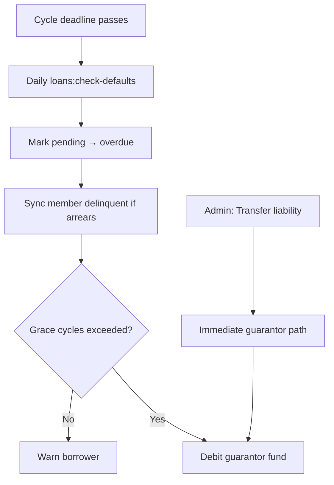

# Loan and contribution delinquency workflow

This document describes how FundFlow tracks late contributions, overdue loan installments, member delinquency, and guarantor liability transfer.

## What was already there

| Area | Backend |
|------|---------|
| Late fees (tiered by days) | `LateFeeService`, contribution/loan settings |
| Guarantor debits after grace | `LoanDefaultService` (daily `loans:check-defaults`) |
| Late contributions on apply | `ContributionService` (`is_late`, `late_fee_amount`) |
| Member `delinquent` status | Model + portal block — but **not auto-synced** |
| Notifications | `LoanDefaultWarningNotification`, `LoanDefaultGuarantorNotification` |

### Key files (pre-existing)

- `app/Services/Loans/LateFeeService.php`
- `app/Services/Loans/LoanDefaultService.php`
- `app/Services/Loans/LoanRepaymentService.php`
- `app/Services/ContributionService.php`
- `app/Console/Commands/LoansCheckDefaultsCommand.php`
- `routes/console.php` — `loans:check-defaults` daily at 07:00

## What was missing (now built)

Previously, most logic lived in services and cron but was **not wired end-to-end** — notably, installments were never set to `overdue`, and `guarantor_liability_transferred_at` was never set from the UI.

### 1. `LoanDelinquencyService`

**Path:** `app/Services/Loans/LoanDelinquencyService.php`

| Method | Purpose |
|--------|---------|
| `markOverdueInstallments()` | Pending installments past the contribution-cycle deadline → `overdue` + late fee |
| `syncMemberDelinquencyStatus()` | `active` ↔ `delinquent` based on overdue installments or unpaid posted contributions |
| `transferGuarantorLiability()` | Sets `guarantor_liability_transferred_at` (immediate guarantor collection path) |
| `restoreBorrowerLiability()` | Clears `guarantor_liability_transferred_at` (standard warning cycle) |
| `runDailyMaintenance()` | Full pipeline used by `loans:check-defaults` |
| `unpaidContributionPeriods()` | Per-member list of overdue contribution periods (respects `joined_at`) |
| `contributionArrearsTableRecords()` | Flat rows for the Contribution arrears Filament table |
| `filterContributionArrearsRecords()` | Search/sort for array-based table records |
| `memberArrearsSummary()` | Snapshot for member view + member dashboard banner |
| `digestCounts()` | KPIs for insights widget and admin digest |
| `syncMemberDelinquencyStatusForMember()` | Single-member delinquency sync from admin UI |

`loans:check-defaults` now runs: **mark overdue → sync members → warnings / guarantor debits**.

### 2. Admin UI (distributed by domain)

Delinquency is no longer a standalone page. Use:

| Concern | Where | Tab / action |
|--------|--------|----------------|
| Overdue loan installments | **Loans** list | **Overdue installments** |
| Guarantor exposure | **Loans** list | **Guarantor exposure** |
| Contribution arrears | **Contributions** list | **Arrears** |
| Delinquent members | **Members** list | **Delinquent** |
| Member status (sync / restore) | **Member** edit | **Delinquency** action group |
| Policy thresholds | **Settings** → Contributions | Delinquency policy section |

**Shared tables:** `app/Filament/Support/LoanDelinquencyTables.php`  
**Maintenance actions:** `app/Filament/Support/LoanDelinquencyHeaderActions.php` on **Loans** (and **Contributions → Arrears** tab)

- **Run delinquency check** — full `runDailyMaintenance()`
- **Mark overdue only** — `markOverdueInstallments()` only
- **Send admin digest** — notifies tenant admins when there is activity to review

**Insights:** `LoanInsightsService::delinquencySnapshot()` on loan list tabs; KPI links route to the tabs above.

### 3. Loan view actions

**File:** `app/Filament/Support/LoanFilamentActions.php`

- **Transfer liability to guarantor** (requires overdue installments + assigned guarantor)
- **Restore borrower liability**

**View loan summary** (`ViewLoan.php`): guarantor liability date, late repayment count.

### 4. Tests

**File:** `tests/Feature/Tenant/LoanDelinquencyServiceTest.php`

Covers: mark overdue, member delinquent sync, guarantor liability transfer, unpaid period labels, periods before `joined_at` excluded, per-period table rows with `pending` status.

### 5. Localization

Arabic strings for main UI labels in `lang/ar.json` (e.g. Delinquency, Overdue installments, Transfer liability to guarantor).

## How the workflow runs



### Borrower path

For each overdue installment on active loans:

1. Count defaults against `late_repayment_count` and `default_grace_cycles` (default **2**, from loan settings).
2. While within grace → **warn borrower** (`LoanDefaultWarningNotification`).
3. After grace → **debit guarantor fund** and mark installment paid by guarantor (`LoanDefaultGuarantorNotification`).

### Admin transfer path

When an admin uses **Transfer liability to guarantor**:

- Sets `guarantor_liability_transferred_at`.
- `LoanDefaultService` uses the **immediate guarantor collection** branch for future overdue installments (skips borrower warning cycle).

**Restore borrower liability** clears the timestamp and returns to the standard cycle.

### Contributions

- Late fees apply when a contribution is applied after the cycle deadline (`ContributionService`).
- **Contribution arrears** tab lists members without a **posted** contribution for any period whose deadline has passed (24-month lookback).
- Members with arrears or overdue installments may be auto-marked **`delinquent`** (portal blocked); status restores to **`active`** when arrears clear.

### Member delinquency

`syncMemberDelinquencyStatus()` marks members **delinquent** when:

- They have **overdue** installments on any active loan, or
- They have **contribution arrears** (missing posted contribution after deadline).

Restores to **active** when neither condition applies.

## Scheduled jobs (contributions & loans)

From `routes/console.php`:

| Command | Schedule |
|---------|----------|
| `contributions:notify` | Monthly, 1st, 09:00 |
| `contributions:apply` | Monthly, 5th, 09:00 |
| `loans:send-due-notifications` | Monthly, 1st, 08:00 |
| `loans:apply-repayments` | Monthly, 6th, 06:00 |
| `loans:check-defaults` | **Daily**, 07:00 |
| `delinquency:send-digest` | **Daily**, 07:30 (after defaults check) |

## Related model fields

**Loan**

- `late_repayment_count`
- `guarantor_liability_transferred_at`
- `guarantor_member_id`

**LoanInstallment**

- `status`: `pending` | `overdue` | `paid`
- `is_late`, `late_fee_amount`
- `paid_by_guarantor`

**Contribution**

- `is_late`, `late_fee_amount`
- `status`: must be `posted` to clear arrears

**Member**

- `status`: includes `delinquent` (portal blocked with suspended/withdrawn/terminated)

## Follow-up summary

This section records work completed after the initial delinquency workspace shipped — including fixes for mis-aligned Contribution arrears data and admin/member UX polish.

### 1. Contribution arrears alignment (fixed)

**Problem:** The Contributions tab listed one row per member with many periods crammed into a single cell (`HtmlString`), which broke table layout and showed periods before a member’s `joined_at`.

**Solution:**

| Change | Detail |
|--------|--------|
| Row model | One Filament row per **member + period** via `contributionArrearsTableRecords()` and `->records()` |
| Eligibility | `memberLiableForContributionPeriod()` skips months before `joined_at` |
| Posted only | Only `posted` contributions clear arrears; UI shows `missing`, `pending`, or `failed` |
| Columns | Member, Period, Contribution (badge), Monthly, Late fee, Member status (optional) |
| Search/sort | `filterContributionArrearsRecords()`; default sort by year/month descending |
| Tab switching | `wire:key="delinquency-table-{tab}"` + `getTableQueryStringIdentifier()` |

**Key files:** `LoanDelinquencyService.php`, `LoanDelinquencyTables.php` (`configureContributionArrearsTable()`), `ListContributions.php` (Arrears tab)

### 2. Member admin actions

On **Members → View** (`MemberDelinquencyActions` + infolist section):

| Action | Behavior |
|--------|----------|
| Sync delinquency status | `syncMemberDelinquencyStatusForMember()` — promote to delinquent or restore when arrears clear |
| Mark delinquent | Manual delinquent flag (blocks member portal) |
| Restore active | Restore when arrears cleared; optional **force** restore |
| Delinquency workspace | Opens Loans → Delinquency |

**Delinquency** infolist block: overdue installment count, unpaid contribution period labels.

**Key files:** `app/Filament/Support/MemberDelinquencyActions.php`, `EditMember.php`

### 3. Admin delinquency digest

| Piece | Detail |
|-------|--------|
| Notification | `DelinquencyDigestNotification` (database + mail when admin email is set) |
| Recipients | All tenant users with `is_admin = true` |
| Content | Counts of overdue installments, contribution arrears periods, delinquent members; link to delinquency workspace |
| Command | `php artisan delinquency:send-digest` |
| Schedule | Daily **07:30** (after `loans:check-defaults` at 07:00) |
| Manual trigger | **Send admin digest** header action on delinquency page |

**Key files:** `DelinquencyDigestService.php`, `DelinquencyDigestNotification.php`, `DelinquencySendDigestCommand.php`, `routes/console.php`

### 4. Member panel arrears banner

| Piece | Detail |
|-------|--------|
| Widget | `MemberArrearsAlert` on member dashboard |
| Visibility | Shown when `memberArrearsSummary()['has_arrears']` is true |
| Copy | Overdue installment count; unpaid contribution periods; delinquent messaging |
| Links | My loans, My contributions |

**Key files:** `app/Filament/Member/Widgets/MemberArrearsAlert.php`, `resources/views/filament/member/widgets/member-arrears-alert.blade.php`

### 5. Verification

```bash
php artisan test --compact tests/Feature/Tenant/LoanDelinquencyServiceTest.php
```

Six tests cover overdue marking, delinquent sync, guarantor liability transfer, period labels, `joined_at` exclusion, and per-period table rows with contribution status.

### 6. Localization

Additional Arabic keys in `lang/ar.json` for delinquency workspace, digest, member actions, and member banner strings.

---

## Possible future enhancements

- Email channel for delinquency digest (in addition to in-app/database notifications)
- Per-member filter on the delinquency contributions tab
- Insights polling (only if reintroduced with stable route-based `context`, not a fixed default)
