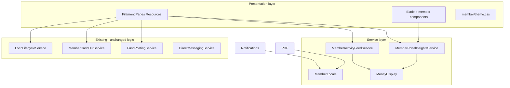

# FundFlow Member Portal — Design & Implementation Plan

| Field | Value |
|-------|-------|
| **Version** | 1.0 |
| **Status** | Draft — ready for Phase 0 kickoff |
| **Branch** | `feature/member-portal-redesign` (from `main`) |
| **Specification** | [member-portal-specification.md](member-portal-specification.md) |
| **Analysis** | [member-portal-redesign-plan.md](member-portal-redesign-plan.md) |
| **Prototype** | [Claude/member-portal-prototype.html](Claude/member-portal-prototype.html) |

---

## 1. Implementation strategy

### 1.1 Approach

- **Keep** Filament v5 member panel, `*InsightsService` layer, `CurrentMember` scoping, existing resources for mutations
- **Replace** dashboard presentation, navigation IA, list-page insight heroes, and scattered Blade partials
- **Add** design system components, consolidated pages, value-add features (§16 of analysis)
- **Ship** incrementally in 9 phases; each phase is a mergeable PR with tests

### 1.2 Git workflow

```
main
 └── feature/member-portal-redesign    ← all implementation
      ├── PR: phase-0-prep
      ├── PR: phase-1-design-system
      ├── PR: phase-2-dashboard
      ├── …
      └── PR: phase-8-value-add
```

| Rule | Detail |
|------|--------|
| **Branch** | `feature/member-portal-redesign` created at Phase 0; rebase from `main` weekly |
| **PRs** | One PR per phase (or split large phases); no unrelated changes |
| **Commits** | Conventional: `feat(member-portal): …`, `test(member-portal): …` |
| **Merge** | Squash or merge per repo convention; tests + pint required |
| **Deploy** | Each phase deployable; feature flags only if strictly necessary |

### 1.3 Definition of done (per phase)

- [ ] Code complete per phase task list
- [ ] `lang/ar.json` updated for all new strings
- [ ] Pest tests added/updated; `php artisan test --compact` passes for affected files
- [ ] `vendor/bin/pint --dirty` clean
- [ ] Manual smoke: `en` + `ar` on changed surfaces
- [ ] No Arabic-Indic digits in amount assertions
- [ ] `docs/member-portal.md` updated when IA changes

---

## 2. Architecture overview



### 2.1 Layer responsibilities

| Layer | Responsibility | Change level |
|-------|----------------|--------------|
| **Filament panel** | Routes, auth, nav, resources | Nav restructure; new pages |
| **Blade components** | `x-member.*` design system | **New** |
| **Insights services** | Snapshot DTOs for widgets | Reshape output; add keys |
| **Domain services** | Business mutations | **No change** unless bugfix |
| **Notifications** | Outbound copy | Locale wrapper |
| **PDF/CSV** | Documents | Font + formatter |

### 2.2 New / modified PHP classes

| Class | Action | Phase |
|-------|--------|-------|
| `App\Support\MemberLocale` | **Create** — `using(User, callable)` | 1 |
| `App\Support\MemberDateDisplay` | **Create** — date formatting | 1 |
| `App\Services\MemberActivityFeedService` | **Create** — unified activity query | 6 |
| `App\Models\Tenant\Transaction::memberFacingDescription()` | **Add** | 6 |
| `App\Filament\Member\Pages\CashAccountPage` | **Create** | 4 |
| `App\Filament\Member\Pages\FundAccountPage` | **Create** | 4 |
| `App\Filament\Member\Pages\MemberActivityPage` | **Create** | 6 |
| `App\Filament\Member\Pages\CommunicationsPage` | **Create** | 7–8 |
| `App\Filament\Member\Pages\MemberSettingsPage` | **Create** (tabbed) | 7 |
| `App\Http\Controllers\Tenant\MemberActivityExportController` | **Create** | 8 |
| `App\Http\Controllers\Tenant\LoanSchedulePdfController` | **Create** | 8 |
| `MemberPortalInsightsService` | **Modify** snapshot shape | 2 |
| `MoneyDisplay` | **Modify** Western digits + `__('SAR')` | 1 |
| `MemberNavigation` | **Modify** groups/sorts | 3 |
| `MemberPanelProvider` | **Modify** theme color, sidebar hook | 1, 3 |

---

## 3. Dashboard data contract

### 3.1 `MemberPortalInsightsService::snapshot()` target shape

```php
/**
 * @return array{
 *   notice: ?array{tone: string, title: string, body: string, action?: array{label: string, url: string}},
 *   pending_actions: list<array{label: string, url: string, tone?: string}>,
 *   cash_card: array{balance: string, available: string, reserved_emi: ?string, actions: list<array>},
 *   fund_card: array{balance: string, headroom: string, monthly: string, actions: list<array>},
 *   loan_panel: ?array,
 *   eligibility_panel: ?array,
 *   quick_actions: list<array{label: string, subtitle?: string, url: string, icon: string, visible: bool}>,
 *   recent_activity: list<array{description: string, date: string, credit: ?string, debit: ?string, type: string}>,
 *   expandable: array{
 *     insights: ?array{sparkline: list<int>, stats: list<array>},
 *     household: ?array,
 *     guarantor: ?array,
 *   },
 * }
 */
```

### 3.2 Notice priority builder

Extract method `buildPriorityNotice(Member $member): ?array` consolidating logic from:

- `buildHero()`, `memberArrearsSummary()`, cycle status, pending deposits, unread messages, override requests

### 3.3 Reserved EMI calculation

Add to snapshot via `LoanDelinquencyService` or active loan next pending installment amount when due within current open period.

---

## 4. Design system

### 4.1 CSS tokens (`resources/css/filament/member/theme.css`)

```css
.fi-panel-member {
    --ff-primary: #534AB7;
    --ff-primary-dark: #3C3489;
    --ff-success: #1D9E75;
    --ff-warning: #EF9F27;
    --ff-danger: #E24B4A;
    --ff-info: #378ADD;
    --ff-panel-radius: 14px;
}
```

Update `MemberPanelProvider` primary color from Emerald to `Color::hex('#534AB7')`.

### 4.2 Blade components (`resources/views/components/member-portal/`)

| Component | Props | Notes |
|-----------|-------|-------|
| `panel` | `title`, `link?`, `slot` | Head + body |
| `notice` | `tone`, `title?`, `slot` | amber/blue/green/red |
| `chip` | `variant`, `slot` | Status pill |
| `stat-card` | `label`, `value`, `hint?` | |
| `quick-action` | `icon`, `title`, `subtitle?`, `href` | Row link |
| `progress-bar` | `percent`, `tone?` | Loan repayment |
| `detail-grid` | `items: [{label, value}]` | 2-col |
| `filter-chips` | `options`, `active`, `wire:model` | Activity filters |
| `tab-bar` | `tabs`, `active` | Sub-nav |
| `amount` | `value`, `signed?`, `class?` | Uses `MoneyDisplay`; `ff-sar-symbol` |

Register namespace in `AppServiceProvider` or use `Blade::anonymousComponentPath()`.

### 4.3 Saudi Riyal font

| Step | Action |
|------|--------|
| 1 | Obtain SAMA / licensed font with U+20C1 or use Noto Sans Symbols 2 |
| 2 | Place in `resources/fonts/saudi-riyal/` (or public) |
| 3 | `@font-face` in `theme.css` |
| 4 | Register in DomPDF `config/dompdf.php` options |
| 5 | Update `lang/ar.json`: `"SAR": "\u20C1"` |
| 6 | Wrap symbol: `<span class="ff-sar-symbol" dir="ltr">{{ __('SAR') }}</span>` |

Fallback: render `SAR` text if font file missing (dev environments).

### 4.4 Prototype fidelity CSS (Phase 1 — required)

**Goal:** Close the gap between Filament default chrome and the [HTML prototype](Claude/member-portal-prototype.html). All rules are **scoped to `.fi-panel-member` only** — the tenant admin panel must not change.

**New file:** `resources/css/filament/member/member-portal-chrome.css`  
**Imported from:** `theme.css` (after tokens, before page-specific rules).

#### Scope rule

```css
/* Every override MUST start with .fi-panel-member */
.fi-panel-member .fi-input { … }
```

Do **not** use global `.fi-` selectors without the panel prefix. Do **not** edit vendor Filament CSS.

#### Prototype → Filament mapping

| Prototype class / pattern | Filament target | Override |
|---------------------------|-----------------|----------|
| `body` gray-50 background | `.fi-main`, `.fi-page` | `background: #f9fafb` |
| `.sidebar` white + border | `.fi-sidebar` | white bg, `border-inline-end: 1px solid #e5e7eb`, compact width |
| `.nav-item` / `.nav-group` | `.fi-sidebar-item`, group labels | 12px labels; 10px uppercase groups `#9ca3af`; active `background: #f3f4f6` |
| Profile block in sidebar | Custom render hook partial | Match prototype: 42px avatar circle, status chip |
| Sticky topbar ~50px | `.fi-topbar` | `min-height: 50px`, white bg, bottom border, reduce visual weight |
| `.panel` 14px radius | `.fi-section`, custom `x-member.panel` | Prefer `x-member.panel` on new UI; soften default sections when unavoidable |
| `input` / `select` / `textarea` | `.fi-input-wrp`, `input`, `select`, `textarea` | 12px font, 8px radius, `#e5e7eb` border, focus ring `#534AB7` |
| `label` 11px semibold gray | `.fi-fo-field-wrp-label` | `font-size: 11px`, `font-weight: 600`, `#6b7280` |
| `.btn-primary` purple | `.fi-btn.fi-color-primary`, `.fi-ac-btn-action` | `#534AB7` bg, 9px radius, 12px font |
| `.btn-outline` | `.fi-btn.fi-outlined` | purple border `#AFA9EC`, hover `#EEEDFE` |
| `.btn-gray` | Secondary/cancel actions | white bg, gray border |
| `.tbl` compact table | `.fi-ta-table` | 12px cells; header 10px uppercase `#9ca3af`, bg `#f9fafb`; row hover `#fafafa` |
| `.tab-bar` / `.tab-btn` | Custom `x-member.tab-bar` + Filament tabs if used | 2px primary underline on active |
| `.filter-chip` | Activity filter chips | 20px radius; active `#534AB7` fill |
| `.notice-*` | `x-member.notice` | Exact prototype pastel fills + borders |
| `.chip-*` | `x-member.chip` | Exact prototype chip colors |
| `.qa` quick-action row | `x-member.quick-action` | 12px radius border, 34px icon square |
| `.prog-bar` | `x-member.progress-bar` | 8px height, green fill |
| `.stat-card` | `x-member.stat-card` | 14px radius, 16px padding |
| `.settle-card` | Loan settle tab | 12px radius, 2px border; selected `#534AB7` + `#EEEDFE` bg |
| Fund gradient hero | `.ff-fund-hero` | `linear-gradient(135deg, #EEEDFE, #DDD9FC)` |

#### Typography scale (member panel only)

| Element | Size | Weight |
|---------|------|--------|
| Body / table cell | 13px / 12px | 400 |
| Panel title | 13px | 600 |
| Section label | 11px | 600 uppercase |
| Balance hero | 28–34px | 700 |
| Chip | 10px | 600 |

Apply via `.fi-panel-member { font-size: 13px; }` and component classes — avoid scattered `!important` except where Filament specificity cannot be beaten otherwise.

#### RTL (`html[dir='rtl'] .fi-panel-member`)

- Mirror sidebar border to `border-inline-end`
- Tab underline and filter chips: use logical properties
- Amount + `ff-sar-symbol`: always `dir="ltr"` on the numeric cluster
- Table text-align: `start` on first column; credit/debit columns stay readable

#### Dark mode

Member panel: **opt out** of dark styling for v1 — force light shell to match prototype:

```css
.fi-panel-member.fi-body { color-scheme: light; }
/* Optional: .fi-panel-member .dark:… resets if Filament forces dark */
```

Document decision in `theme.css` header comment.

#### Phase 1 visual sign-off

Before merging Phase 1 PR, capture side-by-side screenshots (375px + 1280px):

| Screen | Prototype reference | Filament page |
|--------|---------------------|---------------|
| Overview | `page==='overview'` | Dashboard (after Phase 2, use placeholder mock in Phase 1) |
| Cash account | `page==='cash'` | Any existing deposit form page styled with chrome CSS |
| Table page | `page==='transactions'` | Any member list resource |

**Phase 1 minimum:** chrome CSS applied; component library demo page or existing contributions list demonstrates table + form + button parity.

#### Tests (Phase 1)

- `MemberPortalDesignSystemTest` — asserts `.fi-panel-member` loads `member-portal-chrome.css` (Vite manifest or response contains class hook)
- Optional: Pest browser screenshot test against prototype HTML (manual QA checklist if browser test too heavy)

#### Files touched in Phase 1

| File | Action |
|------|--------|
| `resources/css/filament/member/member-portal-chrome.css` | **Create** |
| `resources/css/filament/member/theme.css` | Import chrome; tokens |
| `vite.config.js` | Verify member theme entry unchanged |
| `app/Providers/Filament/MemberPanelProvider.php` | `->viteTheme(...)` already set |

---

### 5.1 `MemberNavigation` updates

```php
public const GROUP_ACCOUNTS = 'my_accounts';
public const GROUP_HISTORY = 'history';
public const GROUP_SELF_SERVICE = 'self_service';
public const GROUP_HELP = 'help';

public const SORT_OVERVIEW = -2; // dashboard default
public const SORT_CASH = 1;
public const SORT_FUND = 2;
// … see specification §5.1
```

### 5.2 Resource visibility

| Resource / Page | `shouldRegisterNavigation()` |
|-----------------|------------------------------|
| `MyFundPostingResource` | `false` — embedded in Cash page |
| `MyAccountResource` | `false` — split into Cash/Fund pages |
| `MyMessageResource` | `false` — embedded in Communications |
| `SupportPage` | `false` — embedded in Communications |
| `LoanCalculatorPage` | `false` — modal from Apply |
| `BusinessDayTestingPage` | `false` for members; admin-only route |
| `MyGuaranteedLoanResource` | `true` only when guarantor count > 0 |

### 5.3 Redirects (`routes/tenant.php` or Filament `redirect`)

| Old path | New path |
|----------|----------|
| `/member/my-fund-postings` | `/member/cash-account` |
| `/member/my-accounts` | `/member/cash-account` |
| `/member/support` | `/member/help?tab=requests` |
| `/member/my-messages` | `/member/help?tab=messages` |

---

## 6. Page implementation notes

### 6.1 Cash account page

**File:** `app/Filament/Member/Pages/CashAccountPage.php`  
**View:** `resources/views/filament/member/pages/cash-account.blade.php`

```
┌─────────────────────┬─────────────────────┐
│ Balance detail grid │ Bank instructions   │
│                     │ Deposit form        │
│                     │ (Livewire embed)    │
├─────────────────────┴─────────────────────┤
│ Cash transaction table                    │
├───────────────────────────────────────────┤
│ Deposit requests history                  │
└───────────────────────────────────────────┘
```

- Reuse `MyFundPostingForm` via embedded `MyFundPostingResource::getPages()['create']` or inline form class
- Bank details: extract shared partial from enrollment `step-fees.blade.php` → `partials/fund-bank-details.blade.php`
- Ledger: query `Transaction` on member cash `Account`

### 6.2 Fund account page

**File:** `app/Filament/Member/Pages/FundAccountPage.php`

- Hero: `x-member.panel` with purple gradient class `ff-fund-hero`
- Stats from `MemberPortalAccountsInsightsService` or inline queries
- Fund ledger table

### 6.3 Loans hub

**Modify:** `app/Filament/Member/Resources/MyLoans/Pages/ListMyLoans.php`

- Add Livewire/tab state: `activeTab` enum
- Tabs render via `x-member.tab-bar`
- Settle tab: mount `MemberLoanFilamentActions` on selected loan
- Apply tab: redirect or embed `ApplyForLoan` with shared stepper partial

### 6.4 Activity page

**File:** `app/Filament/Member/Pages/MemberActivityPage.php`  
**Service:** `MemberActivityFeedService::paginate(Member, filters)`

Query union or single `Transaction` query with `reference_type` filters matching chip values.

### 6.5 Communications page

**File:** `app/Filament/Member/Pages/CommunicationsPage.php`

| Tab | Implementation |
|-----|----------------|
| Messages | `@livewire` or `@include` list from `ListMyMessages` table query |
| Requests | Embed `SupportPage` form + `MyMemberRequestsTableWidget` |
| Alerts | Filament table on `NotificationLog::where('user_id', auth()->id())` |
| FAQ | Blade accordion from lang keys `member_faq.*` |

### 6.6 Settings page

**File:** `app/Filament/Member/Pages/MemberSettingsPage.php`

Merge mount logic from:

- `MyProfilePage` / `EditMyProfilePage`
- `MyContributionSettingsPage`
- `MyNotificationPreferencesPage`

Use Filament `Tabs` schema or custom `x-member.tab-bar` + Livewire properties.

### 6.7 Statements download center

**Modify:** `ListMyStatements` header/footer

- Form: date from, date to → `MemberActivityExportController`
- Button: loan schedule PDF → `LoanSchedulePdfController`
- Reuse `StatementPdfController` for monthly rows

---

## 7. Bilingual implementation

### 7.1 `MemberLocale` helper

```php
// app/Support/MemberLocale.php
final class MemberLocale
{
    public static function using(User $user, callable $callback): mixed
    {
        $previous = app()->getLocale();
        app()->setLocale($user->preferredLocale());
        try {
            return $callback();
        } finally {
            app()->setLocale($previous);
        }
    }
}
```

### 7.2 `MoneyDisplay` changes

```php
public static function format(
    float|int|string|null $amount,
    ?string $currency = null,
    ?string $digitsLocale = 'en',
): ?string {
    // ...
    $formattedAmount = Number::format(abs($numericAmount), 2, locale: $digitsLocale);
    return __('SAR').' '.$formattedAmount;
}
```

Note: currency code setting remains `SAR` in DB; display uses `__('SAR')`.

### 7.3 Notification locale wrapper

Option A — trait on each notification:

```php
public function toArray(object $notifiable): array
{
    return MemberLocale::using($notifiable, fn () => $this->buildPayload());
}
```

Option B — middleware on `DeliversToMemberChannels` (preferred central fix).

### 7.4 Scheduled commands audit

| Command | Fix |
|---------|-----|
| `contributions:notify` | `MemberLocale::using` per member |
| `loans:send-due-notifications` | per member |
| `statements:generate` (notify=true) | per member on `sendNotification` |

### 7.5 `Transaction::memberFacingDescription()`

Map `reference_type` → translation key:

| reference_type | Key pattern |
|----------------|---------------|
| `contribution` | `Contribution — :period` |
| `loan_repayment` | `EMI — loan #:id cycle :n` |
| `fund_posting` | `Deposit` |
| `cash_out` | `Cash out` |
| … | extend as needed |

---

## 8. Phase plan (detailed)

### Phase 0 — Prep (1 week)

| Task | Owner | Output |
|------|-------|--------|
| Create `feature/member-portal-redesign` | Dev | Branch |
| Hide `BusinessDayTestingPage` from member nav | Dev | 1-line visibility |
| Sign-off spec + this plan | Product | Approved docs |
| Decide Cash/Fund: two pages | Product | Decision logged |
| Font file sourced for U+20C1 | Design/Dev | `resources/fonts/` |

**Tests:** None required.  
**PR:** `phase-0-member-portal-prep`

---

### Phase 1 — Design system & i18n foundation (1–2 weeks)

| Task | Files |
|------|-------|
| CSS tokens + panel member primary color | `theme.css`, `MemberPanelProvider.php` |
| **`member-portal-chrome.css`** — scoped Filament overrides (§4.4) | `resources/css/filament/member/member-portal-chrome.css` |
| Prototype mapping: forms, tables, buttons, sidebar, topbar | same |
| `x-member.*` components (all) | `resources/views/components/member-portal/*` |
| `MoneyDisplay` + `MemberLocale` + `MemberDateDisplay` | `app/Filament/Support/`, `app/Support/` |
| Saudi Riyal font + `.ff-sar-symbol` | `theme.css`, `arabic-fonts` partial |
| `lang/ar.json` `"SAR": "\u20C1"` | `lang/ar.json` |
| Sidebar profile block render hook | `MemberPanelProvider.php`, new Blade partial |
| Translate `NotificationPreferenceService::CATEGORIES` labels at render | `MyNotificationPreferencesPage` |
| **Visual sign-off** — screenshot checklist vs prototype (§4.4) | `docs/member-portal-design-qa.md` or PR description |

**Tests:**

- `tests/Unit/MoneyDisplayTest.php` — en/ar symbol, Western digits
- `tests/Unit/MemberLocaleTest.php`
- `tests/Feature/Tenant/MemberPortalDesignSystemTest.php` — component smoke + chrome CSS loaded on member panel

**PR:** `phase-1-member-portal-design-system`

---

### Phase 2 — Dashboard rewrite (1–2 weeks)

| Task | Files |
|------|-------|
| Reshape `snapshot()` + `buildPriorityNotice()` | `MemberPortalInsightsService.php`, `EnrichesMemberPortalDashboard.php` |
| New dashboard Blade zones A–D | `member-portal-dashboard.blade.php`, delete obsolete partials usage |
| Remove lifecycle + relation summaries from default view | same |
| `pending_actions` + `expandable.insights` keys | `MemberPortalInsightsService.php` |
| Retire or gate old partials | `portal-lifecycle`, `portal-relation-summaries` |

**Tests:**

- `tests/Feature/Tenant/MemberPortalDashboardTest.php` — datasets: no loan, active loan, delinquent, guarantor, `en`/`ar`

**PR:** `phase-2-member-portal-dashboard`

---

### Phase 3 — Navigation (1 week)

| Task | Files |
|------|-------|
| Update `MemberNavigation` groups/sorts | `MemberNavigation.php` |
| Hide/relabel resources per §5.2 | Each resource `shouldRegisterNavigation` |
| Add redirects | `routes/tenant.php` |
| Communications page stub (shell) | `CommunicationsPage.php` |
| Calculator → Apply link | `ApplyForLoan.php`, `ListMyLoans.php` |

**Tests:**

- `tests/Feature/Tenant/MemberPortalNavigationTest.php` — nav items count, redirects

**PR:** `phase-3-member-portal-navigation`

---

### Phase 4 — Cash & Fund pages (2 weeks)

| Task | Files |
|------|-------|
| `CashAccountPage` + view | new page + Blade |
| `FundAccountPage` + view | new page + Blade |
| Bank details partial | `partials/fund-bank-details.blade.php` |
| Embed deposit form | reuse `MyFundPostingForm` |
| Cash-out page polish (available balance) | `MyCashOutRequestResource` create page |
| Hide `MyFundPostingResource` list nav | resource class |

**Tests:**

- `tests/Feature/Tenant/MemberCashAccountPageTest.php`
- `tests/Feature/Tenant/MemberFundAccountPageTest.php`

**PR:** `phase-4-member-portal-accounts`

---

### Phase 5 — Loans hub (2 weeks)

| Task | Files |
|------|-------|
| Tabbed `ListMyLoans` | `ListMyLoans.php`, Blade |
| Inline schedule table | relation manager or custom table |
| Settle tab wiring | `MemberLoanFilamentActions` |
| Apply wizard stepper styling | `apply-for-loan.blade.php` |
| `LoanSchedulePdfController` + view | new controller, `pdf/loan-schedule.blade.php` |

**Tests:**

- `tests/Feature/Tenant/MemberLoansHubTest.php`
- `tests/Feature/Tenant/LoanSchedulePdfTest.php`

**PR:** `phase-5-member-portal-loans`

---

### Phase 6 — History & cleanup (1–2 weeks)

| Task | Files |
|------|-------|
| `MemberActivityPage` + `MemberActivityFeedService` | new |
| `Transaction::memberFacingDescription()` | `Transaction.php` |
| Contributions page stat cards only | `my-contributions-insights.blade.php` slim |
| Remove duplicate insight heroes from list pages | Each `*InsightsWidget.php` |
| Delete `MyFundOverview` | remove widget file + discovery |
| `MemberActivityExportController` | CSV stream |

**Tests:**

- `tests/Feature/Tenant/MemberActivityPageTest.php`
- `tests/Feature/Tenant/MemberActivityExportTest.php`

**PR:** `phase-6-member-portal-history`

---

### Phase 7 — Settings, household, help (1 week)

| Task | Files |
|------|-------|
| `MemberSettingsPage` tabbed merge | new page |
| Household expandable on dashboard | `member-portal-dashboard.blade.php` |
| Communications tabs: Messages + Requests | `CommunicationsPage.php` |
| FAQ accordion (lang keys) | `lang/en.json` structure + `ar.json` |
| Alert history tab | `CommunicationsPage` + `NotificationLog` table |

**Tests:**

- `tests/Feature/Tenant/MemberSettingsPageTest.php`
- `tests/Feature/Tenant/MemberCommunicationsTest.php`

**PR:** `phase-7-member-portal-settings-help`

---

### Phase 8 — Polish & notifications locale (1–2 weeks)

| Task | Files |
|------|-------|
| `MemberLocale` on all queued notifications | `DeliversToMemberChannels` or per-class |
| Statement PDF font + `__('SAR')` | `monthly-statement.blade.php`, DomPDF config |
| Email RTL template (optional) | `resources/views/vendor/mail` |
| Deposit receipt (optional) | `FundPosting` view action |
| Contributions CSV (optional) | export controller |
| Update `docs/member-portal.md` | docs |
| Full regression pass | — |

**Tests:**

- Notification locale snapshots per category
- PDF Arabic render test
- `NotificationLog` scoping test

**PR:** `phase-8-member-portal-polish`

---

## 9. Testing strategy

### 9.1 Test matrix

| Area | Type | File pattern |
|------|------|--------------|
| Money / locale helpers | Unit | `tests/Unit/MoneyDisplayTest.php` |
| Dashboard snapshots | Feature | `MemberPortalDashboardTest.php` |
| Navigation / redirects | Feature | `MemberPortalNavigationTest.php` |
| Page access + locale | Feature | `Member*PageTest.php` |
| Exports / PDF | Feature | `*ExportTest.php`, `*PdfTest.php` |
| Notification locale | Feature | extend `SystemMaintenanceNotificationLogsAndStatementsTest` |
| Table standards | Architecture | existing `FilamentTableStandardsTest` if tables added |

### 9.2 Locale test pattern (Pest)

```php
it('renders dashboard in Arabic with Saudi Riyal sign', function () {
    app()->setLocale('ar');
    $this->actingAs($this->memberUser, 'tenant')
        ->get(MyLoanResource::getUrl('index', panel: 'member'))
        ->assertOk()
        ->assertSee("\u{20C1}", false)
        ->assertDontSeeRegex('/[\x{0660}-\x{0669}]/u');
});
```

### 9.3 Manual QA checklist (pre-release)

- [ ] Login → Overview → deposit → logout (`en` + `ar`)
- [ ] Loan apply wizard end-to-end
- [ ] Cash-out with reserved EMI displayed
- [ ] Download monthly PDF + activity CSV in Arabic
- [ ] Switch language mid-session; amounts consistent
- [ ] Parent impersonation → dependent → return
- [ ] Mobile 375px viewport screenshot review

---

## 10. Migration & rollback

| Risk | Mitigation |
|------|------------|
| Broken bookmarks | 302 redirects for 2 releases |
| Dashboard data regression | Feature flag `MEMBER_PORTAL_V2_DASHBOARD` env optional for one week |
| Font missing | Fallback to `SAR` text |
| Notification locale bugs | Log `NotificationLog` body locale in staging |

Rollback: revert PR per phase; database changes none expected (UI-only).

---

## 11. File inventory (target state)

```
app/
├── Filament/Member/
│   ├── Pages/
│   │   ├── CashAccountPage.php          [new]
│   │   ├── FundAccountPage.php          [new]
│   │   ├── MemberActivityPage.php       [new]
│   │   ├── CommunicationsPage.php       [new]
│   │   ├── MemberSettingsPage.php       [new]
│   │   └── MemberDashboard.php          [modify]
│   └── Support/MemberNavigation.php     [modify]
├── Http/Controllers/Tenant/
│   ├── MemberActivityExportController.php [new]
│   └── LoanSchedulePdfController.php      [new]
├── Services/
│   └── MemberActivityFeedService.php    [new]
└── Support/
    ├── MemberLocale.php                 [new]
    └── MemberDateDisplay.php            [new]

resources/
├── views/components/member-portal/      [new directory]
├── views/filament/member/pages/
│   ├── cash-account.blade.php           [new]
│   ├── fund-account.blade.php           [new]
│   └── communications.blade.php       [new]
├── css/filament/member/
│   ├── theme.css                        [modify]
│   └── member-portal-chrome.css         [new — prototype Filament overrides]
└── fonts/saudi-riyal/                   [new]

tests/Feature/Tenant/
├── MemberPortalDashboardTest.php        [new]
├── MemberPortalNavigationTest.php       [new]
├── MemberCashAccountPageTest.php        [new]
└── …
```

---

## 12. Timeline summary

| Phase | Duration | Cumulative |
|-------|----------|------------|
| 0 Prep | 1 week | 1 wk |
| 1 Design system | 1–2 weeks | 2–3 wk |
| 2 Dashboard | 1–2 weeks | 3–5 wk |
| 3 Navigation | 1 week | 4–6 wk |
| 4 Accounts | 2 weeks | 6–8 wk |
| 5 Loans | 2 weeks | 8–10 wk |
| 6 History | 1–2 weeks | 9–12 wk |
| 7 Settings/Help | 1 week | 10–13 wk |
| 8 Polish | 1–2 weeks | 11–14 wk |

**Total: 10–14 weeks** with incremental releases after phases 2, 4, 6, and 8.

---

## 13. Document history

| Version | Date | Change |
|---------|------|--------|
| 1.0 | 2026-06-18 | Initial implementation plan from redesign analysis |
