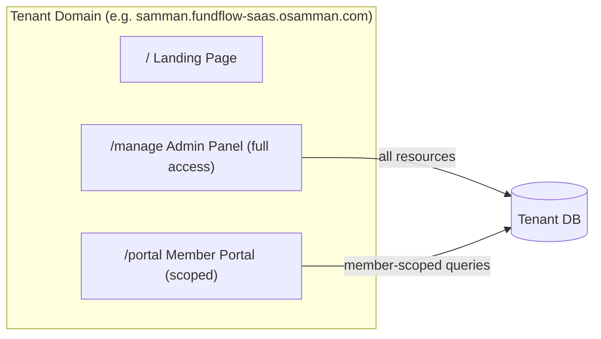

# FundFlow SaaS — Member Portal Design

## Overview

A dedicated Filament panel ("Member Portal") at `/portal` on tenant domains where members can only see their own fund information — accounts, contributions, loans, and a personal dashboard.

## Architecture



## Key Design Decisions

- **Separate panel, same guard**: Both `/manage` (admin) and `/portal` (member) use the `tenant` auth guard. Access control is handled via `canAccessPanel()` on the `User` model — admins (`is_admin = true`) can access the admin panel, regular members with a linked member profile can access the portal.
- **Data scoping**: Each resource in the member panel overrides `getEloquentQuery()` to apply `->where('member_id', $memberId)`, driven by the logged-in user's associated member record via the `User -> Member` HasOne relationship.
- **Read-only**: Members can view their accounts, contributions, and loans but cannot create, edit, or delete any records. All `canCreate()` methods return `false`.
- **Visual distinction**: The member portal uses Teal as its primary color to distinguish from the admin panel's Emerald.

## Access Control

| User Type | `/manage` (Admin) | `/portal` (Member) |
|---|---|---|
| Admin (`is_admin = true`) | Allowed | Denied (no member profile) |
| Member (has member profile) | Denied | Allowed |
| Orphan user (no admin, no member) | Denied | Denied |

Controlled by `User::canAccessPanel()`:

```php
public function canAccessPanel(Panel $panel): bool
{
    if ($panel->getId() === 'tenant') {
        return $this->is_admin;
    }
    if ($panel->getId() === 'member') {
        return $this->member !== null;
    }
    return false;
}
```

## Panel Configuration

- **Panel ID**: `member`
- **Path**: `/portal`
- **Auth Guard**: `tenant`
- **Color**: Teal
- **Provider**: `App\Providers\Filament\MemberPanelProvider`
- **Middleware**: Same tenancy middleware stack as the admin panel (`InitializeTenancyByDomain`, `PreventAccessFromCentralDomains`)

## Resources

### MyAccountResource (`/portal/my-accounts`)

- Scoped to the member's own cash and fund accounts (excludes master accounts)
- **List view**: Account name, type (badge), balance, last activity date
- **View page**: Account details + full transaction history table (date, type, amount, balance after, description)
- Read-only: no create, edit, or delete

### MyContributionResource (`/portal/my-contributions`)

- Scoped to the member's own contributions
- **List view**: Period (month/year), amount, status (badge: pending/posted/failed), posted date
- Filterable by status
- Sorted by period descending (most recent first)
- Read-only: no create or edit (contributions are managed by admins)

### MyLoanResource (`/portal/my-loans`)

- Scoped to the member's own loans
- **List view**: Loan amount, interest rate, term, monthly repayment, total repaid, status (badge), applied date
- **View page**: Loan details, timeline (applied/approved/disbursed/completed dates), repayment history table
- Filterable by status
- Read-only: existing loans cannot be modified

## Dashboard Widget — MyFundOverview

Displays personalized financial stats:

| Stat | Description |
|---|---|
| Fund Balance | Accumulated fund savings |
| Cash Balance | Available cash in member's cash account |
| Total Contributions | Sum of all posted contributions with count |
| Active Loan / Loan Eligibility | If active loan exists: shows amount and outstanding balance. Otherwise: shows eligibility status |
| Dependents | Count of dependent members (only shown if > 0) |

## Data Scoping Strategy

Each resource overrides `getEloquentQuery()` to scope data:

```php
public static function getEloquentQuery(): Builder
{
    $member = auth('tenant')->user()?->member;
    return parent::getEloquentQuery()
        ->where('member_id', $member?->id);
}
```

## Files Created

| File | Purpose |
|---|---|
| `app/Providers/Filament/MemberPanelProvider.php` | Panel provider registered in `bootstrap/providers.php` |
| `app/Filament/Member/Widgets/MyFundOverview.php` | Personal dashboard stats widget |
| `app/Filament/Member/Resources/MyAccounts/MyAccountResource.php` | Account resource with scoped query |
| `app/Filament/Member/Resources/MyAccounts/Tables/MyAccountsTable.php` | Account list table definition |
| `app/Filament/Member/Resources/MyAccounts/Pages/ListMyAccounts.php` | Account list page |
| `app/Filament/Member/Resources/MyAccounts/Pages/ViewMyAccount.php` | Account detail with transactions |
| `app/Filament/Member/Resources/MyContributions/MyContributionResource.php` | Contribution resource with scoped query |
| `app/Filament/Member/Resources/MyContributions/Tables/MyContributionsTable.php` | Contribution list table |
| `app/Filament/Member/Resources/MyContributions/Pages/ListMyContributions.php` | Contribution list page |
| `app/Filament/Member/Resources/MyLoans/MyLoanResource.php` | Loan resource with scoped query |
| `app/Filament/Member/Resources/MyLoans/Tables/MyLoansTable.php` | Loan list table |
| `app/Filament/Member/Resources/MyLoans/Pages/ListMyLoans.php` | Loan list page |
| `app/Filament/Member/Resources/MyLoans/Pages/ViewMyLoan.php` | Loan detail with repayment history |
| `database/migrations/tenant/2026_05_13_144644_add_is_admin_to_users_table.php` | Adds `is_admin` column to tenant users |
| `tests/Feature/Tenant/MemberPortalTest.php` | 11 tests covering access control and data scoping |

## Files Modified

| File | Change |
|---|---|
| `app/Models/Tenant/User.php` | Added `member()` HasOne, `is_admin` field/cast, panel-specific `canAccessPanel()` |
| `bootstrap/providers.php` | Registered `MemberPanelProvider::class` |
| `database/seeders/Tenant/TenantDatabaseSeeder.php` | Admin user seeded with `is_admin: true` |
| `resources/views/tenant/landing.blade.php` | Login button changed to point to Member Portal (`/portal`) |

## Test Coverage

11 Pest feature tests covering:
- Admin can access admin panel
- Member cannot access admin panel
- Member can access member portal
- User without member profile cannot access portal
- Account/contribution/loan resources scope to authenticated member
- Member B sees zero loans (has none)
- Member B sees only their own contributions
- Portal resources cannot be created
- User model has correct member relationship
