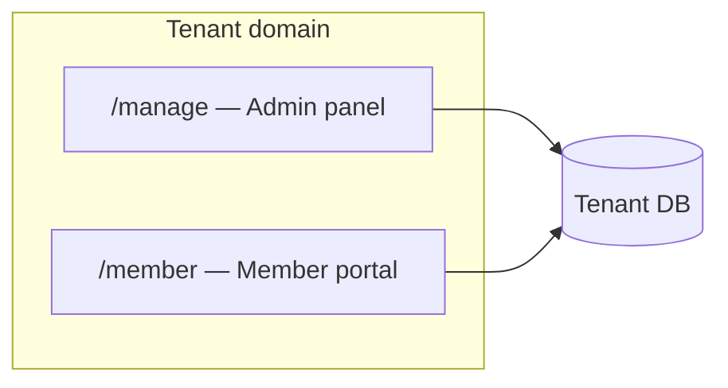

# FundFlow SaaS — Member Portal

## Overview

The member portal is a dedicated Filament panel at **`/member`** on tenant domains. Members sign in with the same `tenant` guard as admins but see only their own data: accounts, contributions, deposits, loans, statements, messages, and a personal dashboard.

## Architecture

## Access control

| User | Admin panel | Member portal |
|------|-------------|---------------|
| Admin (`is_admin`) | Yes | No |
| Member (linked profile) | No | Yes |
| Orphan user | No | No |

Implemented in `User::canAccessPanel()`.

## Panel configuration

- **ID**: `member`
- **Path**: `/member`
- **Provider**: `App\Providers\Filament\MemberPanelProvider`
- **Primary color**: Emerald
- **Database notifications**: enabled
- **Dashboard**: `MemberDashboard` with `MemberPortalDashboardWidget` and `MemberArrearsAlert`

## Navigation (legacy-aligned groups and order)

Sidebar structure matches the legacy member panel (`MemberNavigation` + `MemberPanelProvider`).

| Group | Sort | Item |
|-------|------|------|
| *(ungrouped)* | — | Dashboard |
| *(ungrouped)* | -1 | Messages (badge: unread from admin) |
| **My Finance** | 1 | My contributions |
| **My Finance** | 2 | My Deposits |
| **My Finance** | 3 | My statements |
| **My Finance** | 4 | My dependents (household heads with dependents only) |
| **My Finance** | 5 | My accounts |
| **My Loans** | 1 | My loans |
| **My Loans** | 3 | Guaranteed loans (where you are guarantor) |
| **My Loans** | 4 | Loan calculator |

Profile is in the user menu only (`MyProfilePage` / `EditMyProfilePage`). Apply for loan is not in the sidebar (opened from loans UI).

## Features

### Dashboard

`MemberPortalInsightsService` powers KPIs (cash, fund, contributions, pending deposits, loan balance, unread messages), hero call-to-action, quick links, open contribution cycle, recent deposits, and a contribution sparkline.

### Accounts & contributions

Read-only lists scoped with `getEloquentQuery()->where('member_id', …)`. Account view includes transaction history.

### My Deposits (`MyFundPostingResource`)

Members can **create** deposit requests (`FundPostingService::submit`). Admins review in the tenant panel. On accept/reject, members receive `FundPostingAcceptedNotification` / `FundPostingRejectedNotification`. List page includes `MemberFundPostingInsightsWidget`.

### Loans (`MyLoanResource`)

- List with member-friendly status labels (`LoanUserFacingStage::memberListStatusLabel`)
- View with insights widget and installment relation manager
- **Apply**: `ApplyForLoan` page — wizard (Amount → Purpose → Witnesses → Review); guarantor required when amount exceeds fund balance (setting)
- **Pay this period** and **Pay off loan early** on active loan view (from member cash)
- Cancel pending applications via shared `LoanFilamentActions::cancel()`
- **Loan calculator** standalone page
- **Guaranteed loans** — view loans where you are named guarantor

### Notifications (SMS / WhatsApp)

When enabled under **Settings → Notifications** (Twilio), loan and fund alerts also go to the member phone on file. Database notifications always apply.

### Statements

Read-only monthly statements list.

### Messages (`MyMessageResource`)

Threaded direct messages between the member and fund administrators:

- Inbox of root threads
- Compose new message to admin
- View thread and reply
- Unread admin messages marked read on open
- Database notifications to member (admin send) and to all admins (member send/reply)

Admin counterpart: `MessagesRelationManager` on the member edit screen in the tenant panel.

## Data scoping

Every member resource overrides `getEloquentQuery()` to restrict rows to `auth('tenant')->user()->member`.

## Related code

| Area | Path |
|------|------|
| Panel provider | `app/Providers/Filament/MemberPanelProvider.php` |
| Dashboard insights | `app/Services/MemberPortalInsightsService.php` |
| Deposit insights | `app/Services/MemberFundPostingInsightsService.php` |
| Member Filament code | `app/Filament/Member/**` |
| Tests | `tests/Feature/Tenant/MemberPortalTest.php`, `tests/Unit/MemberPortalInsightsServiceTest.php` |
