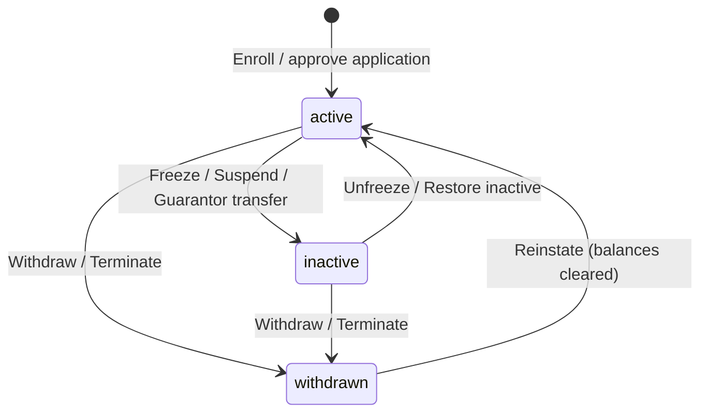

# Member status & membership lifecycle specification

**Version:** 2.0  
**Status:** Approved for implementation  
**Scope:** Tenant member `status`, contribution-cycle flag, member requests, admin workflows, portal gating.

---

## 1. Canonical statuses (minimum)

| Status | Code | Meaning |
|--------|------|---------|
| **Active** | `active` | Operating membership. May still be **delinquent** (computed from arrears — not a separate status). |
| **Inactive** | `inactive` | On hold — frozen, suspended, or guarantor-transfer restriction. |
| **Withdrawn** | `withdrawn` | Left the fund (voluntary exit or admin termination). |

### Derived semantics (not separate statuses)

| Concept | How it is represented |
|---------|------------------------|
| **Delinquent** | `active` + arrears breach (`LoanDelinquencyService::isDelinquent()`) |
| **Frozen** | `inactive` + `frozen_at` set |
| **Suspended** | `inactive` + `frozen_at` null + `contribution_cycles_active` false |
| **Guarantor transfer hold** | `inactive` + `frozen_at` null + `contribution_cycles_active` true |
| **Terminated (involuntary exit)** | `withdrawn` + `payout_frozen_at` set |
| **Voluntary withdrawal** | `withdrawn` + `payout_frozen_at` null |

---

## 2. Separate flags

| Column | Purpose |
|--------|---------|
| `contribution_cycles_active` | When `true`, member stays in automatic contribution cycles while `inactive` (guarantor transfer). |
| `frozen_at` | End of the freeze date when membership was frozen. Distinguishes freeze from suspend. |
| `payout_frozen_at` | Hard payout hold after admin terminate (status is still `withdrawn`). |
| `status_reason` / `status_changed_at` | Audit trail for last workflow action. |

---

## 3. Capability matrix

| Capability | Active (not delinquent) | Active (delinquent) | Inactive | Withdrawn |
|------------|:-----------------------:|:-------------------:|:--------:|:-----------:|
| Member portal | ✅ | ❌ | ❌ | ❌ |
| Apply for loan | ✅ | ❌ | ❌ | ❌ |
| Auto contribution cycles | ✅ | ✅ | ✅* | ❌ |
| Admin: Contribute | ✅ | ✅ | ✅* | ❌ |
| Member: cash-out request | ✅ | ❌ | ❌ | ✅† |
| Payout / settlement | ✅ | ❌ | ❌ | ✅‡ |

\* When `contribution_cycles_active` is true.  
† Voluntary withdrawal settlement.  
‡ `payout_frozen_at` blocks payout until **Release payout** or **Reinstate**.

---

## 4. State machine (simplified)



Delinquency does **not** change `status`; it is computed from arrears on `active` members.

---

## 5. `MemberStatusService` API

| Method | To | Side effects |
|--------|-----|--------------|
| `freeze(Member, reason, freezeDate?, cashOutBalances?)` | `inactive` | `frozen_at`, `contribution_cycles_active=false` |
| `unfreeze(Member)` | `active` | Clears `frozen_at` (frozen inactive only) |
| `suspend(Member, reason)` | `inactive` | No `frozen_at`; cycles off |
| `suspendForGuarantorTransfer(Member)` | `inactive` | No `frozen_at`; cycles on |
| `restoreInactive(Member)` | `active` | Suspended inactive only (no `frozen_at`) |
| `withdraw(Member, reason)` | `withdrawn` | Clears `payout_frozen_at` |
| `terminate(Member, reason)` | `withdrawn` | Sets `payout_frozen_at` |
| `reinstate(Member, reason)` | `active` | Zeros cash/fund; clears payout freeze |
| `releasePayoutReview(Member, reason)` | `withdrawn` | Clears `payout_frozen_at` only |

---

## 6. Delinquency

- **Not a status.** `LoanDelinquencyService::isDelinquent()` = `active` + policy breach.
- Member list **Delinquent** tab filters computed delinquent actives.
- Sync actions report counts; they do not flip `status`.

---

## 7. Member list tabs

`all`, `active`, `inactive`, `withdrawn`, `delinquent` (computed), `migration_pending`

---

## 8. Legacy import mapping

| Legacy | Maps to |
|--------|---------|
| `delinquent` / `متأخر` | `active` |
| `suspended` / `معلق` | `inactive` |
| `terminated` / `منتهي` | `withdrawn` |
| `inactive` | `inactive` |
| `منسحب` / `resigned` | `withdrawn` |

---

## 9. Migration

```sql
UPDATE members SET status = 'active' WHERE status = 'delinquent';
UPDATE members SET status = 'inactive' WHERE status = 'suspended';
UPDATE members SET status = 'withdrawn' WHERE status = 'terminated';
ALTER TABLE members MODIFY status ENUM('active', 'inactive', 'withdrawn') NOT NULL DEFAULT 'active';
```
