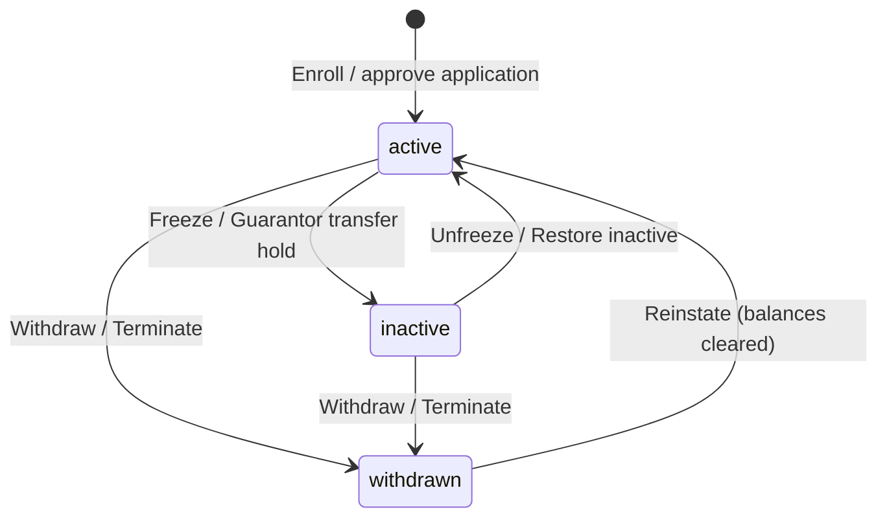

# Member status & membership lifecycle specification

**Version:** 3.0  
**Status:** Approved for implementation  
**Scope:** Tenant member `status`, contribution-cycle flag, member requests, admin workflows, portal gating, **planned membership freeze**, guarantor replacement, pre-portal login requests.

---

## 1. Canonical statuses (minimum)

| Status | Code | Meaning |
|--------|------|---------|
| **Active** | `active` | Operating membership. May still be **delinquent** (computed from arrears — not a separate status). |
| **Inactive** | `inactive` | On hold — frozen, suspended, or guarantor-transfer restriction. |
| **Withdrawn** | `withdrawn` | Left the fund (voluntary exit or admin termination). |

### Derived semantics (not separate statuses)

| Concept | How it is represented |
|---------|------------------------|
| **Delinquent** | `active` + arrears breach (`LoanDelinquencyService::isDelinquent()`) |
| **Frozen** | `inactive` + `frozen_at` set (+ freeze plan columns) |
| **Suspended** | `inactive` + `frozen_at` null + `contribution_cycles_active` false |
| **Guarantor transfer hold** | `inactive` + `frozen_at` null + `contribution_cycles_active` true |
| **Terminated (involuntary exit)** | `withdrawn` + `payout_frozen_at` set |
| **Voluntary withdrawal** | `withdrawn` + `payout_frozen_at` null |

---

## 2. Separate flags

| Column | Purpose |
|--------|---------|
| `contribution_cycles_active` | When `true`, member stays in automatic contribution cycles while `inactive` (guarantor transfer). |
| `frozen_at` | When membership was frozen. Distinguishes freeze from other inactive holds. |
| `freeze_cycles_requested` | Planned freeze length (contribution cycles). A **plan**, not an auto-unfreeze timer. |
| `freeze_cycles_remaining` | Remaining planned cycles with fee/EMI protection. |
| `freeze_emi_cycles_pushed` | How many one-cycle EMI pushes have been applied for this freeze. |
| `freeze_plan_ended_at` | Set when remaining hits 0. Member **stays frozen** until unfreeze; late fees / delinquency resume. |
| `freeze_household_mode` | `self_only` \| `include_dependents` \| `temp_parent` |
| `freeze_temporary_parent_member_id` | Funding sponsor only (legal `parent_member_id` unchanged). |
| `freeze_origin_member_id` | Set on dependents cascade-frozen with a parent. |
| `payout_frozen_at` | Hard payout hold after admin terminate (status is still `withdrawn`). |
| `status_reason` / `status_changed_at` | Audit trail for last workflow action. |

---

## 3. Capability matrix

| Capability | Active (not delinquent) | Active (delinquent) | **Frozen** (inactive + `frozen_at`) | Other inactive | Withdrawn |
|------------|:-----------------------:|:-------------------:|:----------------------------------:|:--------------:|:-----------:|
| Member portal | ✅ full | ❌ | ✅ **read-only** | ❌ | ❌ |
| Apply for loan / mutate | ✅ | ❌ | ❌ | ❌ | ❌ |
| Auto contribution cycles | ✅ | ✅ | ❌ | ✅* | ❌ |
| Admin: Contribute | ✅ | ✅ | ❌ | ✅* | ❌ |
| Member: cash-out | ✅ | ❌ | ❌ **frozen** | ❌ | ✅† |
| Member: fund-out (fund→cash) | ✅ | ❌ | ❌ **frozen** | ❌ | ✅† |
| Payout / settlement | ✅ | ❌ | ❌ | ❌ | ✅‡ |
| Unfreeze / extend freeze requests | — | — | ✅ (portal) | — | — |
| Pre-portal status request (login) | — | — | optional fallback | ❌§ | ✅¶ |

\* When `contribution_cycles_active` is true (guarantor-transfer hold).  
† Leave-fund settlement **auto-submits and accepts** residual cash-out (uncleared bank line until statement match), unless `holdPayout`.  
‡ `payout_frozen_at` blocks payout until **Release payout** or **Reinstate**.  
§ Non-frozen inactive stays admin **Restore inactive** only.  
¶ Withdrawn: **Request reinstate**; if `payout_frozen_at` set, also **Request release payout**.

**Leave fund vs cash-out / fund-out:** Leaving the fund ends membership (`withdraw`) with liquidation (loan settle + auto cash-out accept). Cash-out pays bank money from **cash** while remaining a member. Fund-out moves **fund → cash** after admin accept (no bank line). Neither member cash-out nor fund-out is available while membership is frozen.

### Member request types (membership lifecycle)

| Type | Who can submit | On approve |
|------|----------------|------------|
| `freeze_membership` | Active member (portal) | `MemberFreezeService::applyFreeze()` |
| `extend_freeze_membership` | Frozen member (portal) | `MemberFreezeService::extendFreeze()` |
| `unfreeze_membership` | Frozen member (portal; login fallback) | `MemberFreezeService::applyUnfreeze()` |
| `withdraw_membership` | Active / non-frozen inactive (portal) — **Leave fund** | `withdraw(holdPayout: false, plan)` — household + liquidation |
| `reinstate_membership` | Withdrawn (login surface) | `reinstate()` |
| `release_payout` | Withdrawn with `payout_frozen_at` (login surface) | `releasePayoutReview()` |

---

## 4. Planned membership freeze (v3)

Orchestrator: `App\Services\MemberFreezeService`. Status transition still via `MemberStatusService::freeze()` / `unfreeze()` with freeze metadata.

### 4.1 Request (member wizard or admin)

Member specifies:

1. **Expected freeze cycles** (1–36) — a plan only. Natural end does **not** auto-unfreeze; membership stays frozen until member/admin unfreezes. After the plan ends (`freeze_plan_ended_at`), late fees and delinquency **resume**.
2. **Can extend** while frozen (`extend_freeze_membership` or admin extend) — adds to requested/remaining and clears `freeze_plan_ended_at`.
3. **Household** (parents only):
   - **Freeze me only**
   - **Freeze me + all dependents** (full freeze for each dependent, including their loans/guarantor rules)
   - **Elect temporary funding parent** — one dependent who can log in / is independent (`direct_login_enabled` or `is_separated`) / has positive cash. They become **funding sponsor only** (`parent_member_id` unchanged). Arrangements **auto-revert** on unfreeze (metadata cleared).
4. Optional reason.

### 4.2 Prerequisites (block submit **and** approve)

All must be clear before submit and before approve:

- Pending membership requests (other than this freeze)
- Pending cash-out, fund-out, deposits, cash transfers
- Open / in-progress support tickets
- Pipeline loans (`pending`, `approved`, `partially_disbursed`)
- If the member **guarantees** other loans: every such loan must have a **new guarantor who has accepted** (`loan_guarantor_replacement_requests`)

Guarantor replacement flow:

- Borrowers propose a replacement (admin may override / also propose).
- Proposed guarantor must **accept** before freeze can proceed.
- Outgoing guarantor (or admin) can **Notify borrowers to replace guarantor** from the freeze checklist / status banner **before** submit (rate-limited; does not submit the freeze).
- Notifications (email / SMS / push / in-app) fire on that nudge, at freeze **request** and **approval**, and when a replacement is proposed.

### 4.3 On approve / admin freeze

1. Set inactive + `frozen_at` + plan columns; `contribution_cycles_active = false`.
2. Cancel/exempt open **pending** contribution rows for the member (and cascade-frozen dependents).
3. Push unpaid EMIs **one contribution cycle** (waive overdue late flags on shift). Guarantor liability on the frozen borrower’s loans is **paused** while within the freeze plan.
4. Consume one planned cycle (`remaining−1`, `emi_pushed+1`). Further pushes run on later contribution cycle opens via `onContributionCycleOpened()`.
5. Household side effects (cascade freeze or temp funding sponsor).
6. Notify guarantors of borrower loans, borrowers who needed guarantor replacement, and temp parent (all channels).

Cash-out of fund balance on freeze is **not** offered — cash-out stays frozen for the duration.

### 4.4 During freeze

| Topic | Rule |
|-------|------|
| Portal | Read-only: status widget, statements/views, **Requests** for unfreeze/extend. No loans, cash-out, deposits, allocations, etc. |
| Contributions | Exempt; not initialized for frozen members. |
| Cash-out | Blocked (`MemberMembershipPolicy::canRequestCashOut`). |
| EMIs | One cycle forward per planned freeze cycle. |
| Late fees / delinquency | Suppressed while `isWithinFreezePlan()` (remaining > 0 and plan not ended). After plan ends while still frozen, marking overdue / fees resume. |
| Guarantor of others | Must already be replaced before freeze. |

### 4.5 Unfreeze

- **Early** (plan not ended): pull back EMI schedule by `freeze_emi_cycles_pushed` cycles; clear freeze metadata; restore active.
- **After plan ended**: keep EMI shifts; clear freeze metadata; restore active.
- Cascade-frozen dependents unfreeze with the origin parent.
- Temp funding sponsor metadata clears (arrangement auto-reverts).

### 4.6 Key services / UI

| Piece | Path |
|-------|------|
| Orchestration | `MemberFreezeService` |
| EMI push/pull | `LoanFreezeScheduleService` |
| Guarantor accept | `LoanGuarantorReplacementService` + `loan_guarantor_replacement_requests` |
| Member wizard | `MemberRequestFilamentActions` |
| Admin freeze | `MemberFilamentActions::freeze()` |
| Portal banner | `MembershipFreezeStatusWidget` |

---

## 5. State machine (simplified)


```mermaid
stateDiagram-v2
    [*] --> active: Enroll / approve application

    active --> inactive: Freeze / Guarantor transfer hold
    inactive --> active: Unfreeze / Restore inactive

    active --> withdrawn: Withdraw / Terminate
    inactive --> withdrawn: Withdraw / Terminate

    withdrawn --> active: Reinstate (balances cleared)
```

Delinquency does **not** change `status`; it is computed from arrears on `active` members.

---

## 6. `MemberStatusService` / freeze API

| Method | To | Side effects |
|--------|-----|--------------|
| `freeze(..., freezeMeta)` | `inactive` | `frozen_at`, cycles off, optional plan columns via meta |
| `unfreeze(Member)` | `active` | Clears `frozen_at` and all freeze plan columns |
| `MemberFreezeService::applyFreeze` | — | Gates + household + EMI + pending contrib cancel + notify |
| `MemberFreezeService::applyUnfreeze` | — | Optional EMI pull-back + cascade |
| `MemberFreezeService::extendFreeze` | — | Adds cycles; clears plan-ended |
| `suspendForGuarantorTransfer(Member)` | `inactive` | Internal: no `frozen_at`; cycles on |
| `restoreInactive(Member)` | `active` | Administrative / guarantor hold only (no `frozen_at`) |
| `withdraw` / `terminate` / `reinstate` / `releasePayoutReview` | as before | Leave-fund v3: `withdraw(..., plan)` household + auto cash-out accept |

### Withdrawal settlement (`MemberWithdrawalSettlementService`) — leave-fund v3

1. Block pending ops (deposits, cash-outs, fund-outs, transfers, support, other membership requests, pipeline loans) — same freeze-style gates.
2. Block until every guaranteed loan has an **accepted** guarantor replacement (name→admin match→accept).
3. Parents with **active dependents** must choose:
   - `include_dependents` — each non-withdrawn dependent is fully settled then withdrawn, then the parent.
   - `permanent_parent` — elect an eligible dependent as **true** household head (`parent_member_id = null`); reassign siblings’ `parent_member_id` to them; only the leaving parent withdraws.
4. Early-settle all `active` loans (fund→cash top-up when cash is short).
5. Transfer remaining positive fund to cash; **auto-submit + accept** cash-out (uncleared bank line) unless `holdPayout`.
6. Portal leave is unavailable while frozen (unfreeze first). Admin may still withdraw.
7. Reinstate clears cash/fund to zero; prior leave cash-out is **not** reversed.

---

## 7. Delinquency

- **Not a status.** `LoanDelinquencyService::isDelinquent()` = `active` + policy breach.
- Overdue marking skips borrowers while `MemberMembershipPolicy::suppressesLoanDelinquency()` (frozen **within plan**).
- After freeze plan ends, overdue/late fees may apply even if the member is still frozen until unfreeze.
- Member list **Delinquent** tab filters computed delinquent actives.

---

## 8. Member list tabs

`all`, `active`, `inactive`, `withdrawn`, `delinquent` (computed), `migration_pending`

---

## 9. Legacy import mapping

| Legacy | Maps to |
|--------|---------|
| `delinquent` / `متأخر` | `active` |
| `suspended` / `معلق` | `inactive` |
| `terminated` / `منتهي` | `withdrawn` |
| `inactive` | `inactive` |
| `منسحب` / `resigned` | `withdrawn` |

---

## 10. Resolved product decisions (freeze v3)

| ID | Decision |
|----|----------|
| A1 | Expected cycles are a **plan**; natural end stays frozen until unfreeze; fees resume after plan end |
| A2 | Freeze plan **can be extended** |
| A3 | Early unfreeze **pulls back** EMI shifts; after plan end, shifts are kept |
| B4 | EMI push **one cycle per** freeze cycle (incremental) |
| B5 | Overdue at freeze: waive late flags and push |
| B6 | Guarantor liability on frozen borrower’s loans **paused** during planned freeze |
| C7 | Freeze **blocked** until every guaranteed loan has a new guarantor |
| C8 | Borrower proposes; **admin may override** |
| C9 | New guarantor must **accept** |
| D10 | Temp parent = **funding sponsor only** |
| D11 | Temp parent must log in / be independent / have cash capacity |
| D12–13 | “Freeze dependents” = **full freeze** (including their loans) |
| D14 | Temp parent arrangement **auto-reverts** on unfreeze |
| E15–16 | All listed pending items block **submit and approve** |
| E17 | Pending contributions **cancelled** on approve |
| F18 | Portal **read-only** freeze status + unfreeze/extend |
| F19 | **Admin-initiated** freeze uses the same plan fields |
| F20 | **Cash-out frozen** during membership freeze |
| G21–22 | Notify on **all channels**; guarantor notified at **request and approval**; pre-submit **notify borrowers** action (rate-limited) |

---

## 12. Resolved product decisions (leave-fund v3)

| ID | Decision |
|----|----------|
| L1 | On leave **approve**, **auto-submit + auto-accept** cash-out (uncleared bank line; statement match later) |
| L2 | Elect parent = **true permanent head** (`parent_member_id` reassigned; elected becomes root) |
| L3 | Withdraw-all dependents = each runs **full settlement** then `withdrawn` |
| L4 | Guarantor clearance reuses freeze replacement protocol; leave blocked until accepted |
| L5 | Pending ops block submit and approve (freeze-parity; exclude the leave request itself) |
| L6 | Portal leave unavailable while frozen; admin may still withdraw |
| L7 | Admin terminate / `holdPayout` / release payout remain separate; hold skips auto cash-out |
| L8 | Reinstate = fresh ledger balances; prior cash-out not reversed |
| L9 | Permanent parent eligibility: active, not frozen, portal login, independent, positive cash, no pending leave |

---

## 13. Migration notes

Freeze plan columns and `loan_guarantor_replacement_requests` are tenant migrations (`2026_08_02_085041_*`, `2026_08_02_085042_*`).

Historical status enum cleanup:

```sql
UPDATE members SET status = 'active' WHERE status = 'delinquent';
UPDATE members SET status = 'inactive' WHERE status = 'suspended';
UPDATE members SET status = 'withdrawn' WHERE status = 'terminated';
ALTER TABLE members MODIFY status ENUM('active', 'inactive', 'withdrawn') NOT NULL DEFAULT 'active';
```
