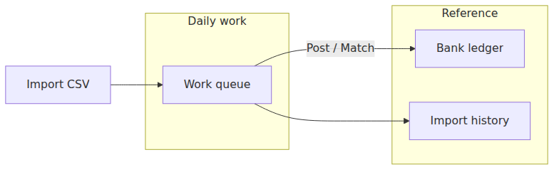

# Bank Clearing Workspace — Implementation Plan

| Field | Value |
|-------|-------|
| **Version** | 1.1 |
| **Status** | **Implemented** (June 2026) |
| **Date** | June 2026 |
| **Related** | [bank-clearing-workspace-exploration.md](bank-clearing-workspace-exploration.md) (pre-restructure analysis) · [admin-portal-redesign-plan.md §7.6](admin-portal-redesign-plan.md#76-bank-clearing) · [Reconciliation workspace](../app/Filament/Tenant/Pages/ReconciliationOverviewPage.php) (reference pattern) |
| **Primary entry** | `BankAccountsResource` → `ListBankAccounts` (`/bank-accounts`) |
| **SMS entry** | `SmsImportsPage` (`/sms-imports`) |

---

## Table of contents

1. [Executive summary](#1-executive-summary)
2. [Pre-restructure state (historical)](#2-pre-restructure-state-historical)
3. [Implemented state](#3-implemented-state)
4. [Target experience](#4-target-experience)
5. [Information architecture](#5-information-architecture)
6. [Workflow redesign](#6-workflow-redesign)
7. [Presentation & UI](#7-presentation--ui)
8. [Technical architecture](#8-technical-architecture)
9. [Implementation phases](#9-implementation-phases)
10. [File map](#10-file-map)
11. [Testing strategy](#11-testing-strategy)
12. [Bilingual & accessibility](#12-bilingual--accessibility)
13. [Success criteria](#13-success-criteria)
14. [Out of scope / deferred](#14-out-of-scope--deferred)

---

## 1. Executive summary

The **Bank clearing** workspace was reorganized from **data-type tabs** (statements, statement lines, ledger, pending match) into a **workflow-first** experience. Admins now work from a single queue, with ledger and import history reserved for audit.

**Delivered outcomes:**

1. **Work queue** — unified inbox for bank-file and operational open items.
2. **Clear vs match** — distinct actions: *Match to bank line* (CSV evidence) vs *Clear without evidence* (operational only).
3. **Bank ledger** and **Import history** — reference tabs; history shows batches + collapsible closed lines.
4. **SMS imports** — separate sidebar page (`/sms-imports`); bank clearing is bank-only.

**Non-goals (unchanged):** Domain services (`BankImportService`, `BankClearingMatchService`, `FundFlowService`, ledger posting rules) were not altered — this is a **UX and IA refactor** on top of existing logic.

**Reference implementation:** Mirror patterns from the reconciliation overhaul:

- `ReconciliationTabRegistry` + pill navigation
- `ReconciliationOverviewPage` workspace shell + shortcuts
- `ReconciliationExceptionPresenter` + grouped row actions
- `EmbedsAsAuditWorkspacePanel` for header actions

---

## 2. Pre-restructure state (historical)

> Snapshot before June 2026 restructure. See [exploration doc](bank-clearing-workspace-exploration.md) for full as-is analysis.

### 2.1 Navigation layers (bank channel)

| Layer | Control | Values |
|-------|---------|--------|
| Channel | `?channel=` / `setChannel()` | Bank · SMS |
| Main tab | Filament `activeTab` / `?tab=` | Pending bank match (default) · Statement lines · Master bank ledger · Statements |
| Sub-section | `?importsSection=` | Unmatched · Matched / closed (Statement lines only) |

### 2.2 Tables and responsibilities

| Table class | Tab | Purpose |
|-------------|-----|---------|
| `PendingOperationalClearanceTable` | Pending bank match | Synthetic operational rows awaiting CSV match |
| `BankTransactionsTable` | Statement lines | Real imported CSV lines; post / match / ignore |
| `MasterBankLedgerTable` | Master bank ledger | Master bank `Transaction` ledger |
| `BankStatementsTable` | Statements | Import batch metadata |

### 2.3 Duplication surfaces

| Action | Workspace | Master account RM |
|--------|-----------|-------------------|
| Clear / Match | Pending + Statement lines | `PendingOperationalClearanceRelationManager` |
| Post to cash / member | Statement lines | `BankLinesAwaitingPostingRelationManager` (master cash) |
| Delete pending | Pending | Same RM |

### 2.4 Pain points (prioritized)

1. **Wrong default** — opens Pending bank match; most sessions start with unmatched imports.
2. **Concept overload** — uncleared vs pending match vs unmatched vs imported/mirrored/posted.
3. **Scattered actions** — same workflows in workspace + master account pages.
4. **Heavy insights** — full KPI widget competes with queue on mobile.
5. **Badge mismatch** — nav badge = all `uncleared()`; tab badge = `pendingOperationalClearanceCount()` only.
6. **Mixed tab systems** — Filament tabs + custom `ff-tenant-tab-pills` for channel/SMS/imports.
7. **Virtual column search bugs** — e.g. `clearance_kind` (fixed); audit other `->state()` columns for `->searchable(false)`.

7. **Virtual column search bugs** — e.g. `clearance_kind` (fixed); audit other `->state()` columns for `->searchable(false)`.

---

## 3. Implemented state

### 3.1 Navigation (June 2026)

| Surface | Control | Values |
|---------|---------|--------|
| Bank clearing tabs | `?tab=` / `setBankTab()` | **Work queue** (default) · Bank ledger · Import history |
| Queue filters | `?queueFilter=` | All open · From bank file · From operations |
| History | `?historySection=closed` | Expands closed-lines panel (legacy deep links) |
| SMS | Sidebar **SMS imports** | `/sms-imports` (`?smsSubTab=transactions\|history`) |
| Legacy SMS URL | `?channel=sms` on `/bank-accounts` | Redirects to `/sms-imports` |

### 3.2 Primary tables

| Table / widget | Tab / page | Purpose |
|----------------|------------|---------|
| `BankClearingQueueTable` | Work queue | Unified open items (bank file + operations) |
| `MasterBankLedgerTable` | Bank ledger | Master bank `Transaction` ledger |
| `BankImportBatchesTableWidget` | Import history | Statement import batches |
| `BankClosedStatementLinesTableWidget` | Import history (collapsible) | Posted / ignored / duplicate lines (audit) |
| `SmsTransactionsTableWidget` | SMS imports | Parsed SMS rows |
| `SmsImportSessionsTableWidget` | SMS imports → History | SMS import batches |

### 3.3 Row actions (work queue)

| Group | Actions |
|-------|---------|
| **Resolve** | Post to cash · Post to member · Match automatically · **Match to bank line** · **Clear without evidence** |
| **Review** | View details (modal with `BankClearingQueuePresenter`) |
| **Remove** | Ignore · Remove pending bank match · Delete |

**Vocabulary:**

| User label | Meaning |
|------------|---------|
| Match to bank line | Pair with imported CSV statement line (evidence) |
| Clear without evidence | Close operational synthetic row without CSV pairing |
| Match automatically | `findUniqueCandidate()` returns exactly one import line |

### 3.4 Master account drill-down

| RM | Behaviour |
|----|-----------|
| `PendingOperationalClearanceRelationManager` | ≤5-row **read-only** preview + **Open in bank clearing** (`queueFilter=operations`) |
| `BankLinesAwaitingPostingRelationManager` | View-only preview + **Open in bank clearing** (`queueFilter=bank_file`) |

### 3.5 Badge & insights

- Sidebar badge: `BankClearingQueueService::openCount()` (actionable queue only).
- Work queue: slim KPI strip + optional **Show balances & trends** toggle for full `BankAccountsInsightsWidget`.

---

## 4. Target experience

### 3.1 User mental model

Organize around **workflow stages**, not database tables:





### 3.2 One-line tab purpose

| Tab | Admin question answered |
|-----|-------------------------|
| **Work queue** | What do I need to do right now? |
| **Bank ledger** | What has been posted to the master bank account? |
| **Import history** | What files did we import and what happened to them? |

### 3.3 Vocabulary (user-facing)

| Internal / code | User label |
|-----------------|------------|
| `imported`, `mirrored` (needs action) | **Needs posting** |
| Operational synthetic rows | **Needs bank match** |
| `posted`, `ignored`, `duplicate` | **Closed** |
| `is_cleared = true` | **Matched to bank** |

Apply consistently in tab helpers, badges, empty states, and notifications.

---

## 5. Information architecture

### 4.1 Bank channel — three primary tabs

Replace four Filament tabs + imports sub-pills with **one pill row** (like Reconciliation):

| Tab key | Label | Default |
|---------|-------|---------|
| `queue` | Work queue | **Yes** |
| `ledger` | Bank ledger | |
| `history` | Import history | |

**Registry:** `App\Filament\Tenant\Support\BankClearingTabRegistry` (new), analogous to `ReconciliationTabRegistry`.

**URL:** `?tab=queue|ledger|history` (migrate aliases: `clearance` → `queue`, `imports` → `queue` with filter, `statements` → `history`, `transactions` → `queue`).

### 4.2 Work queue filter chips (not tabs)

Within **Work queue**, horizontal chips:

| Chip key | Scope |
|----------|-------|
| `all` | Union of open import lines + pending operational rows |
| `bank_file` | CSV import lines needing post or match |
| `operations` | Synthetic operational rows needing bank match |

**URL:** `?queueFilter=all|bank_file|operations` (default `all`).

### 4.3 SMS channel

**Phase 4 decision (recommended):** Move SMS to separate sidebar item **SMS imports** (`SmsImportSessionsResource` or dedicated page), not a channel toggle on Bank clearing.

**Interim (Phase 1):** Keep Bank/SMS channel pills; hide SMS behind **More channels** expander to reduce visual noise.

### 4.4 Master account drill-down

On `ViewMasterAccount` for master cash / expense / fees / invest:

- Replace full duplicate tables with **summary strip + deep link**:
  - “{n} pending bank matches → Open in Bank clearing (filtered)”
- Optional: show **5-row preview** (read-only), no duplicate Clear/Match actions.
- Keep **Transactions** relation manager (account ledger history).

---

## 6. Workflow redesign

### 5.1 Unified work queue query

**New service:** `App\Services\BankClearingQueueService`

Responsibilities:

| Method | Returns |
|--------|---------|
| `openItemsQuery(QueueFilter $filter)` | Eloquent builder for unified queue |
| `counts(): array` | KPIs for queue summary strip |
| `kindsForRecord(BankTransaction $record): string` | `csv_import` \| `deposit` \| `expense` \| … |
| `primaryActionForRecord(BankTransaction $record): ?string` | Suggested next action name |

**Composition (no new tables):**

- **Bank file slice:** existing `BankTransactionsTable` unmatched query (imported/mirrored, real CSV lines).
- **Operations slice:** existing `BankClearingMatchService::applyPendingOperationalClearanceScope()`.
- **Union presentation:** single `BankClearingQueueTable` (new) with shared columns and contextual row actions.

### 5.2 Row action groups

Mirror `ReconciliationExceptionActions` grouping:

| Group | Actions |
|-------|---------|
| **Resolve** | Post to cash · Post to member · Clear / Match · Auto-match (when unique candidate) |
| **Review** | View details (drawer/modal) |
| **Remove** | Ignore · Remove pending bank match · Delete (policy-gated) |

**Bulk (Work queue toolbar):**

- Match all with unique candidates
- Post selected to cash (bank file rows only)
- Ignore selected (bank file rows only)
- Refresh

### 5.3 Auto-match

Extend `BankClearingMatchService`:

- `findUniqueCandidate(BankTransaction $pending): ?BankTransaction`
- `autoMatchWhenUnique(BankTransaction $pending): bool`
- Row action **Auto-match** visible only when unique candidate exists.
- Bulk: **Match all unique** with summary notification (matched / ambiguous / skipped).

### 5.4 Import history tab

Combine:

- **Statements** table (top) — batches, errors, delete, view
- **Closed lines** table (collapsible) — posted/ignored/duplicate lines (read-only audit)

**Import statement** CTA: primary header action on Work queue; secondary on Import history.

### 5.5 Bank ledger tab

Keep `MasterBankLedgerTable` behaviour:

- Manual Credit / Debit / Refund via `AccountTransactionManualAdjustmentHeaderActions`
- View-only row actions
- No import/post actions on this tab

### 5.6 Navigation badge

Align sidebar badge with **actionable work queue count** (not all `uncleared()`):

```php
BankClearingQueueService::openCount()
```

---

## 7. Presentation & UI

### 6.1 Page shell

Refactor `ListBankAccounts` to use workspace layout similar to Reconciliation:

```
┌─────────────────────────────────────────────────────────┐
│ Bank clearing                    [Import] [More ▾]      │
│ Subheading: one sentence — what to do next              │
├─────────────────────────────────────────────────────────┤
│ [Work queue] [Bank ledger] [Import history]             │
├─────────────────────────────────────────────────────────┤
│ Queue KPI strip (4 cards) — Work queue tab only         │
│ Shortcut cards → Master cash, Reconciliation, Settings  │
├─────────────────────────────────────────────────────────┤
│ Filter chips: All open | From bank file | Operations    │
├─────────────────────────────────────────────────────────┤
│ TABLE                                                   │
└─────────────────────────────────────────────────────────┘
```

**New / updated views:**

- `resources/views/filament/tenant/pages/bank-clearing.blade.php` (shell)
- `resources/views/filament/tenant/pages/partials/bank-clearing-tab-pills.blade.php`
- `resources/views/filament/tenant/pages/partials/bank-clearing-queue-insights.blade.php`
- `resources/views/filament/tenant/pages/partials/bank-clearing-shortcuts.blade.php`
- `resources/views/filament/tenant/pages/partials/bank-clearing-workspace-actions.blade.php`

**Trait:** `EmbedsAsAuditWorkspacePanel` or new `EmbedsAsBankClearingWorkspacePanel` for workspace panel actions.

### 6.2 Insights widget

**Phase 1:** On Work queue tab only, show **slim 4-KPI strip** (Imported today · Auto-matched · Open queue · Stale pending).

**Phase 2:** Move full `BankAccountsInsightsWidget` (pipeline bars, balances, trends) behind **“Show balances & trends”** collapsible panel.

### 6.3 Row detail drawer

**New presenter:** `App\Support\BankClearing\BankClearingQueuePresenter`

- Human title, kind badge, amount, member, recommended action, links to related master account / reconciliation.
- Used by View action on queue rows (compact modal, not full page navigation for routine review).

### 6.4 CSS

Extend `resources/css/filament/tenant/tenant-portal-components.css`:

- `ff-bank-clearing-*` classes (mirror `ff-recon-*`)
- Queue KPI cards, shortcut cards, filter chips
- Mobile-first: no horizontal scroll for critical queue columns

### 6.5 Confirmation modals

Reuse `TenantPortalActionModal` for destructive queue actions (delete, remove pending match, bulk match).

---

## 8. Technical architecture

### 7.1 New classes

| Class | Role |
|-------|------|
| `BankClearingTabRegistry` | Tab keys, labels, icons, URL helpers |
| `BankClearingQueueService` | Unified query, counts, kind resolution |
| `BankClearingQueuePresenter` | Row copy, context links, guidance |
| `BankClearingQueueTable` | Filament table config for Work queue |
| `BankClearingQueueActions` | Row + bulk actions (wraps existing services) |
| `BankClearingQueueFilter` | Enum: `All`, `BankFile`, `Operations` |

### 7.2 Modified classes (primary)

| Class | Change |
|-------|--------|
| `ListBankAccounts` | Workspace shell, tab state, default `queue` |
| `BankAccountsResource` | `resolveListBankAccountsTab()` → registry; `listUrl()` helpers |
| `BankAccountsInsightsWidget` | Tab-aware; slim mode on queue |
| `PendingOperationalClearanceRelationManager` | Summary + link (Phase 3) |
| `BankLinesAwaitingPostingRelationManager` | Summary + link (Phase 3) |
| `ReconciliationOverviewPage` | Update shortcut URLs if tab keys change |

### 7.3 Unchanged domain services

Do **not** change posting/clearing logic in:

- `BankClearingMatchService`
- `BankImportService`
- `FundFlowService`
- `FundPostingService` / `MemberCashOutService`
- `MasterExpenseDisbursementService` / fee / invest disbursement services
- `BankTransactionDeletion` / `PendingOperationalClearanceDeletionService`

Queue UI calls these services; no duplicate business rules in Filament actions.

### 7.4 URL backward compatibility

`BankAccountsResource::resolveListBankAccountsTab()` match map:

| Legacy `?tab=` | New tab | Notes |
|----------------|---------|-------|
| `clearance` | `queue` | `queueFilter=operations` |
| `imports`, `transactions` | `queue` | `queueFilter=bank_file` |
| `ledger` | `ledger` | |
| `statements` | `history` | |

Preserve `?channel=sms` until Phase 4.

---

## 9. Implementation phases

### Phase 0 — Prep ✅

- [x] Baseline tab URL tests (`BankAccountsListTabResolutionTest`)

### Phase 1 — Navigation & shell ✅

- [x] `BankClearingTabRegistry`, `bank-clearing.blade.php`, workspace shell, default Work queue
- [x] Legacy URL aliases, import CTA in `workspacePanelActions()`, slim KPIs, shortcuts, `ff-bank-clearing-*` CSS, `lang/ar.json`

### Phase 2 — Unified work queue ✅

- [x] `BankClearingQueueService`, `BankClearingQueueTable`, filter chips, `BankClearingQueuePresenter`, badge alignment
- [x] **Show balances & trends** toggle on queue tab

### Phase 3 — Workflow polish ✅

- [x] Auto-match (`findUniqueCandidate`, bulk **Match all unique**)
- [x] Grouped actions: Resolve / Review / Remove
- [x] **Clear vs match** split (`matchToBankLine`, `clearWithoutEvidence`)
- [x] Import history: batches + collapsible closed lines
- [x] Master account RMs: read-only preview + deep links
- [x] Shared `BankClearingQueueActions` on queue/history tables

### Phase 4 — SMS decoupling ✅

- [x] `SmsImportsPage` in sidebar (`TenantNavigation::SORT_SMS_IMPORTS`)
- [x] Legacy `?channel=sms` redirect; bank clearing bank-only
- [x] Removed `bank-workspace.blade.php`, `imports-section-pills.blade.php`

### Phase summary

| Phase | Effort | User-visible outcome |
|-------|--------|----------------------|
| 0 | 0.5 d | Baseline |
| 1 | 2–3 d | Cleaner nav, default queue, shortcuts |
| 2 | 3–4 d | True unified inbox |
| 3 | 2–3 d | Faster matching, less duplication |
| 4 | 1–2 d | SMS separated |
| **Total** | **~9–12 d** | Full target experience |

---

## 10. File map

### 10.1 New / primary files

```
app/Filament/Tenant/Support/BankClearingTabRegistry.php
app/Filament/Tenant/Concerns/EmbedsAsBankClearingWorkspacePanel.php
app/Filament/Tenant/Pages/SmsImportsPage.php
app/Services/BankClearingQueueService.php
app/Support/BankClearing/BankClearingQueueFilter.php
app/Support/BankClearing/BankClearingQueuePresenter.php
app/Filament/Tenant/Resources/BankAccounts/Tables/BankClearingQueueTable.php
app/Filament/Support/BankClearingQueueActions.php
app/Filament/Tenant/Widgets/BankImportBatchesTableWidget.php
app/Filament/Tenant/Widgets/BankClosedStatementLinesTableWidget.php

resources/views/filament/tenant/pages/bank-clearing.blade.php
resources/views/filament/tenant/pages/sms-imports.blade.php
resources/views/filament/tenant/partials/bank-clearing-*.blade.php
resources/css/filament/tenant/tenant-portal-components.css  (ff-bank-clearing-*)
```

### 10.2 Tests

```
tests/Feature/Tenant/BankClearingTabRegistryTest.php
tests/Feature/Tenant/BankClearingWorkspaceSmokeTest.php
tests/Feature/Tenant/BankClearingWorkspaceLocaleSmokeTest.php
tests/Feature/Tenant/BankClearingQueueWorkflowTest.php
tests/Feature/Tenant/BankClearingPhaseThreeAndSmsTest.php
tests/Feature/Tenant/BankClearingQueuePresenterTest.php
tests/Unit/BankClearingQueueServiceTest.php
tests/Feature/Tenant/BankClearingMatchServiceTest.php
tests/Feature/Tenant/SmsImportSessionsAndBankWorkspaceTest.php
```

### 10.3 Removed (deprecated)

```
resources/views/filament/tenant/resources/bank-accounts/pages/bank-workspace.blade.php
resources/views/filament/tenant/resources/bank-accounts/partials/imports-section-pills.blade.php
resources/views/filament/tenant/partials/bank-clearing-history-section-pills.blade.php
```

`PendingOperationalClearanceTable` and `BankTransactionsTable` remain as building blocks for RMs, widgets, and `auditMode` history lines.

---

## 11. Testing strategy

### 10.1 Per-phase gates

- `vendor/bin/pint --dirty`
- `php artisan test --compact` for affected files
- `npm run build` when CSS changes
- Manual smoke: Work queue → import → post → match flow (en + ar)

### 10.2 Architecture tests

Extend `tests/Architecture/FilamentTableStandardsTest.php` if new tables added (filters, grouping, bulk actions).

### 10.3 Regression hotspots

| Area | Risk |
|------|------|
| Tab URL aliases | Bookmarks, reconciliation shortcuts |
| Bulk match | Partial failures, ambiguous candidates |
| Delete pending | Ledger reversal (`PendingOperationalClearanceDeletionService`) |
| Virtual column search | Global `Column::configureUsing` searchable |
| Master RM links | Filtered queue URL must scope correctly |

---

## 12. Bilingual & accessibility

- All new labels via `__()`; mirror keys in `lang/ar.json`
- Use `translateLabel()` on Filament columns/filters/actions
- Tab pills: reuse `ff-tenant-tab-pills` (RTL-safe)
- Queue modal: reuse `TenantPortalActionModal` + compact confirm for deletes
- Run `tests/Feature/Tenant/BankAccountsTranslationTest.php` after string changes
- Mobile-first table: wrapped cells, compact headers (existing global defaults)

---

## 13. Success criteria

| # | Criterion | Status |
|---|-----------|--------|
| 1 | Admin opens Bank clearing and lands on **Work queue** | ✅ |
| 2 | **One screen** completes post, match, and clear-without-evidence | ✅ |
| 3 | No duplicate match/clear actions on master account RMs | ✅ |
| 4 | Sidebar badge equals actionable queue count | ✅ |
| 5 | Legacy `?tab=clearance` and `?tab=imports` URLs resolve | ✅ |
| 6 | Automated test coverage | ✅ |
| 7 | Arabic UI for new strings | ✅ |
| 8 | Mobile-first table defaults (wrap, compact headers) | ✅ |

---

## 14. Out of scope / deferred

- Changing bank import CSV parsing or matching tolerance rules
- New bank statement file formats
- Custom report builder (see admin-portal-redesign §7.7)
- Dashboard bank clearing widget redesign (separate dashboard phase)
- Auto-posting rules / ML match suggestions
- Member portal bank views

---

## Appendix A — Reconciliation pattern checklist

When implementing each phase, verify parity with reconciliation workspace:

- [x] `*TabRegistry` centralizes tab keys and labels
- [x] Custom blade shell wraps Filament table (or widgets on history tab)
- [x] `workspacePanelActions()` for primary + dropdown actions
- [x] Shortcut cards with deep links
- [x] Presenter class for human-readable row detail
- [x] Grouped row actions via `TableRecordActionGroups`
- [x] Queue-focused KPI strip, not full insights on every tab
- [x] `recordAction` / row click opens view modal
- [x] CSS prefixed `ff-bank-clearing-*` under `.fi-panel-tenant`

---

## Appendix B — Git workflow

```
main
 └── feature/bank-clearing-workspace
      ├── PR: phase-1-navigation-shell
      ├── PR: phase-2-unified-queue
      ├── PR: phase-3-workflow-polish
      └── PR: phase-4-sms-decouple (optional)
```

| Rule | Detail |
|------|--------|
| **Commits** | `feat(bank-clearing): …`, `test(bank-clearing): …` |
| **PRs** | One phase per PR where possible |
| **Merge** | Tests + pint required; `npm run build` if CSS touched |

---

## Appendix C — Manual smoke checklist (en / ar)

Run after deploy or major bank-clearing changes. Automated locale coverage: `php artisan test --compact tests/Feature/Tenant/BankClearingWorkspaceLocaleSmokeTest.php`.

### Setup

| Step | Action |
|------|--------|
| 1 | Log in as tenant admin |
| 2 | **English:** ensure locale is EN (header language switch → English) |
| 3 | **Arabic:** switch to AR (`/locale/ar` or header switch), confirm `dir="rtl"` |

### Bank clearing (`/bank-accounts`)

| # | Check | EN expected | AR expected (examples) | Auto |
|---|-------|-------------|------------------------|------|
| 1 | Default tab | Work queue | قائمة العمل | ✅ |
| 2 | Tab pills | Work queue · Bank ledger · Import history | قائمة العمل · دفتر البنك الرئيسي · سجل الاستيراد | ✅ |
| 3 | No SMS channel toggle on page | — | — | ✅ |
| 4 | Queue filter chips | All open · From bank file · From operations | جميع المفتوح · من ملف البنك · من العمليات | ✅ |
| 5 | Show balances & trends | Toggle expands insights widget | عرض الأرصدة والاتجاهات | ✅ |
| 6 | More menu | SMS imports · Reconciliation | استيراد الرسائل القصيرة | — |
| 7 | Import history tab | Import batches section visible | دفعات الاستيراد | ✅ |
| 8 | Closed lines panel | Expand/collapse works | أسطر كشف مغلقة | ✅ |
| 9 | Row actions (queue item) | Resolve → Match to bank line / Clear without evidence | مطابقة مع سطر بنكي / تسوية بدون دليل | — |
| 10 | Legacy URL `?tab=clearance` | Opens queue, operations filter | — | ✅ (tests) |
| 11 | Legacy `?channel=sms` | Redirects to `/sms-imports` | — | ✅ |

### SMS imports (`/sms-imports`)

| # | Check | EN | AR | Auto |
|---|-------|----|----|------|
| 1 | Sidebar nav item | SMS imports | استيراد الرسائل القصيرة | — |
| 2 | Tabs | Transactions · History | — | ✅ |
| 3 | Workspace title | SMS imports workspace | مساحة عمل استيراد الرسائل القصيرة | ✅ |

### Master account preview

| # | Check | Expected |
|---|-------|----------|
| 1 | Master cash → Pending bank match RM | Read-only rows, **Open in bank clearing** header |
| 2 | Master cash → Bank lines awaiting posting RM | View-only, deep link to `queueFilter=bank_file` |

### Regression commands

```bash
vendor/bin/pint --dirty
php artisan test --compact tests/Feature/Tenant/BankClearingWorkspaceLocaleSmokeTest.php tests/Feature/Tenant/BankClearingWorkspaceSmokeTest.php tests/Feature/Tenant/BankClearingQueueWorkflowTest.php
php scripts/find-bank-accounts-missing-ar.php   # expect 0 missing
```

**Last automated locale smoke:** June 2026 — 8/8 passed (`BankClearingWorkspaceLocaleSmokeTest`).

---

*End of plan.*
