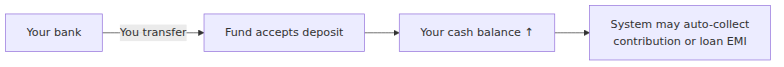
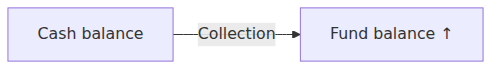
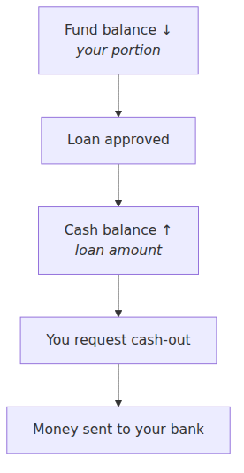
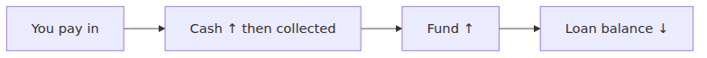

# FundFlow — How Your Money Works (Member Guide)

**One page · For members**

---

## Your two balances

| Balance | What it means |
|---------|----------------|
| **Cash** | Money available in your account right now — used for contributions, loan payments, and withdrawals |
| **Fund** | Your equity stake in the pool — built from contributions and loan repayments; used when you borrow |

Think of **cash** as your wallet and **fund** as your savings in the cooperative.

---

## Money coming in

1. You transfer money to the fund’s bank account.
2. Admin accepts your deposit (or it is posted from a bank import).
3. Your **cash balance** increases.
4. The system may immediately apply cash to your **monthly contribution** or **loan installment** if due.

---

## Monthly contribution

When your contribution is collected, cash moves into your **fund balance**. That is your share of the pool’s total value.

If you do not have enough cash, the contribution stays **pending** or **overdue** until more money arrives.

---

## Taking a loan

- Borrowing uses part of your **fund** and part of the **shared pool** (split depends on your loan).
- The loan amount appears in your **cash** first — it is not sent to your bank automatically.
- You submit a **cash-out request**; after admin approval, money is transferred to your bank.

---

## Paying back a loan

Payments (deposits) are credited to cash, then applied to loan installments. You repay the **pool’s share** of the loan plus any settlement amount — not your own fund equity that was used at disbursement.

When fully repaid, your loan is marked **completed** and your guarantor may be released.

---

## Quick answers

| Question | Answer |
|----------|--------|
| Why is my cash 0 after I paid in? | It may have been collected for contribution or a loan installment |
| Why is my fund negative? | You have an active loan; fund was debited at disbursement |
| When do I get loan money in my bank? | After you request and admin approves a **cash-out** |
| Can I withdraw fund balance directly? | No — only **cash** can be cashed out |

---

## Slide outline (presentation)

1. **Title** — How your money moves in FundFlow  
2. **Two balances** — Cash vs fund (wallet vs equity)  
3. **Deposits** — Bank → your cash  
4. **Contributions** — Cash → fund  
5. **Loans** — Fund → cash → your bank (via cash-out)  
6. **Repayments** — Pay in → cash → fund → loan paid down  
7. **FAQ** — Common member questions  

---

*Full technical reference: [fund-flow-dynamics.md](./fund-flow-dynamics.md)*
