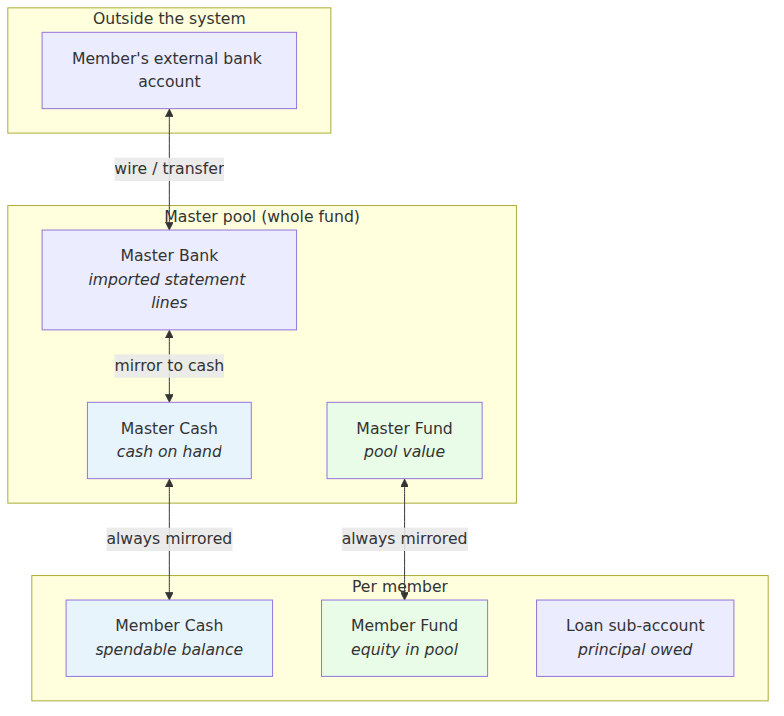
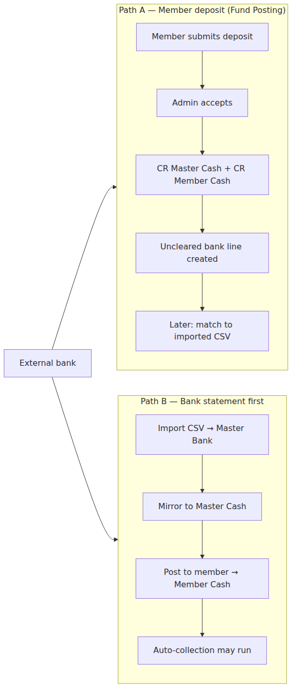
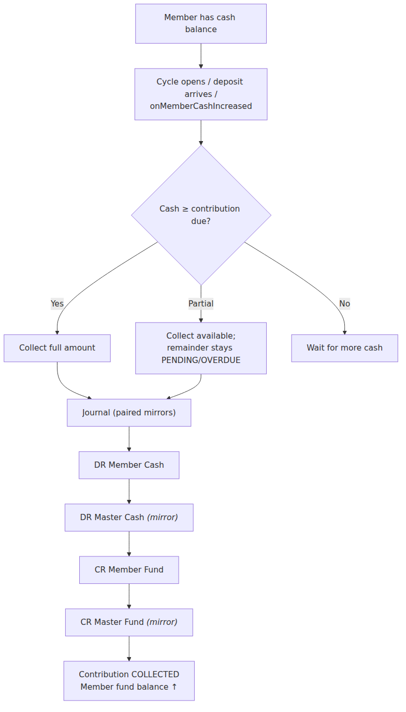
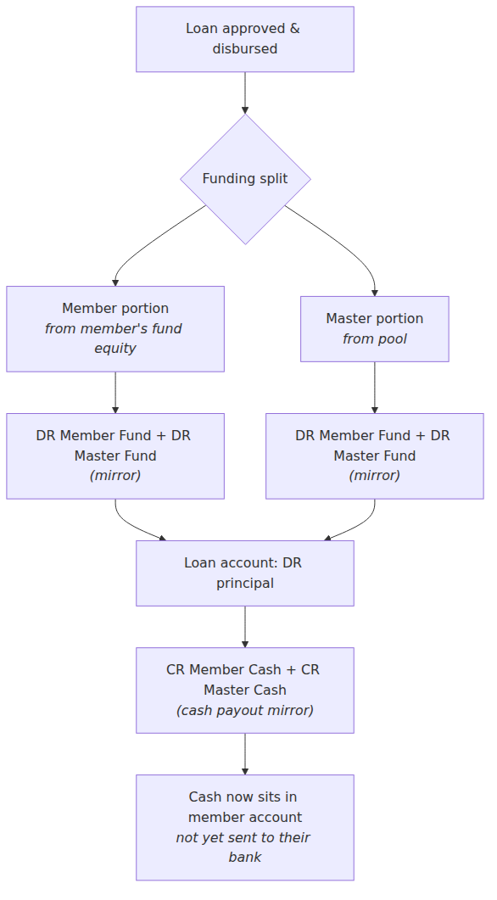
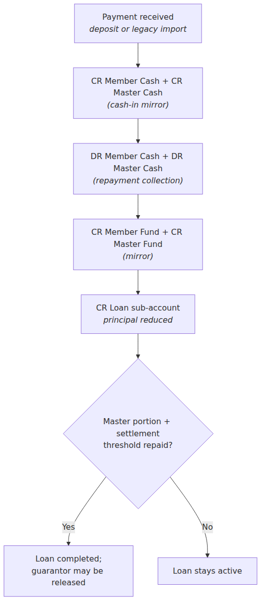
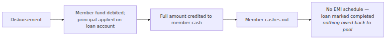
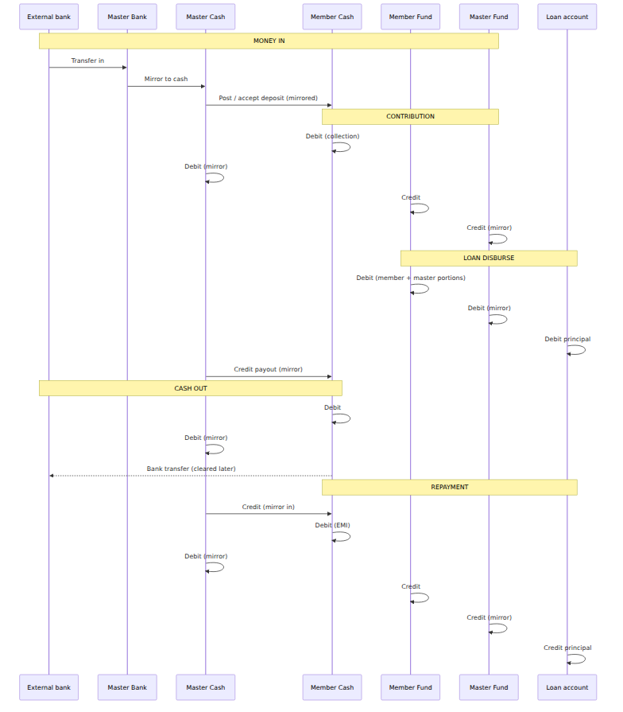

# FundFlow — Fund Flow Dynamics

This diagram set explains how money moves through FundFlow: **two parallel pools** (cash and fund), kept in sync between master and member accounts, with **bank clearance** as a separate reconciliation step.

---

## 1. Account map — where money lives

**Pool rules (checked nightly):**

| Invariant | Meaning |
|-----------|---------|
| Master Cash = Σ Member Cash | Total cash in the pool equals the sum of all members’ cash |
| Master Fund = Σ Member Fund | Total fund value equals the sum of all members’ fund balances |

Cash and fund are **separate ledgers**. A member can have cash without fund movement (and vice versa) until an operation links them (e.g. contribution collection moves cash → fund).

---

## 2. How money enters the system

Two main paths; both end with **member cash credited** (and master cash mirrored).

**Important:** Ledger posting records **intent** (money is in the member’s cash account). **Bank clearance** (matching an imported line or an uncleared placeholder) confirms it against the real bank — it does **not** post extra cash/fund legs when matched correctly.

---

## 3. Monthly contribution collection

When a member has cash (from a deposit or legacy import mirror), the collection cycle **moves cash into fund equity**.

**Economic meaning:** Cash leaves the member’s “wallet” and becomes **fund equity** (their share of the pool). Late fees, if any, also debit member + master cash.

---

## 4. Loan lifecycle — disbursement, cash-out, repayment

### 4a. Disbursement (ledger only — no bank payout yet)

### 4b. Cash-out (actual bank transfer)

### 4c. Loan repayment (EMI / imported payment)

**Repayment target:** Master fund slice + settlement threshold (e.g. 16%). The member’s own fund portion at disbursement is **equity**, not cash EMI — only the pool’s share (+ settlement) is collected via repayments.

---

## 5. Special case — 100% member-fund loan (e.g. loan #143)

When the full loan is funded from the member’s own fund (`member_portion` = full amount, `master_portion` = 0, no settlement due):

There is **no pool exposure**, so no ongoing installment obligation.

---

## 6. End-to-end lifecycle (one member, simplified)

---

## 7. Mental model for stakeholders

| Question | Answer |
|----------|--------|
| Where is “real” bank money? | **Master Bank** (imported statements) + uncleared lines until matched |
| What can a member spend? | **Member Cash** (after collection hasn’t taken it for contributions/EMIs) |
| What is their stake in the pool? | **Member Fund** (contributions − disbursements + repayments) |
| When does the pool shrink/grow? | Fund legs on contribution (in), disbursement (out), repayment (in) |
| Why two steps for bank? | **Ledger** = economic event; **Clearance** = proof it hit the bank |

---

## 8. Operational functions → account touchpoints

| Function | Cash legs | Fund legs | Bank |
|----------|-----------|-----------|------|
| Deposit accept | CR member + master cash | — | Uncleared line → match |
| Bank import | Mirror → post to member | — | Master bank updated |
| Contribution | DR member + master cash | CR member + master fund | — |
| Loan disburse | CR member + master cash | DR member + master fund | — |
| Cash-out approve | DR member + master cash | — | Uncleared → match |
| Loan repayment | CR then DR cash (mirror pair) | CR member + master fund | — |
| Subscription fee | DR member + master cash | Fee to master fees | — |
| Legacy import | Same mirror patterns | Same mirror patterns | Often skipped |
