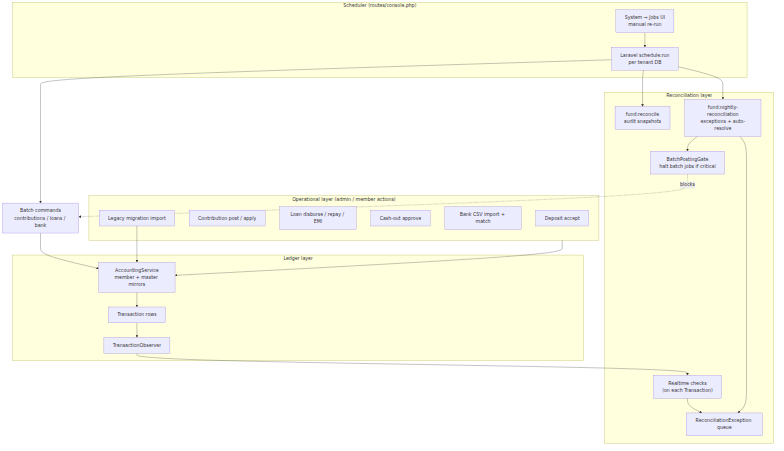
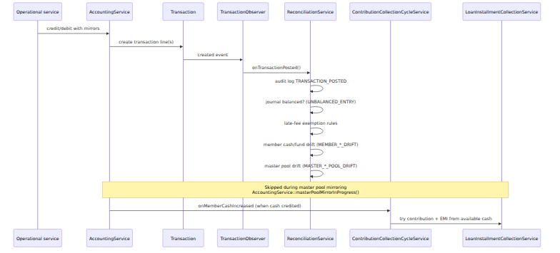
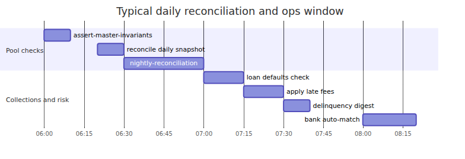
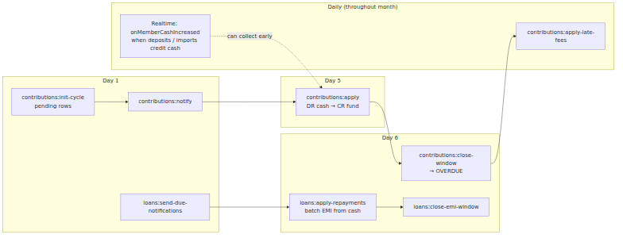
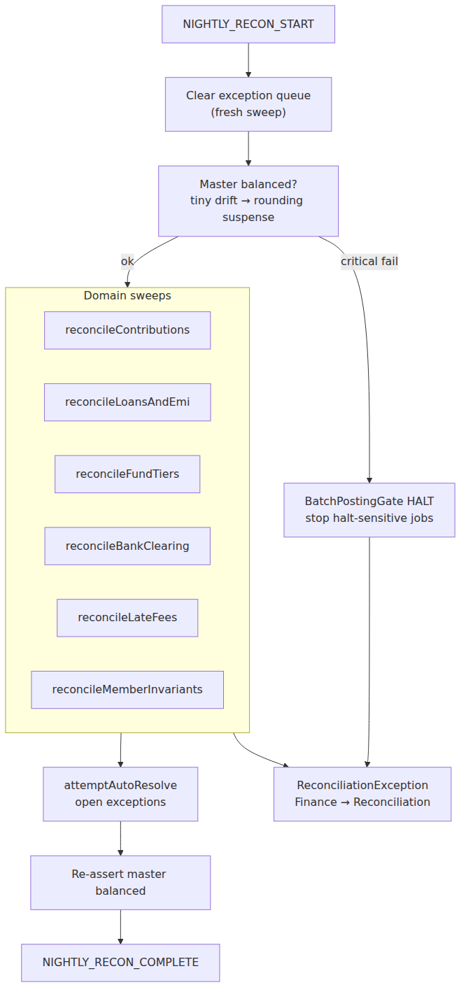
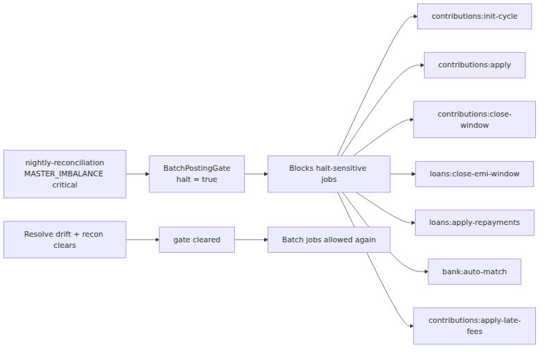
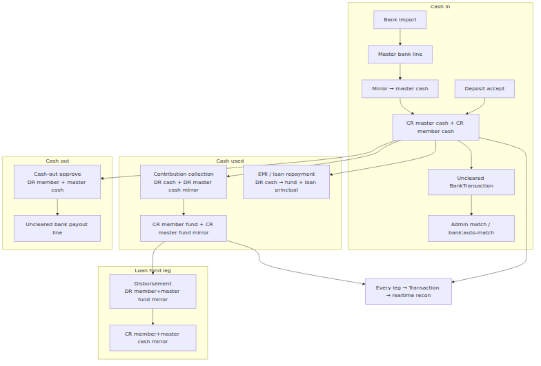

# FundFlow — Reconciliation & Scheduler

This document explains how **operational posting**, **reconciliation**, the **scheduler**, and **system jobs** fit together. It complements the money-movement detail in [fund-flow-dynamics.md](fund-flow-dynamics.md).

**One-page summaries:** [accountants](fund-flow-one-pager-reconciliation-scheduler-accountants.md) · [admins](fund-flow-one-pager-reconciliation-scheduler-admins.md)

**Related manuals:** [manual-accountant.md](manual-accountant.md) · [manual-administrator.md](manual-administrator.md)

---

## Table of contents

1. [Big picture — three layers](#1-big-picture--three-layers)
2. [Realtime path on every ledger post](#2-realtime-path-on-every-ledger-post)
3. [Daily scheduler timeline](#3-daily-scheduler-timeline)
4. [Monthly collection cycle](#4-monthly-collection-cycle)
5. [Nightly reconciliation batch](#5-nightly-reconciliation-batch)
6. [Audit snapshots vs exception queue](#6-audit-snapshots-vs-exception-queue)
7. [Batch posting gate](#7-batch-posting-gate)
8. [Operational flows through the lifecycle](#8-operational-flows-through-the-lifecycle)
9. [System jobs UI](#9-system-jobs-ui)
10. [Async queue jobs (not on cron)](#10-async-queue-jobs-not-on-cron)
11. [Summary](#11-summary)

---

## 1. Big picture — three layers

**Key idea:** Operations **post intent** to the ledger immediately. Reconciliation **verifies** that intent (realtime + nightly). The scheduler **drives recurring collection and checks** on a calendar. They are separate steps — bank clearance, for example, does not re-post cash when you match a line.

| Layer | What it does | When it runs |
|-------|--------------|--------------|
| **Operational** | Admin/member actions (accept deposit, apply contribution, etc.) | On demand |
| **Ledger** | Mirrored journal entries via `AccountingService` | Same transaction as the action |
| **Realtime recon** | Lightweight guards on each `Transaction` | Immediately after post |
| **Snapshots** | Historical audit report stored in `reconciliation_snapshots` | Daily 06:20, monthly 2nd |
| **Nightly batch** | Full domain sweeps, auto-resolve, halt gate | Daily 06:30 |
| **Scheduler** | Recurring collection, fees, bank match, statements | Calendar in `routes/console.php` |

---

## 2. Realtime path on every ledger post

**Realtime checks** (`ReconciliationService::onTransactionPosted()`):

| Check | Exception code | Severity |
|-------|----------------|----------|
| Journal DR = CR for reference | `UNBALANCED_ENTRY` | critical |
| Late-fee exemption consistency | varies | varies |
| Member component formula vs stored balance | `MEMBER_CASH_DRIFT`, `MEMBER_FUND_DRIFT` | high |
| Master cash/fund vs Σ members | `MASTER_CASH_POOL_DRIFT`, `MASTER_FUND_POOL_DRIFT` | high |

**Skipped when:**

- `ReconciliationService::realtimeChecksSuspended()` is active
- `AccountingService::masterPoolMirrorInProgress()` — paired master/member legs post in one logical operation

Heavy domain sweeps (contributions past window, bank uncleared pipeline, EMI state) run in the **nightly batch**, not on every transaction.

---

## 3. Daily scheduler timeline

All scheduled tenant commands use `TenantAwareScheduledCommand` — `schedule:run` executes each command **once per tenant database**.

Source: `routes/console.php` · Registry: `App\Support\ScheduledJobRegistry`

| Time | Command | Role | Halt-sensitive |
|------|---------|------|----------------|
| **06:00** | `fund:assert-master-invariants` | Quick gate: master cash/fund = Σ members | No |
| **06:20** | `fund:reconcile --daily` | Audit snapshot for yesterday | No |
| **06:30** | `fund:nightly-reconciliation` | Control layer: exceptions, auto-resolve, halt gate | No |
| **07:00** | `loans:check-defaults` | Delinquency / guarantor / auto-transfer | No |
| **07:15** | `contributions:apply-late-fees` | Tiered contribution + EMI late fees | **Yes** |
| **07:30** | `delinquency:send-digest` | Admin digest notification | No |
| **08:00** | `bank:auto-match` | Match imported bank lines ↔ uncleared postings | **Yes** |
| *every minute* | `announcements:dispatch-scheduled` | Scheduled member announcements | No |

**Manual run:** Audit & System → Jobs — same commands, subject to `BatchPostingGate` for halt-sensitive entries.

---

## 4. Monthly collection cycle

| Day | Time | Command | Role | Halt-sensitive |
|-----|------|---------|------|----------------|
| **1st** | 08:00 | `contributions:init-cycle` | Create pending contribution rows | **Yes** |
| **1st** | 08:00 | `loans:send-due-notifications` | EMI due notifications | No |
| **1st** | 09:00 | `contributions:notify` | Contribution due notifications | No |
| **2nd** | 06:30 | `fund:reconcile --monthly` | Previous month audit snapshot | No |
| **3rd** | 08:00 | `statements:generate --notify` | Monthly statements + notify | No |
| **5th** | 09:00 | `contributions:apply` | Batch debit cash → credit fund | **Yes** |
| **6th** | 00:30 | `contributions:close-window` | Unpaid → overdue | **Yes** |
| **6th** | 00:45 | `loans:close-emi-window` | Unpaid installments → overdue | **Yes** |
| **6th** | 06:00 | `loans:apply-repayments` | Batch EMI collection from cash | **Yes** |

**Between scheduled runs:** any cash credit (deposit accept, bank import post-to-member, loan disbursement cash leg) triggers `ContributionCollectionCycleService::onMemberCashIncreased()` and `LoanInstallmentCollectionService` — members are not limited to Day 5/6 batch only.

---

## 5. Nightly reconciliation batch

`fund:nightly-reconciliation` → `ReconciliationService::runNightlyBatch()`:

| Sweep | Typical exceptions raised |
|-------|---------------------------|
| Master pre-check | `MASTER_IMBALANCE_UNRESOLVED` (critical → halt) |
| Contributions | `PENDING_PAST_WINDOW_CLOSE`, `COLLECTED_WITHOUT_POST`, tier mismatches |
| Loans / EMI | `EMI_COLLECTED_LEDGER_MISSING`, `ACTIVE_BEFORE_FULL_DISBURSE`, schedule state |
| Fund tiers | Tier / fund allocation consistency |
| Bank clearing | `RECON_UNMATCHED_BANK_LINE`, `UNMATCHED_CASH_ENTRY`, `STALE_PENDING` |
| Late fees | `FEE_WRONG_TIER`, `FEE_INCOME_DRIFT` |
| Member invariants | `MEMBER_CASH_DRIFT`, `MEMBER_FUND_DRIFT` |

After domain sweeps, **auto-resolve** attempts fix simple cases. A **post-batch** master balance check may halt again if drift remains critical.

---

## 6. Audit snapshots vs exception queue

These are **different products** — do not confuse them.

| Mechanism | Command | Output | Use |
|-----------|---------|--------|-----|
| **Exception queue** | `fund:nightly-reconciliation` | Live `reconciliation_exceptions` rows | Active remediation in admin UI |
| **Audit snapshot** | `fund:reconcile --daily` / `--monthly` | `reconciliation_snapshots` + PDF metrics | Historical audit trail for accountants |
| **Point-in-time audit** | `fund:reconcile --realtime` | Report only (`--no-store` skips save) | Ad-hoc investigation |

Snapshots include ledger mismatch counts, unposted bank rows, open exception counts, and coverage matrices — useful for month-end packs, not for replacing the live queue.

---

## 7. Batch posting gate

**Triggers halt:**

- `MASTER_IMBALANCE_UNRESOLVED` critical exception (open or raised during nightly batch)
- Manual halt via system settings (`batch_posting_halted`)

**Enforcement:**

- `ScheduledJobRegistry` — `halt_sensitive: true` on affected jobs
- `SystemJobRunnerService` — blocks manual runs from Jobs UI
- `EnsuresBatchPostingAllowed` trait — blocks Artisan command execution

**Recovery:**

1. Fix underlying master/member pool drift.
2. Resolve or write off critical exceptions.
3. Re-run `fund:nightly-reconciliation` (clears gate on success), or clear halt in settings after verification.

**Not blocked:** deposit accept, manual corrections, snapshot commands, `fund:assert-master-invariants`, notifications, delinquency checks.

---

## 8. Operational flows through the lifecycle

Every arrow that creates a `Transaction` feeds the realtime reconciliation path (section 2). Bank **match/clear** updates linkage — it does **not** post additional cash legs when done correctly.

---

## 9. System jobs UI

**Location:** Audit & System → Jobs

| Feature | Behaviour |
|---------|-----------|
| Job list | Mirrors `ScheduledJobRegistry::all()` |
| Manual run | `SystemJobRunnerService::run()` — records `SystemJobRun` |
| Halt badge | Shown when `BatchPostingGate::isHalted()` |
| History | Per-run exit code, duration, output snippet |

Scheduled cron and manual runs use the **same Artisan commands** — only the trigger differs (`SystemJobRun::TRIGGER_SCHEDULED` vs `TRIGGER_MANUAL`).

---

## 10. Async queue jobs (not on cron)

| Job | Trigger | Purpose |
|-----|---------|---------|
| `RunLegacyMigrationPaymentsJob` | Legacy Migration UI | Classify + import historical payments |
| `ClassifyLegacyPaymentsJob` | Legacy Migration UI | Payment classification only |
| Tenant provisioning jobs | Central app | Cache dirs, tenant setup |

Legacy migration runs **outside** the nightly scheduler. After import, operators may run repair commands (`legacy:repair-excess-loan-repayments`, `accounting:rebuild-balances`, etc.) before relying on reconciliation results.

---

## 11. Summary

FundFlow separates **posting** (what happened economically), **clearance** (does the bank agree?), and **reconciliation** (do the books still obey pool rules?).

1. Day-to-day actions post mirrored ledger entries immediately.
2. Each `Transaction` triggers lightweight realtime checks.
3. Every morning the scheduler runs pool assertions, stores an audit snapshot, then runs a full exception sweep that can halt batch collection jobs if the master pool is broken.
4. Monthly commands open and close contribution/EMI windows; between those dates, cash credits still drive automatic collection via `onMemberCashIncreased`.
5. Admins can re-run any scheduled job from **System → Jobs**, subject to the batch halt gate.

---

## References

| Resource | Path |
|----------|------|
| Scheduler definition | `routes/console.php` |
| Job registry | `app/Support/ScheduledJobRegistry.php` |
| Nightly batch | `app/Services/ReconciliationService.php` |
| Halt gate | `app/Support/BatchPostingGate.php` |
| Manual job runner | `app/Services/SystemJobRunnerService.php` |
| Mirror rules | `.cursor/rules/accounting-master-member-sync.mdc` |
| Accountant manual | `docs/manual-accountant.md` |
| Administrator manual | `docs/manual-administrator.md` |
