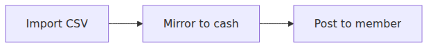

# Master bank manual credits and fund flow

This document explains how **manual credits/debits on the master bank ledger** relate to **statement imports**, **master cash**, and **member cash**. It complements [fund-flow-implementation.md](./fund-flow-implementation.md) and [collection_cycle_workflow.md](./collection_cycle_workflow.md).

## UI locations

| Screen | Tab / area | What it shows |
|--------|------------|---------------|
| **Bank Accounts** | **Statement lines** | Imported CSV rows (`bank_transactions`) — mirror and post-to-member actions |
| **Bank Accounts** | **Master bank ledger** | Account ledger (`transactions` on master bank) — manual credit/debit only |
| **Bank Accounts** | **Statements** | Import history |
| **Master Accounts → Bank** | Transaction History | Same master bank ledger as above |
| **Master Accounts → Cash** | Transaction History | Master cash ledger — manual credit with member tag pairs to member cash |
| **Fund Postings** | — | Member deposits — accept credits master cash + member cash |

Legacy URLs using `?tab=transactions` open **Statement lines** (`imports`).

---

## What a manual master bank credit does

A manual **Credit** or **Debit** on **Bank Accounts → Master bank ledger** (or **Master Accounts → Bank → Transaction History**) uses accounting kind **`master_bank_shadow`** (`AccountingService::postManualMasterBankShadow()`):

| Step | Without member tag | With member tag |
|------|-------------------|-----------------|
| Bank ledger | Credit or debit master bank | Same |
| Master cash | Same amount mirrored (credit/debit) | Same |
| Member cash | — | Same amount mirrored (credit/debit) |
| Collection | — | **Auto-collection** runs after credit (`ContributionCollectionCycleService::onMemberCashIncreased`) |

Manual bank entries still do **not** create **Statement lines** rows or use **Mirror to cash** / **Post to member** on imports. Use CSV import when you need `bank_transactions` reconciliation.

**Debit** with a member tag checks both member cash and master cash balances before posting.

---

## Reversing (“clearing”) manual master bank credits

There is no **Clear** action on master bank ledger entries.

To undo a mistaken manual credit:

1. Open **Bank Accounts → Master bank ledger** (or **Master Accounts → Bank → Transaction History**).
2. Use **Debit** for the same amount with a clear description (e.g. “Reversal of manual credit — …”).

Then complete the deposit using one of the supported paths below. Do not also mirror an import for the same money unless you have reversed the manual bank entry (see [Avoid double-counting](#avoid-double-counting)).

**Note:** **Clear / Match** on **Statement lines** links an imported line to an uncleared fund-posting or membership bank placeholder (`is_cleared`). That is not the same as reversing a manual master bank ledger credit.

---

## Path A — Member deposit (fund posting)

Use when a member has deposited money and you are recording it through the normal deposit workflow. Cash and member balances are updated on accept; bank CSV reconciles later.

1. **Fund Postings** — member submits a deposit (or an admin records one).
2. **Accept** the posting.  
   - Credits **Master Cash** and the **member’s cash** account.  
   - Creates an **uncleared** `bank_transactions` row linked to the posting (for later bank match).  
   - Does **not** require **Mirror to cash** on Statement lines first.
3. When the bank CSV is available: **Bank Accounts → Statement lines → Import statement**.
4. Match the import to the uncleared posting:
   - **Clear / Match** on the statement line, or  
   - **Bank auto-match** (scheduled command) if enabled.

**Service:** `FundPostingService::accept()`, `FundPostingService::clearTransaction()`.

---

## Path B — Bank statement first (import-driven)

Use when work starts from the CSV, not from a manual master bank ledger credit.

1. **Do not** leave manual master bank credits in place for the same deposits (or reverse them first).
2. **Bank Accounts → Statement lines** — import the CSV (`BankImportService`).
3. On each line with status **imported**: **Mirror to cash** (row or bulk).  
   - Credits **master bank** and **master cash** (via `AccountingService::mirror()`).  
   - Status: `imported` → `mirrored`.
4. On each **mirrored** line: **Post to member** and select the member.  
   - Mirrors into **member cash** (no debit of master cash).  
   - Status: `mirrored` → `posted`.

**Service:** `FundFlowService::mirrorToCash()`, `FundFlowService::postToMember()`.

---

## Path C — Direct cash credit (master cash + member in one step)

Use when cash is already at hand and you are not reconciling via a bank import line yet.

1. **Master Accounts → Cash → Transaction History**.
2. **Credit** — amount, description, and **Member tag** (required for pairing).  
   - Posts a paired credit to **Master Cash** and **member cash** (`master_cash_tagged`).  
   - May trigger contribution/settlement via `ContributionCollectionCycleService` after member cash increases.

Use this instead of a manual **master bank** credit when the goal is member balances, not only the bank ledger balance.

**Service:** `AccountingService::postManualCredit()` on master cash with member id.

---

## Decision guide

| Goal | Where to work | Action |
|------|----------------|--------|
| Undo manual bank credits | Master bank ledger | **Debit** (reversal) |
| Member deposit (normal) | Fund Postings | **Accept** → import bank CSV → match/clear |
| From bank CSV only | Statement lines | Import → **Mirror to cash** → **Post to member** |
| Cash + member without CSV | Master Accounts → Cash ledger | **Credit** + member tag |

---

## Avoid double-counting

If you **manually credited master bank** and later **import the same deposit** and **Mirror to cash**, master bank can be credited **twice** for one deposit.

Either:

- **Reverse** the manual bank credit before mirroring the import, or  
- Do not mirror that import line if the manual entry was only a placeholder (prefer reversing and using Path A or B).

---

## Accounting reference (high level)

| Path | Master bank | Master cash | Member cash |
|------|-------------|-------------|-------------|
| Manual bank credit | Credit | Credit (shadow) | Credit if tagged |
| Manual bank debit (reversal) | Debit | Debit (shadow) | Debit if tagged |
| Fund posting accept | Uncleared placeholder row | Credit | Credit |
| Mirror to cash (import) | Credit (mirror) | Credit (mirror) | — |
| Post to member | — | — | Credit (mirror) |
| Manual master cash credit + member tag | — | Credit | Credit (paired) |

For the canonical lifecycle diagram, see [fund-flow-implementation.md](./fund-flow-implementation.md).

---

## Related code

| Area | Location |
|------|----------|
| Manual bank/cash adjustments (Filament) | `App\Filament\Support\AccountTransactionManualAdjustmentHeaderActions` |
| Master bank ledger table | `App\Filament\Tenant\Resources\BankAccounts\Tables\MasterBankLedgerTable` |
| Statement lines table | `App\Filament\Tenant\Resources\BankAccounts\Tables\BankTransactionsTable` |
| Mirror / post to member | `App\Services\FundFlowService` |
| Fund postings | `App\Services\FundPostingService` |
| Bank clearing match | `App\Services\BankClearingMatchService` |
| Manual adjustment kinds | `App\Services\AccountingService::manualAdjustmentKind()` |
