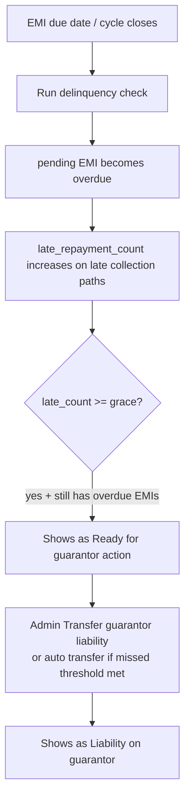

# Session notes — Delinquency overdues, guarantor defaults, loan view

Prompts and assistant responses from a working session, starting with the Delinquency overdues checkbox-only table bug.

Source transcript: [Delinquency guarantor session](a4fed184-b029-48a7-a0e9-f35a2d0dec1e)

---

## Prompt 1

The Delinquency page overdues table shown table with rows consisting of checkboxes only.

### Response

Investigating the overdue table column setup — likely related to the recent tab-switch reconfigure change.

---

### Response

The column wipe happens because `tableColumns` is cleared after `initTableColumnManager()` — Livewire tab switches now hit that path. Fixing the order.

---

### Response

Fixed. Switching tabs via Livewire cleared column state **after** the column manager initialized, so every column was treated as hidden and only the selection checkboxes remained.

`reconfigureTableForSideTab()` now clears `tableColumns` **before** `initTableColumnManager()`, matching the bank accounts pattern. A regression test covers Overview → Overdue and asserts member/loan columns render.

---

## Prompt 2

How do things land on the gaurantor table

### Response

I'll trace how records qualify for the guarantor delinquency table.

---

### Response

A loan appears on **Delinquency → Guarantor** when all of this is true:

1. **Status** is `active`
2. It has a **guarantor** (`guarantor_member_id` set)
3. **Either**:
   - **Liability already transferred** (`guarantor_liability_transferred_at` is set), **or**
   - It is **past grace**: `late_repayment_count >=` Settings → Guarantor rules grace cycles **and** it still has at least one installment with status `overdue`

That query lives in `LoanDelinquencyTables::guarantorExposureQuery()`.

### Typical path onto the table

- **Overdue first**: installments must be flipped to `overdue` (Delinquency tools / scheduled check). Being unpaid in Collection → Arrears is not enough by itself.
- **Late count**: increments when late repayments/collections hit the loan (e.g. late EMI collection paths).
- **Grace**: configured via `Setting::loanDefaultGraceCycles()` (Guarantor & grace rules).
- **Transfer**: admin action on the Guarantor tab, or auto-transfer when `late_repayment_count` hits the separate missed-EMI transfer threshold during the daily check.

So the Guarantor table is the **risk / liability queue**, not the cycle collection list: either “past grace, ready for action” or “already on the guarantor.”

---

## Prompt 3

Where did repayment #20 for loan 176 come from?

### Response

I'll look up loan 176 and repayment/installment #20 in the tenant data and related posting history.

---

### Response

Installment #20 was paid via guarantor today — checking the audit trail and posting that created the repayment.

---

### Response

It came from the **delinquency / guarantor-default pipeline**, not a manual borrower repayment or legacy import.

### What happened

On **2026-07-27 15:49:58** (samman), installment **#20** on loan **176** was collected as a **guarantor default debit**:

| Piece         | Detail                                                                                                                             |
| ------------- | ---------------------------------------------------------------------------------------------------------------------------------- |
| Installment   | `#20` (id `2345`), due `2026-02-05`, amount `3,000`                                                                        |
| Trigger       | `LoanDefaultService::processDefaults()` (part of **Run delinquency check** / `loans:check-defaults`)                     |
| Who paid      | Guarantor**#7** عبدالرحمن بهجت عبدالرحمن زاهد — fund debit                                        |
| Borrower      | **#54** مهند بهجت عبدالرحمن زاهد                                                                        |
| Ledger        | `Guarantor default – loan #176 installment #20` (txns `46763`–`46767`)                                                     |
| Repayment row | `loan_repayments` id `2274`, notes `ff:installment:20` (created by the installment observer when status flipped to `paid`) |
| Flag          | `paid_by_guarantor = true`                                                                                                       |

That same second also debited guarantors for several other loans (`#167`, `#173`, `#174`, `#180`, …), so this was a **bulk delinquency run**, not a one-off UI action on loan 176.

### Why #20 specifically

Loan 176 still had earlier overdue EMIs **#18** and **#19**. With `late_repayment_count = 0` and the usual grace of 2, the job walks overdue installments in due-date order:

1. **#18** → warning
2. **#19** → warning
3. **#20** → past grace → **debit guarantor fund** and mark paid

So repayment #20 is the auto-created repayment log for that guarantor-funded default settlement.

---

## Prompt 4

But, debiting the gaurantor should cover all overdue installement not only one.

### Response

You're right — once past grace, the guarantor debit should clear every overdue installment on that loan, not only the one that crossed the threshold. I'll inspect the current default logic and fix it.

---

### Response

Correct — that was a bug in `LoanDefaultService`.

**Before:** once past grace it only debited the installment that crossed the threshold (#20), and left earlier overdue ones (#18, #19) as warnings.

**Now:** if projected defaults (`late_repayment_count` + overdue count) exceed grace — or guarantor liability is already transferred — it debits the guarantor for **every** remaining overdue installment on that loan.

Re-running **Delinquency → Run delinquency check** should now clear loan 176’s leftover overdue EMIs (#18 and #19) from the guarantor’s fund, same as #20.

---

## Prompt 5

Also it should show as gaurantor paid type

### Response

I'll check how repayments and installments are labeled today, then surface a clear “guarantor paid” type.

---

### Response

Updating repayment notes and UI labels so guarantor-funded EMIs show as type “Guarantor paid”.

---

### Response

Done. Guarantor-funded EMIs now show as type **Guarantor paid** (`دفع الكفيل`).

### Changes

- New repayment note: `ff:installment:{n}:guarantor`
- **Actual repayments** Type badge uses that label (warning color)
- **Repayment schedule** status shows **Guarantor paid** when `paid_by_guarantor` is set
- Existing legacy `ff:installment:N` rows for guarantor-paid installments are upgraded on view (and already synced on samman — loan 176 #20 included)

---

## Prompt 6

how does guarantor liability gets transferred

### Response

I'll trace the guarantor liability transfer flow from admin action through the services that apply it.

---

### Response

There are **two different “guarantor” mechanisms**. Liability transfer is the heavier one.

### 1. Guarantor liability transfer (ownership / collection responsibility)

**Where**

- Admin: **Delinquency → Guarantor → Guarantor Transfer**
- Auto: during **Run delinquency check** when `late_repayment_count` ≥ Settings → guarantor transfer missed threshold

**What it does** (`LoanGuarantorTransferService::transferToGuarantor`)

Requires: active loan, assigned guarantor, at least one **overdue** installment, not already transferred.

Then in one transaction it:

1. Sets `original_borrower_member_id`
2. Moves the loan to the guarantor (`member_id` = guarantor)
3. Sets status/`lifecycle_stage` to **`transferred`**
4. Sets `transferred_to_guarantor_at` **and** `guarantor_liability_transferred_at`
5. **Suspends** the original borrower
6. Deletes remaining pending/overdue installments and **rebuilds** a new schedule for the guarantor (remaining master-portion obligation)

So this is not “just a flag” — the loan becomes the guarantor’s loan going forward.

**Undo (partial):** **Restore borrower liability** only clears `guarantor_liability_transferred_at`. Full reinstatement of a suspended borrower is a separate **Reinstate borrower** action when `transferred_to_guarantor_at` is set.

---

### 2. Guarantor fund debit after grace (not a liability transfer)

When overdue EMIs exceed **grace cycles**, `LoanDefaultService` **debits the guarantor’s fund** and marks installments **Guarantor paid**.

That does **not** change who owns the loan. It’s collection from the guarantor’s fund while the borrower still holds the loan — what happened on loan 176 #20.

---

### Mental model

| Step                                                     | Effect                                                          |
| -------------------------------------------------------- | --------------------------------------------------------------- |
| Within grace                                             | Warn borrower                                                   |
| Past grace                                               | Debit guarantor fund for overdue EMIs (`paid_by_guarantor`)   |
| Admin**Guarantor Transfer** / missed-EMI threshold | Loan transferred to guarantor; borrower suspended; new schedule |

**Guarantor Transfer** ≠ debiting the fund. Transfer reassigns the loan; debit pays overdue EMIs from the guarantor’s fund.

---

## Prompt 7

Has the gaurantor and barrower been notified when the overdues are paid by the gaurantor and when liability is transfered

### Response

I'll check the notification paths for guarantor-paid overdues and liability transfer.

---

### Response

**Partially — it depends which event.**

### When overdues are paid by the guarantor (fund debit)

| Who                 | Notified?                                                                                                   |
| ------------------- | ----------------------------------------------------------------------------------------------------------- |
| **Guarantor** | Yes —`LoanDefaultGuarantorNotification` (“Your fund account was debited for loan #… installment #…”) |
| **Borrower**  | **No** — only the guarantor is notified on debit                                                     |

Borrower only gets a warning earlier, while still within grace (`LoanDefaultWarningNotification`), not when the guarantor is actually charged.

Requires a linked portal user; if the guarantor has no `user`, the notify is skipped.

---

### When liability / loan is transferred to the guarantor

| Who                 | Notified?                                                       |
| ------------------- | --------------------------------------------------------------- |
| **Borrower**  | Yes —`LoanGuarantorTransferNotification` (role `borrower`) |
| **Guarantor** | Yes — same notification (role`guarantor`)                    |
| **Admins**    | Yes —`LoanGuarantorTransferAdminNotification`                |

Also best-effort: failures are logged, not rethrown.

---

**Gap:** on guarantor-paid EMIs, the borrower is not told that the installment was settled from the guarantor’s fund. I can add that notification if you want.

---

## Prompt 8

add it.

### Response

Borrowers are now notified when an overdue installment is paid from the guarantor fund.

**What changed**

- New `LoanDefaultBorrowerGuarantorPaidNotification` (“Installment paid by guarantor”)
- Sent from `LoanDefaultService` after the guarantor debit (skipped if borrower and guarantor share the same user)
- Registered in the notification template catalog; Arabic strings added

**Tests:** `LoanDefaultServiceTest` — 7 passed.

---

## Prompt 9

loan #132, I still see some overdues that are not paid by the gaurantor

### Response

I'll inspect loan #132's overdue installments and how guarantor debit selects what to pay.

---

### Response

Loan 132 has two leftover overdues (#22–#23) while later ones were guarantor-paid; checking why `processDefaults` still treats it as within grace.

---

### Response

Root cause: after guarantor paid #24–#25, #22–#23 stayed overdue, and with `late_repayment_count=0` and grace=2 the job treats the loan as still within grace. Fixing that sticky case and incrementing late counts on guarantor debit.

---

### Response

Loan **#132** is cleared now. Installments **#22** and **#23** were still overdue while **#24**/**#25** had already been paid by the guarantor.

**Why they stuck**

1. An earlier run only paid some overdues (the partial-debit bug).
2. After that, only 2 overdues remained, `late_repayment_count` was still **0**, and grace is **2** — so `0 + 2 > 2` was false and the job treated the loan as still within grace.

**Fix**

- Once any installment is `paid_by_guarantor`, keep debiting remaining overdues (don’t fall back into grace).
- Guarantor debits now also bump `late_repayment_count` / amount, same as late borrower repayments.

I ran defaults for samman: **#22** and **#23** are paid by guarantor; guarantor fund went from **-13,500 → -17,500**.

---

## Prompt 10

In the loan view page, add the member number next to the member name at the top and make them link to the member's view page. Also make the gaurantor name linked as well and add his numer as well.

### Response

Updating the loan view subheading to show linked member and guarantor names with their numbers.

---

### Response

Done. On the loan view page:

**Header subheading** now shows `Name (member#)` for the borrower and `Guarantor: Name (member#)` when present — both link to the member view page — then the loan status.

**Details sections** also show name + number together on the member and guarantor fields, with the numbers linked as well.

---

## Prompt 11

I already have a badge for the gaurantor in the loan progress card, why list it again on top.

### Response

Removing the guarantor from the header subheading — it already appears on the progress card.

---

### Response

Removing guarantor from the header and adding the number + member link on the progress-card badge instead.

---

### Response

Removed the guarantor from the page header. It stays only on the progress-card badge, now with member number and a link to their profile. The header still shows the linked borrower name + number and status.
